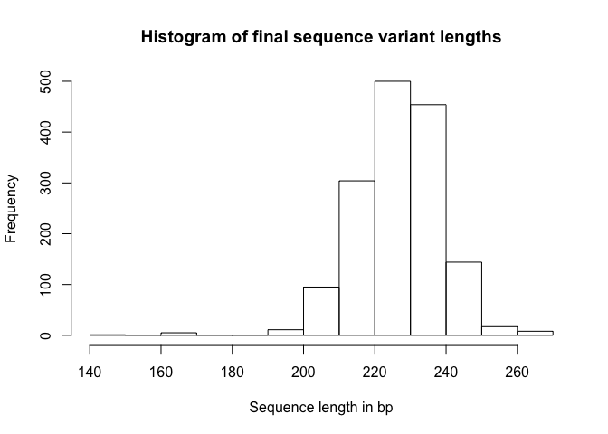

Analysis Report 1: The Influence of Physiological Differences in Males and Females on their Skin’s Microbiome Composition
================
Sanam Sajjadi
November 11, 2018

Introduction
============

Skin is the external interface of the human body with the environment and also the home to many non-pathogenic microbiomes. Interestingly estimation shows that the human body is inhabited by ten times as many non-human cells as human cells! Recent investigations demonstrate that knowledge of new generation sequencing has become essential for basic biological research specifically, in understanding microbiome diversity on the human skin and gut microbiome. Therefore, human microbiome and new generation sequencing have a critical relationship that plays valuable role in aiding further development of many applications such as forensic studies and medicine.

There are several studies which demonstrate effective factors in changing microbiome composition. According to these studies environmental factors, host species and diet are important elements causing the huge diversity on human microbiome.An analysis of skin bacterial microbiota through sequencing of 16S ribosomal RNA genes highlighted the extensive diversity of organisms that live on the human skin (Grice and Segre, 2011).A vast majority of these colonizing microbiota are beneficial to the human host, while others cause skin disorders such as acne, atopic dermatitis, seborrheic dermatitis, and chronic wounds (Grice and Segre, 2011).Changes to microbial communities can contribute to cutaneous disorders, while the maintenance of these communities has a reciprocal nature in order to modulate skin immunity (SanMiguel and Grice, 2015).

The study of the total number of bacteria that live on the human host provide valuable insight into normal immune system function and the etiology of infectious diseases that were once more elusive (Cox *et al.*, 2013) Additional research revealed that the skin surface plays a critical role in influencing human health based on the microbial community that lives on it. The epithelial surface is protected below the follicular opening by hair follicles and sweat ducts which increase the skins surface area from 2 m2 to 25m2. Thus, the skin offers a great area for microbial organisms to live (Gallo, 2017).

The physical location that a person lives plays a critical role in the type of microbial communities that live on the skin. People living in urban environments have a significantly greater abundance of microbes, and the overall skin-associated bacterial communities and structure were evident based on location (Ying *et al.*, 2015). Further, the study of the microbiology of indoor spaces revealed that humans share their interior environment with countless bacteria and fungi, which may negatively impact the rates of acute and chronic illness (Kelley and Gilbert, 2013). Understanding the prevalence of bacteria species in different environments allows for considerations related to health and ways to improve these locations.
New generation sequencing technology is an important analytical tool in forensic studies that allows for application in the DNA database construction, body fluid and species identification, ancestry and phenotypic inference, twin studies, and microbiological analysis (Yang *et al.*, 2014).

In the other related study researhcher asserted that new generation sequencing allows for the analysis of a microbial community to create a more accurate forensic profile. By studying the microbiome that is present in the trace evidence, new generation sequencing helps forensics experts make critical connections that will help criminal justice professionals solve crime (Kuiper, 2016) . In a study of microbiomes on cell phones and shoes, scientists determined that there was a distinct correlation between microbial community sources which highlights the way in which people interact with their environment (Lax *et al.*, 2015). Additional research found that cell phones contain a significant amount of the personal microbiome of their owners. Human’s DNA extraction and sequencing enabled us to determine gender of the fingertip’s owner in forensic cases. Now microbiome composition can also be used to distinguish gender in forensic cases (Meadow *et al.*, 2014).

Also in one of the related studies scientists claimed that sex differences have clear impact on shaping gut microbial composition in mice. Regarding their hypotheses it is possible to differentiate mice genders according to their microbiome composition (Org *et al.*, 2016) . Through the study of human skin’s microbiome and conducting new generation sequencing techniques Fierer eta al., argued that each individual harbors personally unique, stable and transferable skin microbiome that can be used as “fingerprints” for forensic identification.

The hypotheses described above represent a valuable alternative to the other standard techniques like human DNA analysis and finger print analysis. For instance, it is usually difficult to acquire sufficient human DNA for forensic identification, since sufficient amount of saliva, blood or tissues is needed, however it may be easier to recover bacterial DNA from the touched surfaces (Fierer *et al.*, 2010) (additional studies needed to confirm this hypotheses). In this analysis report on Fierer’s research I will discuss and demonstrate that there would be a distinct microbial composition differences between genders. I will assume that physiological differences can be one of the major elements of these differences. I will compare the microbial community on males and females and investigate the factors that may cause these comparisons.

Methods
=======

Sample origin and sequencing
----------------------------

Sample collection:For the keyboard study Fierer and his team had swabbed (25 to 30) keys of three different personal computers and the skin on the front surface of the furthest joint of each fingertip of the owners. Note that those three individuals were healthy and were between 20 and 25 years old at the time of sampling. Two of these participants shared the exact office space. Key board and fingertips were swabbed within 10 minutes of one another, however keyboards had not been touched for more than 30 minutes before swabbing. To compare the microbial communities on these keyboards to other keyboards, Fierer and his team swabbed Space bar keys from 15 different computer keyboards located on the University of Colorado campus. Fierer et al used autoclaved cotton-tipped swabs that were pre-moistened with a sterile solution to collect the swabbing samples. All the swabs were stored at -80 Degree Celsius for less than one week and after that sent for DNA extraction.

DNA Extraction and pyrosequencing: The MO BIO PowerSoil DNA Isolation kit was used to extract genomic DNA by breaking of the frozen cotton tips into bead tubes that contain solution C1. The tubes were incubated for 10 min at 65 Degree Celsius and then shaken using MO BIO vortex adapter. Fierer and his team amplified 16SrRNA genes by utilizing Primer that is best for phylogenetic analysis of pyrosequencing reads. The researchers conducted PCR reactions and finally replicate amplicons were visualized on 0.1% agarose gel. They cleaned the amplicons by using UltraClean-htp 96-well PCR Clean-up kit or MO BIO.

Fierer et al measured the DNA concertation by Quant-it PicoGreen ds DNA reagent and kit, then after quantitation, cleaned amplicons were combined in equimolar ratios into a single tube. The Final pool of DNA was separated from the solution on ice after adding NaCl and ethanol. The precipitated DNA was centrifuged multiple times and then supernatant was removed. The Environmental Genomics Core Facility at the University of South Carolina carried out the pyrosequencing on a 454 Life Sciences Genome Sequencer FLX instrument.

Computational
-------------

The program R was used in this analysis report. General packages like “dplyr”, “tidyr”, “knitr” and “ggplot2” were installed from library to analyze the data. The citation package was also installed from library “citr”. This package was used to easily cite the references in R studio. There are also some primary packages like “dada2”, “seqinr” and “mctoolsr” that were installed for this post analysis report. “mctoolsr” package was downloaded from devtools and “phyloseq” was downloaded via bioconductor. “mctoolsr” is a package that helps with Molecular and Microbial Community Data Analysis. The name of this package stands for “Microbial Community Data Analysis Tools” and it is designed to take marker gene sequences as an input to produce taxa table. Following that Taxa table was created using the denoised sequences. The table is also available in a data frame called Taxa.

The “dada2” package suggests exact amplicons sequence variants from high-throughput amplicon sequencing data, replacing the less accurate OTU clustering approach. This “dada2” package was used to clean and analyze the data, to help trim the sequences with low quality and to remove the chimeras (Callahan *et al.*, 2016). The corresponding tables and plots are available in the script which shows the count of the sequences before and after trimming, denoising and removing chimeras.

Following denoising procedure other related packages like “seqinr” and “phyloseq” were used. “Seqinr” package was used to export the fasta denoised sequences variants and then “phyloseq” was used in order to visualize the results (McMurdie and Holmes, 2013).

Results
=======

Results: In order to compare the microbial communities in both genders, abundance of sequences are important. In this histogram we can see that there were only a few sequences from females, while most of the sequences were from males (Figure 1).

In the following table in order to confirm the result from the previous histogram we tried to see how many samples were from both males and females and where the samples had swabbed from (Sources of the samples which were from different keys on the keyboard). Most of the samples were from males and had been swabbed from different keys. Only 3 samples were from females which were swabbed from the spacebars (Represent a portion of the space bar’s samples). The total of 30 samples had been swabbed from males fingertips. (Table 1)

To visualize the microbial communities that were present in the whole male and female samples, a histogram was created (Figure 2). The diversity of phyla evident in Fig.2 represent five different phyla of bacteria that were present in the samples. More than 6000 sequences were from Actinobacteria, around 3000 sequences were from Firmicutes, and a small portion of the sequences were from Proteobacteria, Cyanobacteria and Bacteroidetes.

To visualize the different classes of bacteria in the samples from females, a histogram was created (Figure 3) In this histogram we can see that more than 750 sequences were from Actinobacteria class, around 300 sequences were from Bacilli class, 240 sequences were from chloroplast class and a few portions of the sequences were in Alphaproteobacteria, Bacteroidia , Betaproteobacteria, Deinooocci, Flavobacteriia, Gammaproteobacteria and Negativicutes Classes.

The same histogram was generated for microbial communities found in males (Figure 4). In this histogram we can see that more than 6000 sequences were from Actinobacteria class, around 2000 sequences were from Bacilli class, and 1000 sequences were from Clostridia class. Small portion of the sequences were from Chloroplast, Gammaproteobacteria, Bacteroidia, Betaproteobacteria and Negativicutes.

``` r
# Be sure to install these packages before running this script
# They can be installed either with the intall.packages() function
# or with the 'Packages' pane in RStudio

# load general-use packages
library("dplyr")
library("tidyr")
library("knitr")
library("ggplot2")

# this package allows for the easy inclusion of literature citations in our Rmd
# more info here: https://github.com/crsh/citr
# and here:
# http://rmarkdown.rstudio.com/authoring_bibliographies_and_citations.html
library("citr")

# These are the primary packages well use to clean and analyze the data
# this package needs to be installed from bioconductor -- it's not on CRAN
# see info here: https://benjjneb.github.io/dada2/dada-installation.html
library("dada2")

# This to export a fasta of our final denoised sequence variant
library("seqinr")

# To install this you have to install from GitHub
# See more info here: https://github.com/leffj/mctoolsr
# run this -- install.packages("devtools")
# and then this -- devtools::install_github("leffj/mctoolsr")
library("mctoolsr")

# And this to visualize our results
# it also needs to be installed from bioconductor
library("phyloseq")
```

``` r
# NOTE: Much of the following follows the DADA2 tutorials available here:
# https://benjjneb.github.io/dada2/tutorial.html
# Accessed October 19, 2017

# set the base path for our input data files
path <- "data/raw_data"

# Sort ensures samples are in order
filenames_forward_reads <- sort(list.files(path, pattern = ".fastq"))

# Extract sample names, assuming filenames have format: SAMPLENAME.fastq
sample_names <- sapply(strsplit(filenames_forward_reads, "\\."), `[`, 1)

# Specify the full path to each of the filenames_forward_reads
filenames_forward_reads <- file.path(path, filenames_forward_reads)
```

``` r
# Plots the quality profiles of all the first twenty samples
plotQualityProfile(filenames_forward_reads[1:20])
```

    ## Scale for 'y' is already present. Adding another scale for 'y', which
    ## will replace the existing scale.


We can see from the quality profiles that most reads tend to get pretty bad in quality after around 200 bases.

``` r
# Place filtered files in filtered/ subdirectory
# note this will fail if the directory doesn't exist
filter_path <- file.path("output", "filtered")
filtered_reads_path <- file.path(filter_path,
                                 paste0(sample_names,
                                        "_filt.fastq.gz"))

# See ?filterAndTrim for details on the parameters
# See here for adjustments for 454 data:
# https://benjjneb.github.io/dada2/
#     faq.html#can-i-use-dada2-with-my-454-or-ion-torrent-data
filtered_output <- filterAndTrim(fwd = filenames_forward_reads,
                                 filt = filtered_reads_path,
                                 maxLen = 300,
                                 maxN = 0, # discard any seqs with Ns
                                 maxEE = 3, # allow w/ up to 3 expected errors
                                 truncQ = 2, # cut off if quality gets this low
                                 rm.phix = TRUE,
                                 compress = TRUE,
                                 multithread = FALSE)
```

``` r
# produce nicely-formatted markdown table of read counts
# before/after trimming
kable(filtered_output,
      col.names = c("Reads In",
                    "Reads Out"))
```

|                  |  Reads In|  Reads Out|
|------------------|---------:|----------:|
| ERR1938262.fastq |       320|        318|
| ERR1938263.fastq |       898|        895|
| ERR1938264.fastq |       665|        663|
| ERR1938265.fastq |       216|        216|
| ERR1938266.fastq |       327|        325|
| ERR1938267.fastq |       564|        563|
| ERR1938268.fastq |       577|        571|
| ERR1938269.fastq |      1270|       1267|
| ERR1938270.fastq |      1400|       1396|
| ERR1938271.fastq |      1210|       1204|
| ERR1938272.fastq |      1038|       1034|
| ERR1938273.fastq |      1083|       1079|
| ERR1938274.fastq |      1550|       1543|
| ERR1938275.fastq |      1245|       1239|
| ERR1938276.fastq |      1358|       1352|
| ERR1938277.fastq |      1165|       1162|
| ERR1938278.fastq |      1536|       1533|
| ERR1938279.fastq |      1109|       1102|
| ERR1938280.fastq |       960|        956|
| ERR1938281.fastq |      1126|       1124|
| ERR1938282.fastq |      1104|       1099|
| ERR1938283.fastq |      1359|       1355|
| ERR1938284.fastq |      1267|       1263|
| ERR1938285.fastq |      1275|       1261|
| ERR1938286.fastq |      1317|       1308|
| ERR1938287.fastq |      1109|       1106|
| ERR1938288.fastq |       475|        474|
| ERR1938289.fastq |      1241|       1240|
| ERR1938290.fastq |       971|        970|
| ERR1938291.fastq |      1223|       1215|
| ERR1938292.fastq |       691|        691|
| ERR1938293.fastq |       825|        820|
| ERR1938294.fastq |      1166|       1160|
| ERR1938295.fastq |      1063|       1059|
| ERR1938296.fastq |       620|        620|
| ERR1938297.fastq |      1221|       1215|
| ERR1938298.fastq |      1453|       1450|
| ERR1938299.fastq |      1221|       1219|
| ERR1938300.fastq |      1244|       1232|
| ERR1938301.fastq |       946|        943|
| ERR1938302.fastq |      1396|       1392|
| ERR1938303.fastq |      1068|       1065|
| ERR1938304.fastq |      1232|       1230|
| ERR1938305.fastq |      1053|       1049|
| ERR1938306.fastq |       502|        502|
| ERR1938307.fastq |      1386|       1384|
| ERR1938308.fastq |      1112|       1112|
| ERR1938309.fastq |       675|        674|
| ERR1938310.fastq |      1126|       1125|
| ERR1938311.fastq |      1026|       1023|
| ERR1938312.fastq |      1191|       1189|
| ERR1938313.fastq |      1282|       1273|
| ERR1938314.fastq |       811|        809|
| ERR1938315.fastq |      1101|       1098|
| ERR1938316.fastq |      1240|       1234|
| ERR1938317.fastq |       531|        529|
| ERR1938318.fastq |       241|        241|
| ERR1938319.fastq |      1335|       1328|
| ERR1938320.fastq |       728|        723|
| ERR1938321.fastq |      1957|       1947|
| ERR1938322.fastq |      1428|       1416|
| ERR1938323.fastq |      1134|       1127|
| ERR1938324.fastq |       757|        752|
| ERR1938325.fastq |      1329|       1320|
| ERR1938326.fastq |      1697|       1685|
| ERR1938327.fastq |       756|        753|
| ERR1938328.fastq |      1026|       1022|
| ERR1938329.fastq |      1249|       1245|
| ERR1938330.fastq |      1535|       1531|
| ERR1938331.fastq |      1166|       1160|
| ERR1938332.fastq |      1147|       1143|
| ERR1938333.fastq |      1212|       1211|
| ERR1938334.fastq |       836|        831|
| ERR1938335.fastq |      1497|       1489|
| ERR1938336.fastq |      1413|       1409|
| ERR1938337.fastq |      1080|       1075|
| ERR1938338.fastq |      1335|       1332|
| ERR1938339.fastq |      1130|       1127|
| ERR1938340.fastq |      1262|       1258|
| ERR1938341.fastq |       502|        499|
| ERR1938342.fastq |      1187|       1184|
| ERR1938343.fastq |      1020|       1017|
| ERR1938344.fastq |      1117|       1109|
| ERR1938345.fastq |      1290|       1285|
| ERR1938346.fastq |      1071|       1067|
| ERR1938347.fastq |      1052|       1049|
| ERR1938348.fastq |      1062|       1056|
| ERR1938349.fastq |      1496|       1493|
| ERR1938350.fastq |      1355|       1348|
| ERR1938351.fastq |       749|        742|
| ERR1938352.fastq |      2071|       2061|
| ERR1938353.fastq |       452|        452|
| ERR1938354.fastq |      1505|       1499|
| ERR1938355.fastq |      2288|       2281|
| ERR1938356.fastq |      1338|       1338|
| ERR1938357.fastq |      1092|       1090|
| ERR1938358.fastq |       903|        902|
| ERR1938359.fastq |      1595|       1584|
| ERR1938360.fastq |      1056|       1052|
| ERR1938361.fastq |      1280|       1277|
| ERR1938362.fastq |       610|        609|
| ERR1938363.fastq |      2026|       2013|
| ERR1938364.fastq |      1257|       1252|
| ERR1938365.fastq |       822|        819|
| ERR1938366.fastq |       277|        277|
| ERR1938367.fastq |      1082|       1077|
| ERR1938368.fastq |      1762|       1745|
| ERR1938369.fastq |      1536|       1528|
| ERR1938370.fastq |      1195|       1191|
| ERR1938371.fastq |       997|        996|
| ERR1938372.fastq |       842|        841|
| ERR1938373.fastq |       982|        982|
| ERR1938374.fastq |       464|        462|
| ERR1938375.fastq |       720|        718|
| ERR1938376.fastq |       584|        581|

``` r
# this build error models from each of the samples
errors_forward_reads <- learnErrors(filtered_reads_path,
                                    multithread = FALSE)
```

    ## Not all sequences were the same length.
    ## Not all sequences were the same length.
    ## Not all sequences were the same length.
    ## Not all sequences were the same length.
    ## Not all sequences were the same length.
    ## Not all sequences were the same length.
    ## Not all sequences were the same length.
    ## Not all sequences were the same length.
    ## Not all sequences were the same length.
    ## Not all sequences were the same length.
    ## Not all sequences were the same length.
    ## Not all sequences were the same length.
    ## Not all sequences were the same length.
    ## Not all sequences were the same length.
    ## Not all sequences were the same length.
    ## Not all sequences were the same length.
    ## Not all sequences were the same length.
    ## Not all sequences were the same length.
    ## Not all sequences were the same length.
    ## Not all sequences were the same length.
    ## Not all sequences were the same length.
    ## Not all sequences were the same length.
    ## Not all sequences were the same length.
    ## Not all sequences were the same length.
    ## Not all sequences were the same length.
    ## Not all sequences were the same length.
    ## Not all sequences were the same length.
    ## Not all sequences were the same length.
    ## Not all sequences were the same length.
    ## Not all sequences were the same length.
    ## Not all sequences were the same length.
    ## Not all sequences were the same length.
    ## Not all sequences were the same length.
    ## Not all sequences were the same length.
    ## Not all sequences were the same length.
    ## Not all sequences were the same length.
    ## Not all sequences were the same length.
    ## Not all sequences were the same length.
    ## Not all sequences were the same length.
    ## Not all sequences were the same length.
    ## Not all sequences were the same length.
    ## Not all sequences were the same length.
    ## Not all sequences were the same length.
    ## Not all sequences were the same length.
    ## Not all sequences were the same length.
    ## Not all sequences were the same length.
    ## Not all sequences were the same length.
    ## Not all sequences were the same length.
    ## Not all sequences were the same length.
    ## Not all sequences were the same length.
    ## Not all sequences were the same length.
    ## Not all sequences were the same length.
    ## Not all sequences were the same length.
    ## Not all sequences were the same length.
    ## Not all sequences were the same length.
    ## Not all sequences were the same length.
    ## Not all sequences were the same length.
    ## Not all sequences were the same length.
    ## Not all sequences were the same length.
    ## Not all sequences were the same length.
    ## Not all sequences were the same length.
    ## Not all sequences were the same length.
    ## Not all sequences were the same length.
    ## Not all sequences were the same length.
    ## Not all sequences were the same length.
    ## Not all sequences were the same length.
    ## Not all sequences were the same length.
    ## Not all sequences were the same length.
    ## Not all sequences were the same length.
    ## Not all sequences were the same length.
    ## Not all sequences were the same length.
    ## Not all sequences were the same length.
    ## Not all sequences were the same length.
    ## Not all sequences were the same length.
    ## Not all sequences were the same length.
    ## Not all sequences were the same length.
    ## Not all sequences were the same length.
    ## Not all sequences were the same length.
    ## Not all sequences were the same length.
    ## Not all sequences were the same length.
    ## Not all sequences were the same length.
    ## Not all sequences were the same length.
    ## Not all sequences were the same length.
    ## Not all sequences were the same length.
    ## Not all sequences were the same length.
    ## Not all sequences were the same length.
    ## Not all sequences were the same length.
    ## Not all sequences were the same length.
    ## Not all sequences were the same length.
    ## Not all sequences were the same length.
    ## Not all sequences were the same length.
    ## Not all sequences were the same length.
    ## Not all sequences were the same length.
    ## Not all sequences were the same length.
    ## Not all sequences were the same length.
    ## Not all sequences were the same length.
    ## Not all sequences were the same length.
    ## Not all sequences were the same length.
    ## Not all sequences were the same length.
    ## Not all sequences were the same length.
    ## Not all sequences were the same length.
    ## Not all sequences were the same length.
    ## Not all sequences were the same length.
    ## Not all sequences were the same length.
    ## Not all sequences were the same length.
    ## Not all sequences were the same length.
    ## Not all sequences were the same length.
    ## Not all sequences were the same length.
    ## Not all sequences were the same length.
    ## Not all sequences were the same length.
    ## Not all sequences were the same length.
    ## Not all sequences were the same length.
    ## Not all sequences were the same length.
    ## Not all sequences were the same length.
    ## Not all sequences were the same length.
    ## 28802208 total bases in 125531 reads from 115 samples will be used for learning the error rates.
    ## Initializing error rates to maximum possible estimate.
    ## selfConsist step 1 ...................................................................................................................
    ##    selfConsist step 2
    ##    selfConsist step 3
    ##    selfConsist step 4
    ##    selfConsist step 5
    ## Convergence after  5  rounds.

``` r
# quick check to see if error models match data
# (black lines match black points) and are generally decresing left to right
plotErrors(errors_forward_reads,
           nominalQ = TRUE)
```

    ## Warning: Transformation introduced infinite values in continuous y-axis

    ## Warning: Transformation introduced infinite values in continuous y-axis


``` r
# get rid of any duplicated sequences
dereplicated_forward_reads <- derepFastq(filtered_reads_path,
                                         verbose = FALSE)
```

    ## Not all sequences were the same length.
    ## Not all sequences were the same length.
    ## Not all sequences were the same length.
    ## Not all sequences were the same length.
    ## Not all sequences were the same length.
    ## Not all sequences were the same length.
    ## Not all sequences were the same length.
    ## Not all sequences were the same length.
    ## Not all sequences were the same length.
    ## Not all sequences were the same length.
    ## Not all sequences were the same length.
    ## Not all sequences were the same length.
    ## Not all sequences were the same length.
    ## Not all sequences were the same length.
    ## Not all sequences were the same length.
    ## Not all sequences were the same length.
    ## Not all sequences were the same length.
    ## Not all sequences were the same length.
    ## Not all sequences were the same length.
    ## Not all sequences were the same length.
    ## Not all sequences were the same length.
    ## Not all sequences were the same length.
    ## Not all sequences were the same length.
    ## Not all sequences were the same length.
    ## Not all sequences were the same length.
    ## Not all sequences were the same length.
    ## Not all sequences were the same length.
    ## Not all sequences were the same length.
    ## Not all sequences were the same length.
    ## Not all sequences were the same length.
    ## Not all sequences were the same length.
    ## Not all sequences were the same length.
    ## Not all sequences were the same length.
    ## Not all sequences were the same length.
    ## Not all sequences were the same length.
    ## Not all sequences were the same length.
    ## Not all sequences were the same length.
    ## Not all sequences were the same length.
    ## Not all sequences were the same length.
    ## Not all sequences were the same length.
    ## Not all sequences were the same length.
    ## Not all sequences were the same length.
    ## Not all sequences were the same length.
    ## Not all sequences were the same length.
    ## Not all sequences were the same length.
    ## Not all sequences were the same length.
    ## Not all sequences were the same length.
    ## Not all sequences were the same length.
    ## Not all sequences were the same length.
    ## Not all sequences were the same length.
    ## Not all sequences were the same length.
    ## Not all sequences were the same length.
    ## Not all sequences were the same length.
    ## Not all sequences were the same length.
    ## Not all sequences were the same length.
    ## Not all sequences were the same length.
    ## Not all sequences were the same length.
    ## Not all sequences were the same length.
    ## Not all sequences were the same length.
    ## Not all sequences were the same length.
    ## Not all sequences were the same length.
    ## Not all sequences were the same length.
    ## Not all sequences were the same length.
    ## Not all sequences were the same length.
    ## Not all sequences were the same length.
    ## Not all sequences were the same length.
    ## Not all sequences were the same length.
    ## Not all sequences were the same length.
    ## Not all sequences were the same length.
    ## Not all sequences were the same length.
    ## Not all sequences were the same length.
    ## Not all sequences were the same length.
    ## Not all sequences were the same length.
    ## Not all sequences were the same length.
    ## Not all sequences were the same length.
    ## Not all sequences were the same length.
    ## Not all sequences were the same length.
    ## Not all sequences were the same length.
    ## Not all sequences were the same length.
    ## Not all sequences were the same length.
    ## Not all sequences were the same length.
    ## Not all sequences were the same length.
    ## Not all sequences were the same length.
    ## Not all sequences were the same length.
    ## Not all sequences were the same length.
    ## Not all sequences were the same length.
    ## Not all sequences were the same length.
    ## Not all sequences were the same length.
    ## Not all sequences were the same length.
    ## Not all sequences were the same length.
    ## Not all sequences were the same length.
    ## Not all sequences were the same length.
    ## Not all sequences were the same length.
    ## Not all sequences were the same length.
    ## Not all sequences were the same length.
    ## Not all sequences were the same length.
    ## Not all sequences were the same length.
    ## Not all sequences were the same length.
    ## Not all sequences were the same length.
    ## Not all sequences were the same length.
    ## Not all sequences were the same length.
    ## Not all sequences were the same length.
    ## Not all sequences were the same length.
    ## Not all sequences were the same length.
    ## Not all sequences were the same length.
    ## Not all sequences were the same length.
    ## Not all sequences were the same length.
    ## Not all sequences were the same length.
    ## Not all sequences were the same length.
    ## Not all sequences were the same length.
    ## Not all sequences were the same length.
    ## Not all sequences were the same length.
    ## Not all sequences were the same length.
    ## Not all sequences were the same length.
    ## Not all sequences were the same length.

``` r
# Name the derep-class objects by the sample names
names(dereplicated_forward_reads) <- sample_names
```

``` r
# parameters adjusted based on recommendations for 454 data here:
# https://benjjneb.github.io/dada2/
#     faq.html#can-i-use-dada2-with-my-454-or-ion-torrent-data
dada_forward_reads <- dada(dereplicated_forward_reads,
                           err = errors_forward_reads,
                           HOMOPOLYMER_GAP_PENALTY = -1, # reduce penalty bc 454
                           BAND_SIZE = 32) # performs local alignments bc indels
```

    ## Sample 1 - 318 reads in 139 unique sequences.
    ## Sample 2 - 895 reads in 416 unique sequences.
    ## Sample 3 - 663 reads in 317 unique sequences.
    ## Sample 4 - 216 reads in 117 unique sequences.
    ## Sample 5 - 325 reads in 135 unique sequences.
    ## Sample 6 - 563 reads in 166 unique sequences.
    ## Sample 7 - 571 reads in 212 unique sequences.
    ## Sample 8 - 1267 reads in 607 unique sequences.
    ## Sample 9 - 1396 reads in 704 unique sequences.
    ## Sample 10 - 1204 reads in 697 unique sequences.
    ## Sample 11 - 1034 reads in 614 unique sequences.
    ## Sample 12 - 1079 reads in 662 unique sequences.
    ## Sample 13 - 1543 reads in 818 unique sequences.
    ## Sample 14 - 1239 reads in 744 unique sequences.
    ## Sample 15 - 1352 reads in 696 unique sequences.
    ## Sample 16 - 1162 reads in 592 unique sequences.
    ## Sample 17 - 1533 reads in 749 unique sequences.
    ## Sample 18 - 1102 reads in 528 unique sequences.
    ## Sample 19 - 956 reads in 530 unique sequences.
    ## Sample 20 - 1124 reads in 580 unique sequences.
    ## Sample 21 - 1099 reads in 523 unique sequences.
    ## Sample 22 - 1355 reads in 638 unique sequences.
    ## Sample 23 - 1263 reads in 600 unique sequences.
    ## Sample 24 - 1261 reads in 536 unique sequences.
    ## Sample 25 - 1308 reads in 659 unique sequences.
    ## Sample 26 - 1106 reads in 492 unique sequences.
    ## Sample 27 - 474 reads in 251 unique sequences.
    ## Sample 28 - 1240 reads in 551 unique sequences.
    ## Sample 29 - 970 reads in 440 unique sequences.
    ## Sample 30 - 1215 reads in 579 unique sequences.
    ## Sample 31 - 691 reads in 401 unique sequences.
    ## Sample 32 - 820 reads in 486 unique sequences.
    ## Sample 33 - 1160 reads in 419 unique sequences.
    ## Sample 34 - 1059 reads in 505 unique sequences.
    ## Sample 35 - 620 reads in 331 unique sequences.
    ## Sample 36 - 1215 reads in 668 unique sequences.
    ## Sample 37 - 1450 reads in 640 unique sequences.
    ## Sample 38 - 1219 reads in 755 unique sequences.
    ## Sample 39 - 1232 reads in 531 unique sequences.
    ## Sample 40 - 943 reads in 515 unique sequences.
    ## Sample 41 - 1392 reads in 590 unique sequences.
    ## Sample 42 - 1065 reads in 504 unique sequences.
    ## Sample 43 - 1230 reads in 633 unique sequences.
    ## Sample 44 - 1049 reads in 554 unique sequences.
    ## Sample 45 - 502 reads in 296 unique sequences.
    ## Sample 46 - 1384 reads in 667 unique sequences.
    ## Sample 47 - 1112 reads in 625 unique sequences.
    ## Sample 48 - 674 reads in 227 unique sequences.
    ## Sample 49 - 1125 reads in 291 unique sequences.
    ## Sample 50 - 1023 reads in 238 unique sequences.
    ## Sample 51 - 1189 reads in 309 unique sequences.
    ## Sample 52 - 1273 reads in 385 unique sequences.
    ## Sample 53 - 809 reads in 237 unique sequences.
    ## Sample 54 - 1098 reads in 342 unique sequences.
    ## Sample 55 - 1234 reads in 453 unique sequences.
    ## Sample 56 - 529 reads in 185 unique sequences.
    ## Sample 57 - 241 reads in 88 unique sequences.
    ## Sample 58 - 1328 reads in 440 unique sequences.
    ## Sample 59 - 723 reads in 292 unique sequences.
    ## Sample 60 - 1947 reads in 543 unique sequences.
    ## Sample 61 - 1416 reads in 527 unique sequences.
    ## Sample 62 - 1127 reads in 363 unique sequences.
    ## Sample 63 - 752 reads in 225 unique sequences.
    ## Sample 64 - 1320 reads in 530 unique sequences.
    ## Sample 65 - 1685 reads in 618 unique sequences.
    ## Sample 66 - 753 reads in 251 unique sequences.
    ## Sample 67 - 1022 reads in 362 unique sequences.
    ## Sample 68 - 1245 reads in 277 unique sequences.
    ## Sample 69 - 1531 reads in 598 unique sequences.
    ## Sample 70 - 1160 reads in 426 unique sequences.
    ## Sample 71 - 1143 reads in 395 unique sequences.
    ## Sample 72 - 1211 reads in 369 unique sequences.
    ## Sample 73 - 831 reads in 249 unique sequences.
    ## Sample 74 - 1489 reads in 470 unique sequences.
    ## Sample 75 - 1409 reads in 374 unique sequences.
    ## Sample 76 - 1075 reads in 280 unique sequences.
    ## Sample 77 - 1332 reads in 332 unique sequences.
    ## Sample 78 - 1127 reads in 360 unique sequences.
    ## Sample 79 - 1258 reads in 386 unique sequences.
    ## Sample 80 - 499 reads in 165 unique sequences.
    ## Sample 81 - 1184 reads in 256 unique sequences.
    ## Sample 82 - 1017 reads in 310 unique sequences.
    ## Sample 83 - 1109 reads in 273 unique sequences.
    ## Sample 84 - 1285 reads in 317 unique sequences.
    ## Sample 85 - 1067 reads in 294 unique sequences.
    ## Sample 86 - 1049 reads in 348 unique sequences.
    ## Sample 87 - 1056 reads in 289 unique sequences.
    ## Sample 88 - 1493 reads in 358 unique sequences.
    ## Sample 89 - 1348 reads in 336 unique sequences.
    ## Sample 90 - 742 reads in 238 unique sequences.
    ## Sample 91 - 2061 reads in 482 unique sequences.
    ## Sample 92 - 452 reads in 142 unique sequences.
    ## Sample 93 - 1499 reads in 397 unique sequences.
    ## Sample 94 - 2281 reads in 524 unique sequences.
    ## Sample 95 - 1338 reads in 389 unique sequences.
    ## Sample 96 - 1090 reads in 277 unique sequences.
    ## Sample 97 - 902 reads in 239 unique sequences.
    ## Sample 98 - 1584 reads in 489 unique sequences.
    ## Sample 99 - 1052 reads in 328 unique sequences.
    ## Sample 100 - 1277 reads in 322 unique sequences.
    ## Sample 101 - 609 reads in 130 unique sequences.
    ## Sample 102 - 2013 reads in 509 unique sequences.
    ## Sample 103 - 1252 reads in 353 unique sequences.
    ## Sample 104 - 819 reads in 187 unique sequences.
    ## Sample 105 - 277 reads in 92 unique sequences.
    ## Sample 106 - 1077 reads in 327 unique sequences.
    ## Sample 107 - 1745 reads in 577 unique sequences.
    ## Sample 108 - 1528 reads in 378 unique sequences.
    ## Sample 109 - 1191 reads in 260 unique sequences.
    ## Sample 110 - 996 reads in 277 unique sequences.
    ## Sample 111 - 841 reads in 243 unique sequences.
    ## Sample 112 - 982 reads in 377 unique sequences.
    ## Sample 113 - 462 reads in 272 unique sequences.
    ## Sample 114 - 718 reads in 267 unique sequences.
    ## Sample 115 - 581 reads in 300 unique sequences.

``` r
# check dada results
dada_forward_reads
```

    ## $ERR1938262
    ## dada-class: object describing DADA2 denoising results
    ## 8 sequence variants were inferred from 139 input unique sequences.
    ## Key parameters: OMEGA_A = 1e-40, OMEGA_C = 1e-40, BAND_SIZE = 32
    ## 
    ## $ERR1938263
    ## dada-class: object describing DADA2 denoising results
    ## 31 sequence variants were inferred from 416 input unique sequences.
    ## Key parameters: OMEGA_A = 1e-40, OMEGA_C = 1e-40, BAND_SIZE = 32
    ## 
    ## $ERR1938264
    ## dada-class: object describing DADA2 denoising results
    ## 25 sequence variants were inferred from 317 input unique sequences.
    ## Key parameters: OMEGA_A = 1e-40, OMEGA_C = 1e-40, BAND_SIZE = 32
    ## 
    ## $ERR1938265
    ## dada-class: object describing DADA2 denoising results
    ## 8 sequence variants were inferred from 117 input unique sequences.
    ## Key parameters: OMEGA_A = 1e-40, OMEGA_C = 1e-40, BAND_SIZE = 32
    ## 
    ## $ERR1938266
    ## dada-class: object describing DADA2 denoising results
    ## 7 sequence variants were inferred from 135 input unique sequences.
    ## Key parameters: OMEGA_A = 1e-40, OMEGA_C = 1e-40, BAND_SIZE = 32
    ## 
    ## $ERR1938267
    ## dada-class: object describing DADA2 denoising results
    ## 7 sequence variants were inferred from 166 input unique sequences.
    ## Key parameters: OMEGA_A = 1e-40, OMEGA_C = 1e-40, BAND_SIZE = 32
    ## 
    ## $ERR1938268
    ## dada-class: object describing DADA2 denoising results
    ## 19 sequence variants were inferred from 212 input unique sequences.
    ## Key parameters: OMEGA_A = 1e-40, OMEGA_C = 1e-40, BAND_SIZE = 32
    ## 
    ## $ERR1938269
    ## dada-class: object describing DADA2 denoising results
    ## 61 sequence variants were inferred from 607 input unique sequences.
    ## Key parameters: OMEGA_A = 1e-40, OMEGA_C = 1e-40, BAND_SIZE = 32
    ## 
    ## $ERR1938270
    ## dada-class: object describing DADA2 denoising results
    ## 62 sequence variants were inferred from 704 input unique sequences.
    ## Key parameters: OMEGA_A = 1e-40, OMEGA_C = 1e-40, BAND_SIZE = 32
    ## 
    ## $ERR1938271
    ## dada-class: object describing DADA2 denoising results
    ## 49 sequence variants were inferred from 697 input unique sequences.
    ## Key parameters: OMEGA_A = 1e-40, OMEGA_C = 1e-40, BAND_SIZE = 32
    ## 
    ## $ERR1938272
    ## dada-class: object describing DADA2 denoising results
    ## 50 sequence variants were inferred from 614 input unique sequences.
    ## Key parameters: OMEGA_A = 1e-40, OMEGA_C = 1e-40, BAND_SIZE = 32
    ## 
    ## $ERR1938273
    ## dada-class: object describing DADA2 denoising results
    ## 46 sequence variants were inferred from 662 input unique sequences.
    ## Key parameters: OMEGA_A = 1e-40, OMEGA_C = 1e-40, BAND_SIZE = 32
    ## 
    ## $ERR1938274
    ## dada-class: object describing DADA2 denoising results
    ## 63 sequence variants were inferred from 818 input unique sequences.
    ## Key parameters: OMEGA_A = 1e-40, OMEGA_C = 1e-40, BAND_SIZE = 32
    ## 
    ## $ERR1938275
    ## dada-class: object describing DADA2 denoising results
    ## 49 sequence variants were inferred from 744 input unique sequences.
    ## Key parameters: OMEGA_A = 1e-40, OMEGA_C = 1e-40, BAND_SIZE = 32
    ## 
    ## $ERR1938276
    ## dada-class: object describing DADA2 denoising results
    ## 55 sequence variants were inferred from 696 input unique sequences.
    ## Key parameters: OMEGA_A = 1e-40, OMEGA_C = 1e-40, BAND_SIZE = 32
    ## 
    ## $ERR1938277
    ## dada-class: object describing DADA2 denoising results
    ## 52 sequence variants were inferred from 592 input unique sequences.
    ## Key parameters: OMEGA_A = 1e-40, OMEGA_C = 1e-40, BAND_SIZE = 32
    ## 
    ## $ERR1938278
    ## dada-class: object describing DADA2 denoising results
    ## 69 sequence variants were inferred from 749 input unique sequences.
    ## Key parameters: OMEGA_A = 1e-40, OMEGA_C = 1e-40, BAND_SIZE = 32
    ## 
    ## $ERR1938279
    ## dada-class: object describing DADA2 denoising results
    ## 41 sequence variants were inferred from 528 input unique sequences.
    ## Key parameters: OMEGA_A = 1e-40, OMEGA_C = 1e-40, BAND_SIZE = 32
    ## 
    ## $ERR1938280
    ## dada-class: object describing DADA2 denoising results
    ## 42 sequence variants were inferred from 530 input unique sequences.
    ## Key parameters: OMEGA_A = 1e-40, OMEGA_C = 1e-40, BAND_SIZE = 32
    ## 
    ## $ERR1938281
    ## dada-class: object describing DADA2 denoising results
    ## 51 sequence variants were inferred from 580 input unique sequences.
    ## Key parameters: OMEGA_A = 1e-40, OMEGA_C = 1e-40, BAND_SIZE = 32
    ## 
    ## $ERR1938282
    ## dada-class: object describing DADA2 denoising results
    ## 33 sequence variants were inferred from 523 input unique sequences.
    ## Key parameters: OMEGA_A = 1e-40, OMEGA_C = 1e-40, BAND_SIZE = 32
    ## 
    ## $ERR1938283
    ## dada-class: object describing DADA2 denoising results
    ## 59 sequence variants were inferred from 638 input unique sequences.
    ## Key parameters: OMEGA_A = 1e-40, OMEGA_C = 1e-40, BAND_SIZE = 32
    ## 
    ## $ERR1938284
    ## dada-class: object describing DADA2 denoising results
    ## 56 sequence variants were inferred from 600 input unique sequences.
    ## Key parameters: OMEGA_A = 1e-40, OMEGA_C = 1e-40, BAND_SIZE = 32
    ## 
    ## $ERR1938285
    ## dada-class: object describing DADA2 denoising results
    ## 40 sequence variants were inferred from 536 input unique sequences.
    ## Key parameters: OMEGA_A = 1e-40, OMEGA_C = 1e-40, BAND_SIZE = 32
    ## 
    ## $ERR1938286
    ## dada-class: object describing DADA2 denoising results
    ## 50 sequence variants were inferred from 659 input unique sequences.
    ## Key parameters: OMEGA_A = 1e-40, OMEGA_C = 1e-40, BAND_SIZE = 32
    ## 
    ## $ERR1938287
    ## dada-class: object describing DADA2 denoising results
    ## 40 sequence variants were inferred from 492 input unique sequences.
    ## Key parameters: OMEGA_A = 1e-40, OMEGA_C = 1e-40, BAND_SIZE = 32
    ## 
    ## $ERR1938288
    ## dada-class: object describing DADA2 denoising results
    ## 27 sequence variants were inferred from 251 input unique sequences.
    ## Key parameters: OMEGA_A = 1e-40, OMEGA_C = 1e-40, BAND_SIZE = 32
    ## 
    ## $ERR1938289
    ## dada-class: object describing DADA2 denoising results
    ## 57 sequence variants were inferred from 551 input unique sequences.
    ## Key parameters: OMEGA_A = 1e-40, OMEGA_C = 1e-40, BAND_SIZE = 32
    ## 
    ## $ERR1938290
    ## dada-class: object describing DADA2 denoising results
    ## 34 sequence variants were inferred from 440 input unique sequences.
    ## Key parameters: OMEGA_A = 1e-40, OMEGA_C = 1e-40, BAND_SIZE = 32
    ## 
    ## $ERR1938291
    ## dada-class: object describing DADA2 denoising results
    ## 43 sequence variants were inferred from 579 input unique sequences.
    ## Key parameters: OMEGA_A = 1e-40, OMEGA_C = 1e-40, BAND_SIZE = 32
    ## 
    ## $ERR1938292
    ## dada-class: object describing DADA2 denoising results
    ## 49 sequence variants were inferred from 401 input unique sequences.
    ## Key parameters: OMEGA_A = 1e-40, OMEGA_C = 1e-40, BAND_SIZE = 32
    ## 
    ## $ERR1938293
    ## dada-class: object describing DADA2 denoising results
    ## 47 sequence variants were inferred from 486 input unique sequences.
    ## Key parameters: OMEGA_A = 1e-40, OMEGA_C = 1e-40, BAND_SIZE = 32
    ## 
    ## $ERR1938294
    ## dada-class: object describing DADA2 denoising results
    ## 29 sequence variants were inferred from 419 input unique sequences.
    ## Key parameters: OMEGA_A = 1e-40, OMEGA_C = 1e-40, BAND_SIZE = 32
    ## 
    ## $ERR1938295
    ## dada-class: object describing DADA2 denoising results
    ## 39 sequence variants were inferred from 505 input unique sequences.
    ## Key parameters: OMEGA_A = 1e-40, OMEGA_C = 1e-40, BAND_SIZE = 32
    ## 
    ## $ERR1938296
    ## dada-class: object describing DADA2 denoising results
    ## 37 sequence variants were inferred from 331 input unique sequences.
    ## Key parameters: OMEGA_A = 1e-40, OMEGA_C = 1e-40, BAND_SIZE = 32
    ## 
    ## $ERR1938297
    ## dada-class: object describing DADA2 denoising results
    ## 48 sequence variants were inferred from 668 input unique sequences.
    ## Key parameters: OMEGA_A = 1e-40, OMEGA_C = 1e-40, BAND_SIZE = 32
    ## 
    ## $ERR1938298
    ## dada-class: object describing DADA2 denoising results
    ## 46 sequence variants were inferred from 640 input unique sequences.
    ## Key parameters: OMEGA_A = 1e-40, OMEGA_C = 1e-40, BAND_SIZE = 32
    ## 
    ## $ERR1938299
    ## dada-class: object describing DADA2 denoising results
    ## 59 sequence variants were inferred from 755 input unique sequences.
    ## Key parameters: OMEGA_A = 1e-40, OMEGA_C = 1e-40, BAND_SIZE = 32
    ## 
    ## $ERR1938300
    ## dada-class: object describing DADA2 denoising results
    ## 44 sequence variants were inferred from 531 input unique sequences.
    ## Key parameters: OMEGA_A = 1e-40, OMEGA_C = 1e-40, BAND_SIZE = 32
    ## 
    ## $ERR1938301
    ## dada-class: object describing DADA2 denoising results
    ## 36 sequence variants were inferred from 515 input unique sequences.
    ## Key parameters: OMEGA_A = 1e-40, OMEGA_C = 1e-40, BAND_SIZE = 32
    ## 
    ## $ERR1938302
    ## dada-class: object describing DADA2 denoising results
    ## 62 sequence variants were inferred from 590 input unique sequences.
    ## Key parameters: OMEGA_A = 1e-40, OMEGA_C = 1e-40, BAND_SIZE = 32
    ## 
    ## $ERR1938303
    ## dada-class: object describing DADA2 denoising results
    ## 51 sequence variants were inferred from 504 input unique sequences.
    ## Key parameters: OMEGA_A = 1e-40, OMEGA_C = 1e-40, BAND_SIZE = 32
    ## 
    ## $ERR1938304
    ## dada-class: object describing DADA2 denoising results
    ## 56 sequence variants were inferred from 633 input unique sequences.
    ## Key parameters: OMEGA_A = 1e-40, OMEGA_C = 1e-40, BAND_SIZE = 32
    ## 
    ## $ERR1938305
    ## dada-class: object describing DADA2 denoising results
    ## 45 sequence variants were inferred from 554 input unique sequences.
    ## Key parameters: OMEGA_A = 1e-40, OMEGA_C = 1e-40, BAND_SIZE = 32
    ## 
    ## $ERR1938306
    ## dada-class: object describing DADA2 denoising results
    ## 31 sequence variants were inferred from 296 input unique sequences.
    ## Key parameters: OMEGA_A = 1e-40, OMEGA_C = 1e-40, BAND_SIZE = 32
    ## 
    ## $ERR1938307
    ## dada-class: object describing DADA2 denoising results
    ## 62 sequence variants were inferred from 667 input unique sequences.
    ## Key parameters: OMEGA_A = 1e-40, OMEGA_C = 1e-40, BAND_SIZE = 32
    ## 
    ## $ERR1938308
    ## dada-class: object describing DADA2 denoising results
    ## 74 sequence variants were inferred from 625 input unique sequences.
    ## Key parameters: OMEGA_A = 1e-40, OMEGA_C = 1e-40, BAND_SIZE = 32
    ## 
    ## $ERR1938309
    ## dada-class: object describing DADA2 denoising results
    ## 17 sequence variants were inferred from 227 input unique sequences.
    ## Key parameters: OMEGA_A = 1e-40, OMEGA_C = 1e-40, BAND_SIZE = 32
    ## 
    ## $ERR1938310
    ## dada-class: object describing DADA2 denoising results
    ## 24 sequence variants were inferred from 291 input unique sequences.
    ## Key parameters: OMEGA_A = 1e-40, OMEGA_C = 1e-40, BAND_SIZE = 32
    ## 
    ## $ERR1938311
    ## dada-class: object describing DADA2 denoising results
    ## 17 sequence variants were inferred from 238 input unique sequences.
    ## Key parameters: OMEGA_A = 1e-40, OMEGA_C = 1e-40, BAND_SIZE = 32
    ## 
    ## $ERR1938312
    ## dada-class: object describing DADA2 denoising results
    ## 18 sequence variants were inferred from 309 input unique sequences.
    ## Key parameters: OMEGA_A = 1e-40, OMEGA_C = 1e-40, BAND_SIZE = 32
    ## 
    ## $ERR1938313
    ## dada-class: object describing DADA2 denoising results
    ## 21 sequence variants were inferred from 385 input unique sequences.
    ## Key parameters: OMEGA_A = 1e-40, OMEGA_C = 1e-40, BAND_SIZE = 32
    ## 
    ## $ERR1938314
    ## dada-class: object describing DADA2 denoising results
    ## 17 sequence variants were inferred from 237 input unique sequences.
    ## Key parameters: OMEGA_A = 1e-40, OMEGA_C = 1e-40, BAND_SIZE = 32
    ## 
    ## $ERR1938315
    ## dada-class: object describing DADA2 denoising results
    ## 24 sequence variants were inferred from 342 input unique sequences.
    ## Key parameters: OMEGA_A = 1e-40, OMEGA_C = 1e-40, BAND_SIZE = 32
    ## 
    ## $ERR1938316
    ## dada-class: object describing DADA2 denoising results
    ## 28 sequence variants were inferred from 453 input unique sequences.
    ## Key parameters: OMEGA_A = 1e-40, OMEGA_C = 1e-40, BAND_SIZE = 32
    ## 
    ## $ERR1938317
    ## dada-class: object describing DADA2 denoising results
    ## 18 sequence variants were inferred from 185 input unique sequences.
    ## Key parameters: OMEGA_A = 1e-40, OMEGA_C = 1e-40, BAND_SIZE = 32
    ## 
    ## $ERR1938318
    ## dada-class: object describing DADA2 denoising results
    ## 10 sequence variants were inferred from 88 input unique sequences.
    ## Key parameters: OMEGA_A = 1e-40, OMEGA_C = 1e-40, BAND_SIZE = 32
    ## 
    ## $ERR1938319
    ## dada-class: object describing DADA2 denoising results
    ## 35 sequence variants were inferred from 440 input unique sequences.
    ## Key parameters: OMEGA_A = 1e-40, OMEGA_C = 1e-40, BAND_SIZE = 32
    ## 
    ## $ERR1938320
    ## dada-class: object describing DADA2 denoising results
    ## 32 sequence variants were inferred from 292 input unique sequences.
    ## Key parameters: OMEGA_A = 1e-40, OMEGA_C = 1e-40, BAND_SIZE = 32
    ## 
    ## $ERR1938321
    ## dada-class: object describing DADA2 denoising results
    ## 32 sequence variants were inferred from 543 input unique sequences.
    ## Key parameters: OMEGA_A = 1e-40, OMEGA_C = 1e-40, BAND_SIZE = 32
    ## 
    ## $ERR1938322
    ## dada-class: object describing DADA2 denoising results
    ## 40 sequence variants were inferred from 527 input unique sequences.
    ## Key parameters: OMEGA_A = 1e-40, OMEGA_C = 1e-40, BAND_SIZE = 32
    ## 
    ## $ERR1938323
    ## dada-class: object describing DADA2 denoising results
    ## 31 sequence variants were inferred from 363 input unique sequences.
    ## Key parameters: OMEGA_A = 1e-40, OMEGA_C = 1e-40, BAND_SIZE = 32
    ## 
    ## $ERR1938324
    ## dada-class: object describing DADA2 denoising results
    ## 18 sequence variants were inferred from 225 input unique sequences.
    ## Key parameters: OMEGA_A = 1e-40, OMEGA_C = 1e-40, BAND_SIZE = 32
    ## 
    ## $ERR1938325
    ## dada-class: object describing DADA2 denoising results
    ## 47 sequence variants were inferred from 530 input unique sequences.
    ## Key parameters: OMEGA_A = 1e-40, OMEGA_C = 1e-40, BAND_SIZE = 32
    ## 
    ## $ERR1938326
    ## dada-class: object describing DADA2 denoising results
    ## 36 sequence variants were inferred from 618 input unique sequences.
    ## Key parameters: OMEGA_A = 1e-40, OMEGA_C = 1e-40, BAND_SIZE = 32
    ## 
    ## $ERR1938327
    ## dada-class: object describing DADA2 denoising results
    ## 16 sequence variants were inferred from 251 input unique sequences.
    ## Key parameters: OMEGA_A = 1e-40, OMEGA_C = 1e-40, BAND_SIZE = 32
    ## 
    ## $ERR1938328
    ## dada-class: object describing DADA2 denoising results
    ## 25 sequence variants were inferred from 362 input unique sequences.
    ## Key parameters: OMEGA_A = 1e-40, OMEGA_C = 1e-40, BAND_SIZE = 32
    ## 
    ## $ERR1938329
    ## dada-class: object describing DADA2 denoising results
    ## 13 sequence variants were inferred from 277 input unique sequences.
    ## Key parameters: OMEGA_A = 1e-40, OMEGA_C = 1e-40, BAND_SIZE = 32
    ## 
    ## $ERR1938330
    ## dada-class: object describing DADA2 denoising results
    ## 39 sequence variants were inferred from 598 input unique sequences.
    ## Key parameters: OMEGA_A = 1e-40, OMEGA_C = 1e-40, BAND_SIZE = 32
    ## 
    ## $ERR1938331
    ## dada-class: object describing DADA2 denoising results
    ## 33 sequence variants were inferred from 426 input unique sequences.
    ## Key parameters: OMEGA_A = 1e-40, OMEGA_C = 1e-40, BAND_SIZE = 32
    ## 
    ## $ERR1938332
    ## dada-class: object describing DADA2 denoising results
    ## 29 sequence variants were inferred from 395 input unique sequences.
    ## Key parameters: OMEGA_A = 1e-40, OMEGA_C = 1e-40, BAND_SIZE = 32
    ## 
    ## $ERR1938333
    ## dada-class: object describing DADA2 denoising results
    ## 27 sequence variants were inferred from 369 input unique sequences.
    ## Key parameters: OMEGA_A = 1e-40, OMEGA_C = 1e-40, BAND_SIZE = 32
    ## 
    ## $ERR1938334
    ## dada-class: object describing DADA2 denoising results
    ## 17 sequence variants were inferred from 249 input unique sequences.
    ## Key parameters: OMEGA_A = 1e-40, OMEGA_C = 1e-40, BAND_SIZE = 32
    ## 
    ## $ERR1938335
    ## dada-class: object describing DADA2 denoising results
    ## 27 sequence variants were inferred from 470 input unique sequences.
    ## Key parameters: OMEGA_A = 1e-40, OMEGA_C = 1e-40, BAND_SIZE = 32
    ## 
    ## $ERR1938336
    ## dada-class: object describing DADA2 denoising results
    ## 31 sequence variants were inferred from 374 input unique sequences.
    ## Key parameters: OMEGA_A = 1e-40, OMEGA_C = 1e-40, BAND_SIZE = 32
    ## 
    ## $ERR1938337
    ## dada-class: object describing DADA2 denoising results
    ## 17 sequence variants were inferred from 280 input unique sequences.
    ## Key parameters: OMEGA_A = 1e-40, OMEGA_C = 1e-40, BAND_SIZE = 32
    ## 
    ## $ERR1938338
    ## dada-class: object describing DADA2 denoising results
    ## 26 sequence variants were inferred from 332 input unique sequences.
    ## Key parameters: OMEGA_A = 1e-40, OMEGA_C = 1e-40, BAND_SIZE = 32
    ## 
    ## $ERR1938339
    ## dada-class: object describing DADA2 denoising results
    ## 20 sequence variants were inferred from 360 input unique sequences.
    ## Key parameters: OMEGA_A = 1e-40, OMEGA_C = 1e-40, BAND_SIZE = 32
    ## 
    ## $ERR1938340
    ## dada-class: object describing DADA2 denoising results
    ## 22 sequence variants were inferred from 386 input unique sequences.
    ## Key parameters: OMEGA_A = 1e-40, OMEGA_C = 1e-40, BAND_SIZE = 32
    ## 
    ## $ERR1938341
    ## dada-class: object describing DADA2 denoising results
    ## 9 sequence variants were inferred from 165 input unique sequences.
    ## Key parameters: OMEGA_A = 1e-40, OMEGA_C = 1e-40, BAND_SIZE = 32
    ## 
    ## $ERR1938342
    ## dada-class: object describing DADA2 denoising results
    ## 26 sequence variants were inferred from 256 input unique sequences.
    ## Key parameters: OMEGA_A = 1e-40, OMEGA_C = 1e-40, BAND_SIZE = 32
    ## 
    ## $ERR1938343
    ## dada-class: object describing DADA2 denoising results
    ## 16 sequence variants were inferred from 310 input unique sequences.
    ## Key parameters: OMEGA_A = 1e-40, OMEGA_C = 1e-40, BAND_SIZE = 32
    ## 
    ## $ERR1938344
    ## dada-class: object describing DADA2 denoising results
    ## 16 sequence variants were inferred from 273 input unique sequences.
    ## Key parameters: OMEGA_A = 1e-40, OMEGA_C = 1e-40, BAND_SIZE = 32
    ## 
    ## $ERR1938345
    ## dada-class: object describing DADA2 denoising results
    ## 28 sequence variants were inferred from 317 input unique sequences.
    ## Key parameters: OMEGA_A = 1e-40, OMEGA_C = 1e-40, BAND_SIZE = 32
    ## 
    ## $ERR1938346
    ## dada-class: object describing DADA2 denoising results
    ## 15 sequence variants were inferred from 294 input unique sequences.
    ## Key parameters: OMEGA_A = 1e-40, OMEGA_C = 1e-40, BAND_SIZE = 32
    ## 
    ## $ERR1938347
    ## dada-class: object describing DADA2 denoising results
    ## 18 sequence variants were inferred from 348 input unique sequences.
    ## Key parameters: OMEGA_A = 1e-40, OMEGA_C = 1e-40, BAND_SIZE = 32
    ## 
    ## $ERR1938348
    ## dada-class: object describing DADA2 denoising results
    ## 20 sequence variants were inferred from 289 input unique sequences.
    ## Key parameters: OMEGA_A = 1e-40, OMEGA_C = 1e-40, BAND_SIZE = 32
    ## 
    ## $ERR1938349
    ## dada-class: object describing DADA2 denoising results
    ## 24 sequence variants were inferred from 358 input unique sequences.
    ## Key parameters: OMEGA_A = 1e-40, OMEGA_C = 1e-40, BAND_SIZE = 32
    ## 
    ## $ERR1938350
    ## dada-class: object describing DADA2 denoising results
    ## 21 sequence variants were inferred from 336 input unique sequences.
    ## Key parameters: OMEGA_A = 1e-40, OMEGA_C = 1e-40, BAND_SIZE = 32
    ## 
    ## $ERR1938351
    ## dada-class: object describing DADA2 denoising results
    ## 9 sequence variants were inferred from 238 input unique sequences.
    ## Key parameters: OMEGA_A = 1e-40, OMEGA_C = 1e-40, BAND_SIZE = 32
    ## 
    ## $ERR1938352
    ## dada-class: object describing DADA2 denoising results
    ## 22 sequence variants were inferred from 482 input unique sequences.
    ## Key parameters: OMEGA_A = 1e-40, OMEGA_C = 1e-40, BAND_SIZE = 32
    ## 
    ## $ERR1938353
    ## dada-class: object describing DADA2 denoising results
    ## 9 sequence variants were inferred from 142 input unique sequences.
    ## Key parameters: OMEGA_A = 1e-40, OMEGA_C = 1e-40, BAND_SIZE = 32
    ## 
    ## $ERR1938354
    ## dada-class: object describing DADA2 denoising results
    ## 27 sequence variants were inferred from 397 input unique sequences.
    ## Key parameters: OMEGA_A = 1e-40, OMEGA_C = 1e-40, BAND_SIZE = 32
    ## 
    ## $ERR1938355
    ## dada-class: object describing DADA2 denoising results
    ## 27 sequence variants were inferred from 524 input unique sequences.
    ## Key parameters: OMEGA_A = 1e-40, OMEGA_C = 1e-40, BAND_SIZE = 32
    ## 
    ## $ERR1938356
    ## dada-class: object describing DADA2 denoising results
    ## 24 sequence variants were inferred from 389 input unique sequences.
    ## Key parameters: OMEGA_A = 1e-40, OMEGA_C = 1e-40, BAND_SIZE = 32
    ## 
    ## $ERR1938357
    ## dada-class: object describing DADA2 denoising results
    ## 15 sequence variants were inferred from 277 input unique sequences.
    ## Key parameters: OMEGA_A = 1e-40, OMEGA_C = 1e-40, BAND_SIZE = 32
    ## 
    ## $ERR1938358
    ## dada-class: object describing DADA2 denoising results
    ## 23 sequence variants were inferred from 239 input unique sequences.
    ## Key parameters: OMEGA_A = 1e-40, OMEGA_C = 1e-40, BAND_SIZE = 32
    ## 
    ## $ERR1938359
    ## dada-class: object describing DADA2 denoising results
    ## 27 sequence variants were inferred from 489 input unique sequences.
    ## Key parameters: OMEGA_A = 1e-40, OMEGA_C = 1e-40, BAND_SIZE = 32
    ## 
    ## $ERR1938360
    ## dada-class: object describing DADA2 denoising results
    ## 19 sequence variants were inferred from 328 input unique sequences.
    ## Key parameters: OMEGA_A = 1e-40, OMEGA_C = 1e-40, BAND_SIZE = 32
    ## 
    ## $ERR1938361
    ## dada-class: object describing DADA2 denoising results
    ## 27 sequence variants were inferred from 322 input unique sequences.
    ## Key parameters: OMEGA_A = 1e-40, OMEGA_C = 1e-40, BAND_SIZE = 32
    ## 
    ## $ERR1938362
    ## dada-class: object describing DADA2 denoising results
    ## 5 sequence variants were inferred from 130 input unique sequences.
    ## Key parameters: OMEGA_A = 1e-40, OMEGA_C = 1e-40, BAND_SIZE = 32
    ## 
    ## $ERR1938363
    ## dada-class: object describing DADA2 denoising results
    ## 36 sequence variants were inferred from 509 input unique sequences.
    ## Key parameters: OMEGA_A = 1e-40, OMEGA_C = 1e-40, BAND_SIZE = 32
    ## 
    ## $ERR1938364
    ## dada-class: object describing DADA2 denoising results
    ## 26 sequence variants were inferred from 353 input unique sequences.
    ## Key parameters: OMEGA_A = 1e-40, OMEGA_C = 1e-40, BAND_SIZE = 32
    ## 
    ## $ERR1938365
    ## dada-class: object describing DADA2 denoising results
    ## 18 sequence variants were inferred from 187 input unique sequences.
    ## Key parameters: OMEGA_A = 1e-40, OMEGA_C = 1e-40, BAND_SIZE = 32
    ## 
    ## $ERR1938366
    ## dada-class: object describing DADA2 denoising results
    ## 4 sequence variants were inferred from 92 input unique sequences.
    ## Key parameters: OMEGA_A = 1e-40, OMEGA_C = 1e-40, BAND_SIZE = 32
    ## 
    ## $ERR1938367
    ## dada-class: object describing DADA2 denoising results
    ## 16 sequence variants were inferred from 327 input unique sequences.
    ## Key parameters: OMEGA_A = 1e-40, OMEGA_C = 1e-40, BAND_SIZE = 32
    ## 
    ## $ERR1938368
    ## dada-class: object describing DADA2 denoising results
    ## 34 sequence variants were inferred from 577 input unique sequences.
    ## Key parameters: OMEGA_A = 1e-40, OMEGA_C = 1e-40, BAND_SIZE = 32
    ## 
    ## $ERR1938369
    ## dada-class: object describing DADA2 denoising results
    ## 24 sequence variants were inferred from 378 input unique sequences.
    ## Key parameters: OMEGA_A = 1e-40, OMEGA_C = 1e-40, BAND_SIZE = 32
    ## 
    ## $ERR1938370
    ## dada-class: object describing DADA2 denoising results
    ## 9 sequence variants were inferred from 260 input unique sequences.
    ## Key parameters: OMEGA_A = 1e-40, OMEGA_C = 1e-40, BAND_SIZE = 32
    ## 
    ## $ERR1938371
    ## dada-class: object describing DADA2 denoising results
    ## 16 sequence variants were inferred from 277 input unique sequences.
    ## Key parameters: OMEGA_A = 1e-40, OMEGA_C = 1e-40, BAND_SIZE = 32
    ## 
    ## $ERR1938372
    ## dada-class: object describing DADA2 denoising results
    ## 15 sequence variants were inferred from 243 input unique sequences.
    ## Key parameters: OMEGA_A = 1e-40, OMEGA_C = 1e-40, BAND_SIZE = 32
    ## 
    ## $ERR1938373
    ## dada-class: object describing DADA2 denoising results
    ## 34 sequence variants were inferred from 377 input unique sequences.
    ## Key parameters: OMEGA_A = 1e-40, OMEGA_C = 1e-40, BAND_SIZE = 32
    ## 
    ## $ERR1938374
    ## dada-class: object describing DADA2 denoising results
    ## 22 sequence variants were inferred from 272 input unique sequences.
    ## Key parameters: OMEGA_A = 1e-40, OMEGA_C = 1e-40, BAND_SIZE = 32
    ## 
    ## $ERR1938375
    ## dada-class: object describing DADA2 denoising results
    ## 15 sequence variants were inferred from 267 input unique sequences.
    ## Key parameters: OMEGA_A = 1e-40, OMEGA_C = 1e-40, BAND_SIZE = 32
    ## 
    ## $ERR1938376
    ## dada-class: object describing DADA2 denoising results
    ## 23 sequence variants were inferred from 300 input unique sequences.
    ## Key parameters: OMEGA_A = 1e-40, OMEGA_C = 1e-40, BAND_SIZE = 32

``` r
# produce the 'site by species matrix'
sequence_table <- makeSequenceTable(dada_forward_reads)
```

    ## The sequences being tabled vary in length.

The output table has 115 rows (samples) and 1539 columns (sequence variants). Notice how we can embed R code directly in our markdown text.

``` r
# Quick check to look at distribution of trimmed and denoised sequences
hist(nchar(getSequences(sequence_table)),
     main = "Histogram of final sequence variant lengths",
     xlab = "Sequence length in bp")
```



``` r
# Check for and remove chimeras
sequence_table_nochim <- removeBimeraDenovo(sequence_table,
                                            method = "consensus",
                                            multithread = FALSE,
                                            verbose = TRUE)
```

    ## Identified 6 bimeras out of 1539 input sequences.

``` r
# What percent of our reads are non-chimeric?
non_chimeric_reads <- round(sum(sequence_table_nochim) / sum(sequence_table),
                            digits = 4) * 100
```

After removing chimeras, we were left with 99.97% of our cleaned reads.

``` r
# Build a table showing how many sequences remain at each step of the pipeline
get_n <- function(x) sum(getUniques(x)) # make a quick function
track <- cbind(filtered_output, # already has 2 columns
               sapply(dada_forward_reads, get_n),
               rowSums(sequence_table),
               rowSums(sequence_table_nochim))

# add nice meaningful column names
colnames(track) <- c("Input",
                     "Filtered",
                     "Denoised",
                     "Sequence Table",
                     "Non-chimeric")

# set the proper rownames
rownames(track) <- sample_names

# produce nice markdown table of progress through the pipeline
kable(track)
```

|            |  Input|  Filtered|  Denoised|  Sequence Table|  Non-chimeric|
|------------|------:|---------:|---------:|---------------:|-------------:|
| ERR1938262 |    320|       318|       271|             271|           271|
| ERR1938263 |    898|       895|       788|             788|           788|
| ERR1938264 |    665|       663|       578|             578|           578|
| ERR1938265 |    216|       216|       161|             161|           161|
| ERR1938266 |    327|       325|       277|             277|           277|
| ERR1938267 |    564|       563|       538|             538|           538|
| ERR1938268 |    577|       571|       533|             533|           533|
| ERR1938269 |   1270|      1267|      1186|            1186|          1186|
| ERR1938270 |   1400|      1396|      1301|            1301|          1301|
| ERR1938271 |   1210|      1204|      1071|            1071|          1071|
| ERR1938272 |   1038|      1034|       940|             940|           940|
| ERR1938273 |   1083|      1079|       972|             972|           972|
| ERR1938274 |   1550|      1543|      1438|            1438|          1438|
| ERR1938275 |   1245|      1239|      1078|            1078|          1078|
| ERR1938276 |   1358|      1352|      1225|            1225|          1225|
| ERR1938277 |   1165|      1162|      1072|            1072|          1072|
| ERR1938278 |   1536|      1533|      1398|            1398|          1398|
| ERR1938279 |   1109|      1102|      1036|            1036|          1036|
| ERR1938280 |    960|       956|       886|             886|           886|
| ERR1938281 |   1126|      1124|      1012|            1012|          1012|
| ERR1938282 |   1104|      1099|       973|             973|           973|
| ERR1938283 |   1359|      1355|      1238|            1238|          1238|
| ERR1938284 |   1267|      1263|      1157|            1157|          1157|
| ERR1938285 |   1275|      1261|      1193|            1193|          1193|
| ERR1938286 |   1317|      1308|      1181|            1181|          1177|
| ERR1938287 |   1109|      1106|      1018|            1018|          1014|
| ERR1938288 |    475|       474|       402|             402|           402|
| ERR1938289 |   1241|      1240|      1141|            1141|          1141|
| ERR1938290 |    971|       970|       895|             895|           895|
| ERR1938291 |   1223|      1215|      1087|            1087|          1087|
| ERR1938292 |    691|       691|       600|             600|           600|
| ERR1938293 |    825|       820|       708|             708|           708|
| ERR1938294 |   1166|      1160|      1089|            1089|          1079|
| ERR1938295 |   1063|      1059|       955|             955|           955|
| ERR1938296 |    620|       620|       538|             538|           538|
| ERR1938297 |   1221|      1215|      1097|            1097|          1089|
| ERR1938298 |   1453|      1450|      1358|            1358|          1358|
| ERR1938299 |   1221|      1219|      1078|            1078|          1078|
| ERR1938300 |   1244|      1232|      1120|            1120|          1117|
| ERR1938301 |    946|       943|       843|             843|           843|
| ERR1938302 |   1396|      1392|      1313|            1313|          1313|
| ERR1938303 |   1068|      1065|       978|             978|           978|
| ERR1938304 |   1232|      1230|      1137|            1137|          1137|
| ERR1938305 |   1053|      1049|       924|             924|           924|
| ERR1938306 |    502|       502|       418|             418|           418|
| ERR1938307 |   1386|      1384|      1267|            1267|          1267|
| ERR1938308 |   1112|      1112|      1009|            1009|          1009|
| ERR1938309 |    675|       674|       610|             610|           610|
| ERR1938310 |   1126|      1125|      1077|            1077|          1077|
| ERR1938311 |   1026|      1023|       986|             986|           986|
| ERR1938312 |   1191|      1189|      1110|            1110|          1110|
| ERR1938313 |   1282|      1273|      1206|            1206|          1206|
| ERR1938314 |    811|       809|       759|             759|           759|
| ERR1938315 |   1101|      1098|      1041|            1041|          1041|
| ERR1938316 |   1240|      1234|      1118|            1118|          1118|
| ERR1938317 |    531|       529|       479|             479|           479|
| ERR1938318 |    241|       241|       208|             208|           208|
| ERR1938319 |   1335|      1328|      1230|            1230|          1230|
| ERR1938320 |    728|       723|       634|             634|           634|
| ERR1938321 |   1957|      1947|      1860|            1860|          1860|
| ERR1938322 |   1428|      1416|      1289|            1289|          1286|
| ERR1938323 |   1134|      1127|      1066|            1066|          1066|
| ERR1938324 |    757|       752|       704|             704|           704|
| ERR1938325 |   1329|      1320|      1208|            1208|          1208|
| ERR1938326 |   1697|      1685|      1540|            1540|          1540|
| ERR1938327 |    756|       753|       664|             664|           664|
| ERR1938328 |   1026|      1022|       954|             954|           954|
| ERR1938329 |   1249|      1245|      1185|            1185|          1185|
| ERR1938330 |   1535|      1531|      1375|            1375|          1375|
| ERR1938331 |   1166|      1160|      1086|            1086|          1086|
| ERR1938332 |   1147|      1143|      1039|            1039|          1039|
| ERR1938333 |   1212|      1211|      1137|            1137|          1137|
| ERR1938334 |    836|       831|       789|             789|           789|
| ERR1938335 |   1497|      1489|      1410|            1410|          1410|
| ERR1938336 |   1413|      1409|      1354|            1354|          1354|
| ERR1938337 |   1080|      1075|      1029|            1029|          1029|
| ERR1938338 |   1335|      1332|      1257|            1257|          1257|
| ERR1938339 |   1130|      1127|      1021|            1021|          1021|
| ERR1938340 |   1262|      1258|      1183|            1183|          1183|
| ERR1938341 |    502|       499|       444|             444|           444|
| ERR1938342 |   1187|      1184|      1140|            1140|          1140|
| ERR1938343 |   1020|      1017|       978|             978|           978|
| ERR1938344 |   1117|      1109|      1071|            1071|          1071|
| ERR1938345 |   1290|      1285|      1256|            1256|          1256|
| ERR1938346 |   1071|      1067|      1008|            1008|          1008|
| ERR1938347 |   1052|      1049|       996|             996|           996|
| ERR1938348 |   1062|      1056|      1021|            1021|          1021|
| ERR1938349 |   1496|      1493|      1452|            1452|          1452|
| ERR1938350 |   1355|      1348|      1315|            1315|          1315|
| ERR1938351 |    749|       742|       694|             694|           694|
| ERR1938352 |   2071|      2061|      2021|            2021|          2021|
| ERR1938353 |    452|       452|       421|             421|           421|
| ERR1938354 |   1505|      1499|      1453|            1453|          1453|
| ERR1938355 |   2288|      2281|      2232|            2232|          2232|
| ERR1938356 |   1338|      1338|      1295|            1295|          1295|
| ERR1938357 |   1092|      1090|      1057|            1057|          1057|
| ERR1938358 |    903|       902|       867|             867|           867|
| ERR1938359 |   1595|      1584|      1493|            1493|          1493|
| ERR1938360 |   1056|      1052|       994|             994|           994|
| ERR1938361 |   1280|      1277|      1245|            1245|          1245|
| ERR1938362 |    610|       609|       565|             565|           565|
| ERR1938363 |   2026|      2013|      1945|            1945|          1945|
| ERR1938364 |   1257|      1252|      1205|            1205|          1205|
| ERR1938365 |    822|       819|       789|             789|           789|
| ERR1938366 |    277|       277|       245|             245|           245|
| ERR1938367 |   1082|      1077|      1019|            1019|          1019|
| ERR1938368 |   1762|      1745|      1677|            1677|          1677|
| ERR1938369 |   1536|      1528|      1468|            1468|          1468|
| ERR1938370 |   1195|      1191|      1163|            1163|          1163|
| ERR1938371 |    997|       996|       960|             960|           960|
| ERR1938372 |    842|       841|       802|             802|           802|
| ERR1938373 |    982|       982|       894|             894|           894|
| ERR1938374 |    464|       462|       370|             370|           370|
| ERR1938375 |    720|       718|       637|             637|           637|
| ERR1938376 |    584|       581|       491|             491|           491|

``` r
# assigns taxonomy to each sequence variant based on a supplied training set
# made up of known sequences
taxa <- assignTaxonomy(sequence_table_nochim,
                       "data/training/rdp_train_set_16.fa.gz",
                       multithread = FALSE,
                       tryRC = TRUE) # also check with seq reverse compliments

# show the results of the taxonomy assignment
unname(taxa); #
```

    ##         [,1]       [,2]                          [,3]                   
    ##    [1,] "Bacteria" "Actinobacteria"              "Actinobacteria"       
    ##    [2,] "Bacteria" "Actinobacteria"              "Actinobacteria"       
    ##    [3,] "Bacteria" "Firmicutes"                  "Bacilli"              
    ##    [4,] "Bacteria" "Firmicutes"                  "Bacilli"              
    ##    [5,] "Bacteria" "Actinobacteria"              "Actinobacteria"       
    ##    [6,] "Bacteria" "Cyanobacteria/Chloroplast"   "Chloroplast"          
    ##    [7,] "Bacteria" "Firmicutes"                  "Bacilli"              
    ##    [8,] "Bacteria" "Firmicutes"                  "Clostridia"           
    ##    [9,] "Bacteria" "Cyanobacteria/Chloroplast"   "Chloroplast"          
    ##   [10,] "Bacteria" "Firmicutes"                  "Bacilli"              
    ##   [11,] "Bacteria" "Firmicutes"                  "Clostridia"           
    ##   [12,] "Bacteria" "Firmicutes"                  "Bacilli"              
    ##   [13,] "Bacteria" "Actinobacteria"              "Actinobacteria"       
    ##   [14,] "Bacteria" "Firmicutes"                  "Bacilli"              
    ##   [15,] "Bacteria" "Actinobacteria"              "Actinobacteria"       
    ##   [16,] "Bacteria" "Actinobacteria"              "Actinobacteria"       
    ##   [17,] "Bacteria" "Firmicutes"                  "Bacilli"              
    ##   [18,] "Bacteria" "Firmicutes"                  "Bacilli"              
    ##   [19,] "Bacteria" "Firmicutes"                  "Bacilli"              
    ##   [20,] "Bacteria" "Firmicutes"                  "Bacilli"              
    ##   [21,] "Bacteria" "Actinobacteria"              "Actinobacteria"       
    ##   [22,] "Bacteria" "Firmicutes"                  "Bacilli"              
    ##   [23,] "Bacteria" "Proteobacteria"              "Gammaproteobacteria"  
    ##   [24,] "Bacteria" "Firmicutes"                  "Negativicutes"        
    ##   [25,] "Bacteria" "Actinobacteria"              "Actinobacteria"       
    ##   [26,] "Bacteria" "Cyanobacteria/Chloroplast"   "Chloroplast"          
    ##   [27,] "Bacteria" "Firmicutes"                  "Bacilli"              
    ##   [28,] "Bacteria" "Firmicutes"                  "Bacilli"              
    ##   [29,] "Bacteria" "Firmicutes"                  "Clostridia"           
    ##   [30,] "Bacteria" "Cyanobacteria/Chloroplast"   "Chloroplast"          
    ##   [31,] "Bacteria" "Cyanobacteria/Chloroplast"   "Chloroplast"          
    ##   [32,] "Bacteria" "Actinobacteria"              "Actinobacteria"       
    ##   [33,] "Bacteria" "Firmicutes"                  "Bacilli"              
    ##   [34,] "Bacteria" "Firmicutes"                  "Clostridia"           
    ##   [35,] "Bacteria" "Actinobacteria"              "Actinobacteria"       
    ##   [36,] "Bacteria" "Bacteroidetes"               "Bacteroidia"          
    ##   [37,] "Bacteria" "Actinobacteria"              "Actinobacteria"       
    ##   [38,] "Bacteria" "Firmicutes"                  "Clostridia"           
    ##   [39,] "Bacteria" "Actinobacteria"              "Actinobacteria"       
    ##   [40,] "Bacteria" "Firmicutes"                  "Bacilli"              
    ##   [41,] "Bacteria" "Proteobacteria"              "Gammaproteobacteria"  
    ##   [42,] "Bacteria" "Firmicutes"                  "Bacilli"              
    ##   [43,] "Bacteria" "Firmicutes"                  "Bacilli"              
    ##   [44,] "Bacteria" "Actinobacteria"              "Actinobacteria"       
    ##   [45,] "Bacteria" "Firmicutes"                  "Clostridia"           
    ##   [46,] "Bacteria" "Firmicutes"                  "Bacilli"              
    ##   [47,] "Bacteria" "Firmicutes"                  "Clostridia"           
    ##   [48,] "Bacteria" "Firmicutes"                  "Bacilli"              
    ##   [49,] "Bacteria" "Firmicutes"                  "Bacilli"              
    ##   [50,] "Bacteria" "Firmicutes"                  "Clostridia"           
    ##   [51,] "Bacteria" "Firmicutes"                  "Bacilli"              
    ##   [52,] "Bacteria" "Actinobacteria"              "Actinobacteria"       
    ##   [53,] "Bacteria" "Firmicutes"                  "Bacilli"              
    ##   [54,] "Bacteria" "Firmicutes"                  "Bacilli"              
    ##   [55,] "Bacteria" "Firmicutes"                  "Clostridia"           
    ##   [56,] "Bacteria" "Actinobacteria"              "Actinobacteria"       
    ##   [57,] "Bacteria" "Actinobacteria"              "Actinobacteria"       
    ##   [58,] "Bacteria" "Cyanobacteria/Chloroplast"   "Chloroplast"          
    ##   [59,] "Bacteria" "Actinobacteria"              "Actinobacteria"       
    ##   [60,] "Bacteria" "Firmicutes"                  "Clostridia"           
    ##   [61,] "Bacteria" "Proteobacteria"              "Betaproteobacteria"   
    ##   [62,] "Bacteria" "Cyanobacteria/Chloroplast"   "Chloroplast"          
    ##   [63,] "Bacteria" "Firmicutes"                  "Bacilli"              
    ##   [64,] "Bacteria" "Actinobacteria"              "Actinobacteria"       
    ##   [65,] "Bacteria" "Actinobacteria"              "Actinobacteria"       
    ##   [66,] "Bacteria" "Proteobacteria"              "Betaproteobacteria"   
    ##   [67,] "Bacteria" "Firmicutes"                  "Bacilli"              
    ##   [68,] "Bacteria" "Actinobacteria"              "Actinobacteria"       
    ##   [69,] "Bacteria" "Actinobacteria"              "Actinobacteria"       
    ##   [70,] "Bacteria" "Actinobacteria"              "Actinobacteria"       
    ##   [71,] "Bacteria" "Actinobacteria"              "Actinobacteria"       
    ##   [72,] "Bacteria" "Firmicutes"                  "Bacilli"              
    ##   [73,] "Bacteria" "Actinobacteria"              "Actinobacteria"       
    ##   [74,] "Bacteria" "Firmicutes"                  "Bacilli"              
    ##   [75,] "Bacteria" "Firmicutes"                  "Negativicutes"        
    ##   [76,] "Bacteria" "Bacteroidetes"               "Bacteroidia"          
    ##   [77,] "Bacteria" "Firmicutes"                  "Clostridia"           
    ##   [78,] "Bacteria" "Proteobacteria"              "Gammaproteobacteria"  
    ##   [79,] "Bacteria" "Actinobacteria"              "Actinobacteria"       
    ##   [80,] "Bacteria" "Proteobacteria"              "Gammaproteobacteria"  
    ##   [81,] "Bacteria" "Firmicutes"                  "Clostridia"           
    ##   [82,] "Bacteria" "Firmicutes"                  "Clostridia"           
    ##   [83,] "Bacteria" "Proteobacteria"              "Betaproteobacteria"   
    ##   [84,] "Bacteria" "Cyanobacteria/Chloroplast"   "Chloroplast"          
    ##   [85,] "Bacteria" "Firmicutes"                  "Bacilli"              
    ##   [86,] "Bacteria" "Actinobacteria"              "Actinobacteria"       
    ##   [87,] "Bacteria" "Firmicutes"                  "Clostridia"           
    ##   [88,] "Bacteria" "Actinobacteria"              "Actinobacteria"       
    ##   [89,] "Bacteria" "Firmicutes"                  "Bacilli"              
    ##   [90,] "Bacteria" "Firmicutes"                  "Bacilli"              
    ##   [91,] "Bacteria" "Firmicutes"                  "Bacilli"              
    ##   [92,] "Bacteria" "Proteobacteria"              "Gammaproteobacteria"  
    ##   [93,] "Bacteria" "Actinobacteria"              "Actinobacteria"       
    ##   [94,] "Bacteria" "Firmicutes"                  "Clostridia"           
    ##   [95,] "Bacteria" "Proteobacteria"              "Gammaproteobacteria"  
    ##   [96,] "Bacteria" "Bacteroidetes"               "Bacteroidia"          
    ##   [97,] "Bacteria" "Firmicutes"                  "Clostridia"           
    ##   [98,] "Bacteria" "Firmicutes"                  "Clostridia"           
    ##   [99,] "Bacteria" "Actinobacteria"              "Actinobacteria"       
    ##  [100,] "Bacteria" "Firmicutes"                  "Bacilli"              
    ##  [101,] "Bacteria" "Firmicutes"                  "Clostridia"           
    ##  [102,] "Bacteria" "Cyanobacteria/Chloroplast"   "Chloroplast"          
    ##  [103,] "Bacteria" "Bacteroidetes"               "Bacteroidia"          
    ##  [104,] "Bacteria" "Firmicutes"                  "Bacilli"              
    ##  [105,] "Bacteria" "Actinobacteria"              "Actinobacteria"       
    ##  [106,] "Bacteria" "Firmicutes"                  "Clostridia"           
    ##  [107,] "Bacteria" "Firmicutes"                  "Bacilli"              
    ##  [108,] "Bacteria" "Actinobacteria"              "Actinobacteria"       
    ##  [109,] "Bacteria" "Firmicutes"                  "Bacilli"              
    ##  [110,] "Bacteria" "Actinobacteria"              "Actinobacteria"       
    ##  [111,] "Bacteria" "Actinobacteria"              "Actinobacteria"       
    ##  [112,] "Bacteria" "Firmicutes"                  "Bacilli"              
    ##  [113,] "Bacteria" "Firmicutes"                  "Clostridia"           
    ##  [114,] "Bacteria" "Proteobacteria"              "Betaproteobacteria"   
    ##  [115,] "Bacteria" "Firmicutes"                  "Bacilli"              
    ##  [116,] "Bacteria" "Actinobacteria"              "Actinobacteria"       
    ##  [117,] "Bacteria" "Proteobacteria"              "Betaproteobacteria"   
    ##  [118,] "Bacteria" "Actinobacteria"              "Actinobacteria"       
    ##  [119,] "Bacteria" "Firmicutes"                  "Bacilli"              
    ##  [120,] "Bacteria" "Cyanobacteria/Chloroplast"   "Chloroplast"          
    ##  [121,] "Bacteria" "Cyanobacteria/Chloroplast"   "Chloroplast"          
    ##  [122,] "Bacteria" "Firmicutes"                  "Clostridia"           
    ##  [123,] "Bacteria" "Firmicutes"                  "Clostridia"           
    ##  [124,] "Bacteria" "Proteobacteria"              "Gammaproteobacteria"  
    ##  [125,] "Bacteria" "Cyanobacteria/Chloroplast"   "Chloroplast"          
    ##  [126,] "Bacteria" "Firmicutes"                  "Erysipelotrichia"     
    ##  [127,] "Bacteria" "Firmicutes"                  "Bacilli"              
    ##  [128,] "Bacteria" "Firmicutes"                  "Bacilli"              
    ##  [129,] "Bacteria" "Proteobacteria"              "Betaproteobacteria"   
    ##  [130,] "Bacteria" "Proteobacteria"              "Gammaproteobacteria"  
    ##  [131,] "Bacteria" "Bacteroidetes"               "Bacteroidia"          
    ##  [132,] "Bacteria" "Firmicutes"                  "Bacilli"              
    ##  [133,] "Bacteria" "Actinobacteria"              "Actinobacteria"       
    ##  [134,] "Bacteria" "Firmicutes"                  "Clostridia"           
    ##  [135,] "Bacteria" "Cyanobacteria/Chloroplast"   "Chloroplast"          
    ##  [136,] "Bacteria" "Firmicutes"                  "Bacilli"              
    ##  [137,] "Bacteria" "Firmicutes"                  "Bacilli"              
    ##  [138,] "Bacteria" "Actinobacteria"              "Actinobacteria"       
    ##  [139,] "Bacteria" "Firmicutes"                  "Bacilli"              
    ##  [140,] "Bacteria" "Proteobacteria"              "Betaproteobacteria"   
    ##  [141,] "Bacteria" "Actinobacteria"              "Actinobacteria"       
    ##  [142,] "Bacteria" "Firmicutes"                  "Bacilli"              
    ##  [143,] "Bacteria" "Firmicutes"                  "Clostridia"           
    ##  [144,] "Bacteria" "Firmicutes"                  "Negativicutes"        
    ##  [145,] "Bacteria" "Firmicutes"                  "Clostridia"           
    ##  [146,] "Bacteria" "Firmicutes"                  "Negativicutes"        
    ##  [147,] "Bacteria" "Cyanobacteria/Chloroplast"   "Chloroplast"          
    ##  [148,] "Bacteria" "Proteobacteria"              "Gammaproteobacteria"  
    ##  [149,] "Bacteria" "Firmicutes"                  "Clostridia"           
    ##  [150,] "Bacteria" "Firmicutes"                  "Bacilli"              
    ##  [151,] "Bacteria" "Firmicutes"                  "Clostridia"           
    ##  [152,] "Bacteria" "Firmicutes"                  "Bacilli"              
    ##  [153,] "Bacteria" "Actinobacteria"              "Actinobacteria"       
    ##  [154,] "Bacteria" "Firmicutes"                  "Bacilli"              
    ##  [155,] "Bacteria" "Firmicutes"                  "Clostridia"           
    ##  [156,] "Bacteria" "Firmicutes"                  "Clostridia"           
    ##  [157,] "Bacteria" "Actinobacteria"              "Actinobacteria"       
    ##  [158,] "Bacteria" "Firmicutes"                  "Clostridia"           
    ##  [159,] "Bacteria" "Firmicutes"                  "Negativicutes"        
    ##  [160,] "Bacteria" "Firmicutes"                  "Bacilli"              
    ##  [161,] "Bacteria" "Firmicutes"                  "Bacilli"              
    ##  [162,] "Bacteria" "Firmicutes"                  "Clostridia"           
    ##  [163,] "Bacteria" "Proteobacteria"              "Betaproteobacteria"   
    ##  [164,] "Bacteria" "Cyanobacteria/Chloroplast"   "Chloroplast"          
    ##  [165,] "Bacteria" "Firmicutes"                  "Bacilli"              
    ##  [166,] "Bacteria" "Firmicutes"                  "Clostridia"           
    ##  [167,] "Bacteria" "Firmicutes"                  "Clostridia"           
    ##  [168,] "Bacteria" "Firmicutes"                  "Clostridia"           
    ##  [169,] "Bacteria" "Proteobacteria"              "Betaproteobacteria"   
    ##  [170,] "Bacteria" "Firmicutes"                  "Clostridia"           
    ##  [171,] "Bacteria" "Firmicutes"                  "Bacilli"              
    ##  [172,] "Bacteria" "Firmicutes"                  "Clostridia"           
    ##  [173,] "Bacteria" "Proteobacteria"              "Gammaproteobacteria"  
    ##  [174,] "Bacteria" "Bacteroidetes"               "Bacteroidia"          
    ##  [175,] "Bacteria" "Actinobacteria"              "Actinobacteria"       
    ##  [176,] "Bacteria" "Firmicutes"                  "Clostridia"           
    ##  [177,] "Bacteria" "Firmicutes"                  "Clostridia"           
    ##  [178,] "Bacteria" "Actinobacteria"              "Actinobacteria"       
    ##  [179,] "Bacteria" "Firmicutes"                  "Clostridia"           
    ##  [180,] "Bacteria" "Firmicutes"                  "Clostridia"           
    ##  [181,] "Bacteria" "Firmicutes"                  "Clostridia"           
    ##  [182,] "Bacteria" "Firmicutes"                  "Bacilli"              
    ##  [183,] "Bacteria" "Proteobacteria"              "Gammaproteobacteria"  
    ##  [184,] "Bacteria" "Firmicutes"                  "Bacilli"              
    ##  [185,] "Bacteria" "Bacteroidetes"               "Bacteroidia"          
    ##  [186,] "Bacteria" "Firmicutes"                  "Bacilli"              
    ##  [187,] "Bacteria" "Proteobacteria"              "Gammaproteobacteria"  
    ##  [188,] "Bacteria" "Actinobacteria"              "Actinobacteria"       
    ##  [189,] "Bacteria" "Actinobacteria"              "Actinobacteria"       
    ##  [190,] "Bacteria" "Firmicutes"                  "Bacilli"              
    ##  [191,] "Bacteria" "Firmicutes"                  "Clostridia"           
    ##  [192,] "Bacteria" "Proteobacteria"              "Gammaproteobacteria"  
    ##  [193,] "Bacteria" "Deinococcus-Thermus"         "Deinococci"           
    ##  [194,] "Bacteria" "Firmicutes"                  "Negativicutes"        
    ##  [195,] "Bacteria" "Proteobacteria"              "Alphaproteobacteria"  
    ##  [196,] "Bacteria" "Bacteroidetes"               "Bacteroidia"          
    ##  [197,] "Bacteria" "Firmicutes"                  "Clostridia"           
    ##  [198,] "Bacteria" "Firmicutes"                  "Clostridia"           
    ##  [199,] "Bacteria" "Firmicutes"                  "Clostridia"           
    ##  [200,] "Bacteria" "Cyanobacteria/Chloroplast"   "Chloroplast"          
    ##  [201,] "Bacteria" "Actinobacteria"              "Actinobacteria"       
    ##  [202,] "Bacteria" "Firmicutes"                  "Bacilli"              
    ##  [203,] "Bacteria" "Bacteroidetes"               "Bacteroidia"          
    ##  [204,] "Bacteria" "Actinobacteria"              "Actinobacteria"       
    ##  [205,] "Bacteria" "Cyanobacteria/Chloroplast"   "Chloroplast"          
    ##  [206,] "Bacteria" "Firmicutes"                  "Clostridia"           
    ##  [207,] "Bacteria" "Proteobacteria"              "Gammaproteobacteria"  
    ##  [208,] "Bacteria" "Firmicutes"                  "Bacilli"              
    ##  [209,] "Bacteria" "Firmicutes"                  "Bacilli"              
    ##  [210,] "Bacteria" "Firmicutes"                  "Bacilli"              
    ##  [211,] "Bacteria" "Cyanobacteria/Chloroplast"   "Chloroplast"          
    ##  [212,] "Bacteria" "Firmicutes"                  "Bacilli"              
    ##  [213,] "Bacteria" "Actinobacteria"              "Actinobacteria"       
    ##  [214,] "Bacteria" "Firmicutes"                  "Clostridia"           
    ##  [215,] "Bacteria" "Firmicutes"                  "Bacilli"              
    ##  [216,] "Bacteria" "Firmicutes"                  "Bacilli"              
    ##  [217,] "Bacteria" "Proteobacteria"              "Gammaproteobacteria"  
    ##  [218,] "Bacteria" "Proteobacteria"              "Gammaproteobacteria"  
    ##  [219,] "Bacteria" "Proteobacteria"              "Alphaproteobacteria"  
    ##  [220,] "Bacteria" "Fusobacteria"                "Fusobacteriia"        
    ##  [221,] "Bacteria" "Firmicutes"                  "Bacilli"              
    ##  [222,] "Bacteria" "Proteobacteria"              "Gammaproteobacteria"  
    ##  [223,] "Bacteria" "Actinobacteria"              "Actinobacteria"       
    ##  [224,] "Bacteria" "Actinobacteria"              "Actinobacteria"       
    ##  [225,] "Bacteria" "Firmicutes"                  "Bacilli"              
    ##  [226,] "Bacteria" "Firmicutes"                  "Bacilli"              
    ##  [227,] "Bacteria" "Firmicutes"                  "Bacilli"              
    ##  [228,] "Bacteria" "Actinobacteria"              "Actinobacteria"       
    ##  [229,] "Bacteria" "Bacteroidetes"               "Flavobacteriia"       
    ##  [230,] "Bacteria" "Firmicutes"                  "Clostridia"           
    ##  [231,] "Bacteria" "Firmicutes"                  "Clostridia"           
    ##  [232,] "Bacteria" "Firmicutes"                  "Clostridia"           
    ##  [233,] "Bacteria" "Bacteroidetes"               "Bacteroidia"          
    ##  [234,] "Bacteria" "Firmicutes"                  "Bacilli"              
    ##  [235,] "Bacteria" "Actinobacteria"              "Actinobacteria"       
    ##  [236,] "Bacteria" "Firmicutes"                  "Bacilli"              
    ##  [237,] "Bacteria" "Actinobacteria"              "Actinobacteria"       
    ##  [238,] "Bacteria" "Firmicutes"                  "Clostridia"           
    ##  [239,] "Bacteria" "Bacteroidetes"               "Bacteroidia"          
    ##  [240,] "Bacteria" "Bacteroidetes"               "Flavobacteriia"       
    ##  [241,] "Bacteria" "Proteobacteria"              "Gammaproteobacteria"  
    ##  [242,] "Bacteria" "Firmicutes"                  "Bacilli"              
    ##  [243,] "Bacteria" "Cyanobacteria/Chloroplast"   "Chloroplast"          
    ##  [244,] "Bacteria" "Bacteroidetes"               "Bacteroidia"          
    ##  [245,] "Bacteria" "Bacteroidetes"               "Bacteroidia"          
    ##  [246,] "Bacteria" "Bacteroidetes"               "Bacteroidia"          
    ##  [247,] "Bacteria" "Firmicutes"                  "Clostridia"           
    ##  [248,] "Bacteria" "Firmicutes"                  "Bacilli"              
    ##  [249,] "Bacteria" "Actinobacteria"              "Actinobacteria"       
    ##  [250,] "Bacteria" "Firmicutes"                  "Clostridia"           
    ##  [251,] "Bacteria" "Firmicutes"                  "Clostridia"           
    ##  [252,] "Bacteria" "Firmicutes"                  "Clostridia"           
    ##  [253,] "Bacteria" "Firmicutes"                  "Clostridia"           
    ##  [254,] "Bacteria" "Actinobacteria"              "Actinobacteria"       
    ##  [255,] "Bacteria" "Firmicutes"                  "Bacilli"              
    ##  [256,] "Bacteria" "Actinobacteria"              "Actinobacteria"       
    ##  [257,] "Bacteria" "Firmicutes"                  "Bacilli"              
    ##  [258,] "Bacteria" "Firmicutes"                  "Bacilli"              
    ##  [259,] "Bacteria" "Firmicutes"                  "Clostridia"           
    ##  [260,] "Bacteria" "Firmicutes"                  "Clostridia"           
    ##  [261,] "Bacteria" "Firmicutes"                  "Bacilli"              
    ##  [262,] "Bacteria" "Proteobacteria"              "Betaproteobacteria"   
    ##  [263,] "Bacteria" "Firmicutes"                  "Bacilli"              
    ##  [264,] "Bacteria" "Firmicutes"                  "Clostridia"           
    ##  [265,] "Bacteria" "Firmicutes"                  "Clostridia"           
    ##  [266,] "Bacteria" "Actinobacteria"              "Actinobacteria"       
    ##  [267,] "Bacteria" "Firmicutes"                  "Clostridia"           
    ##  [268,] "Bacteria" "Firmicutes"                  "Bacilli"              
    ##  [269,] "Bacteria" "Firmicutes"                  "Bacilli"              
    ##  [270,] "Bacteria" "Actinobacteria"              "Actinobacteria"       
    ##  [271,] "Bacteria" "Proteobacteria"              "Gammaproteobacteria"  
    ##  [272,] "Bacteria" "Actinobacteria"              "Actinobacteria"       
    ##  [273,] "Bacteria" "Firmicutes"                  "Clostridia"           
    ##  [274,] "Bacteria" "Firmicutes"                  "Clostridia"           
    ##  [275,] "Bacteria" "Firmicutes"                  "Bacilli"              
    ##  [276,] "Bacteria" "Firmicutes"                  "Negativicutes"        
    ##  [277,] "Bacteria" "Bacteroidetes"               "Flavobacteriia"       
    ##  [278,] "Bacteria" "Actinobacteria"              "Actinobacteria"       
    ##  [279,] "Bacteria" "Firmicutes"                  "Clostridia"           
    ##  [280,] "Bacteria" "Firmicutes"                  "Bacilli"              
    ##  [281,] "Bacteria" "Firmicutes"                  "Bacilli"              
    ##  [282,] "Bacteria" "Firmicutes"                  "Clostridia"           
    ##  [283,] "Bacteria" "Firmicutes"                  "Bacilli"              
    ##  [284,] "Bacteria" "Firmicutes"                  "Bacilli"              
    ##  [285,] "Bacteria" "Firmicutes"                  "Clostridia"           
    ##  [286,] "Bacteria" "Bacteroidetes"               "Bacteroidia"          
    ##  [287,] "Bacteria" "Firmicutes"                  "Clostridia"           
    ##  [288,] "Bacteria" "Proteobacteria"              "Betaproteobacteria"   
    ##  [289,] "Bacteria" "Firmicutes"                  "Clostridia"           
    ##  [290,] "Bacteria" "Firmicutes"                  "Negativicutes"        
    ##  [291,] "Bacteria" "Proteobacteria"              "Gammaproteobacteria"  
    ##  [292,] "Bacteria" "Actinobacteria"              "Actinobacteria"       
    ##  [293,] "Bacteria" "Firmicutes"                  "Clostridia"           
    ##  [294,] "Bacteria" "Proteobacteria"              "Gammaproteobacteria"  
    ##  [295,] "Bacteria" "Proteobacteria"              "Betaproteobacteria"   
    ##  [296,] "Bacteria" "Firmicutes"                  "Bacilli"              
    ##  [297,] "Bacteria" "Firmicutes"                  "Bacilli"              
    ##  [298,] "Bacteria" "Firmicutes"                  "Bacilli"              
    ##  [299,] "Bacteria" "Bacteroidetes"               "Flavobacteriia"       
    ##  [300,] "Bacteria" "Actinobacteria"              "Actinobacteria"       
    ##  [301,] "Bacteria" "Firmicutes"                  "Clostridia"           
    ##  [302,] "Bacteria" "Firmicutes"                  "Clostridia"           
    ##  [303,] "Bacteria" "Firmicutes"                  "Negativicutes"        
    ##  [304,] "Bacteria" "Actinobacteria"              "Actinobacteria"       
    ##  [305,] "Bacteria" "Actinobacteria"              "Actinobacteria"       
    ##  [306,] "Bacteria" "Firmicutes"                  "Bacilli"              
    ##  [307,] "Bacteria" "Firmicutes"                  "Bacilli"              
    ##  [308,] "Bacteria" "Firmicutes"                  "Bacilli"              
    ##  [309,] "Bacteria" "Firmicutes"                  "Clostridia"           
    ##  [310,] "Bacteria" "Firmicutes"                  "Clostridia"           
    ##  [311,] "Bacteria" "Actinobacteria"              "Actinobacteria"       
    ##  [312,] "Bacteria" "Firmicutes"                  "Clostridia"           
    ##  [313,] "Bacteria" "Firmicutes"                  "Bacilli"              
    ##  [314,] "Bacteria" "Firmicutes"                  "Clostridia"           
    ##  [315,] "Bacteria" "Firmicutes"                  "Negativicutes"        
    ##  [316,] "Bacteria" "Firmicutes"                  "Clostridia"           
    ##  [317,] "Bacteria" "Firmicutes"                  "Clostridia"           
    ##  [318,] "Bacteria" "Bacteroidetes"               "Bacteroidia"          
    ##  [319,] "Bacteria" "Firmicutes"                  "Clostridia"           
    ##  [320,] "Bacteria" "Firmicutes"                  "Bacilli"              
    ##  [321,] "Bacteria" "Firmicutes"                  "Bacilli"              
    ##  [322,] "Bacteria" "Firmicutes"                  "Bacilli"              
    ##  [323,] "Bacteria" "Actinobacteria"              "Actinobacteria"       
    ##  [324,] "Bacteria" "Firmicutes"                  "Bacilli"              
    ##  [325,] "Bacteria" "Firmicutes"                  "Clostridia"           
    ##  [326,] "Bacteria" "Firmicutes"                  "Clostridia"           
    ##  [327,] "Bacteria" "Firmicutes"                  "Clostridia"           
    ##  [328,] "Bacteria" "Firmicutes"                  "Clostridia"           
    ##  [329,] "Bacteria" "Proteobacteria"              "Gammaproteobacteria"  
    ##  [330,] "Bacteria" "Firmicutes"                  "Clostridia"           
    ##  [331,] "Bacteria" "Bacteroidetes"               "Bacteroidia"          
    ##  [332,] "Bacteria" "Bacteroidetes"               "Flavobacteriia"       
    ##  [333,] "Bacteria" "Firmicutes"                  "Clostridia"           
    ##  [334,] "Bacteria" "Firmicutes"                  "Bacilli"              
    ##  [335,] "Bacteria" "Firmicutes"                  "Bacilli"              
    ##  [336,] "Bacteria" "Firmicutes"                  "Bacilli"              
    ##  [337,] "Bacteria" "Proteobacteria"              "Betaproteobacteria"   
    ##  [338,] "Bacteria" "Firmicutes"                  "Negativicutes"        
    ##  [339,] "Bacteria" "Firmicutes"                  "Clostridia"           
    ##  [340,] "Bacteria" "Firmicutes"                  "Clostridia"           
    ##  [341,] "Bacteria" "Firmicutes"                  "Clostridia"           
    ##  [342,] "Bacteria" "Firmicutes"                  "Clostridia"           
    ##  [343,] "Bacteria" "Proteobacteria"              "Alphaproteobacteria"  
    ##  [344,] "Bacteria" "Actinobacteria"              "Actinobacteria"       
    ##  [345,] "Bacteria" "Cyanobacteria/Chloroplast"   "Chloroplast"          
    ##  [346,] "Bacteria" "Firmicutes"                  "Bacilli"              
    ##  [347,] "Bacteria" "Cyanobacteria/Chloroplast"   "Chloroplast"          
    ##  [348,] "Bacteria" "Firmicutes"                  "Bacilli"              
    ##  [349,] "Bacteria" "Firmicutes"                  "Clostridia"           
    ##  [350,] "Bacteria" "Actinobacteria"              "Actinobacteria"       
    ##  [351,] "Bacteria" "Firmicutes"                  "Clostridia"           
    ##  [352,] "Bacteria" "Bacteroidetes"               "Bacteroidia"          
    ##  [353,] "Bacteria" "Firmicutes"                  "Clostridia"           
    ##  [354,] "Bacteria" "Firmicutes"                  "Clostridia"           
    ##  [355,] "Bacteria" "Firmicutes"                  "Clostridia"           
    ##  [356,] "Bacteria" "Firmicutes"                  "Clostridia"           
    ##  [357,] "Bacteria" "Firmicutes"                  "Clostridia"           
    ##  [358,] "Bacteria" "Firmicutes"                  "Clostridia"           
    ##  [359,] "Bacteria" "Firmicutes"                  "Bacilli"              
    ##  [360,] "Bacteria" "Proteobacteria"              "Betaproteobacteria"   
    ##  [361,] "Bacteria" "Actinobacteria"              "Actinobacteria"       
    ##  [362,] "Bacteria" "Firmicutes"                  "Bacilli"              
    ##  [363,] "Bacteria" "Firmicutes"                  "Bacilli"              
    ##  [364,] "Bacteria" "Fusobacteria"                "Fusobacteriia"        
    ##  [365,] "Bacteria" "Firmicutes"                  "Bacilli"              
    ##  [366,] "Bacteria" "Bacteroidetes"               "Bacteroidia"          
    ##  [367,] "Bacteria" "Firmicutes"                  "Clostridia"           
    ##  [368,] "Bacteria" "Firmicutes"                  "Clostridia"           
    ##  [369,] "Bacteria" "Firmicutes"                  "Clostridia"           
    ##  [370,] "Bacteria" "Actinobacteria"              "Actinobacteria"       
    ##  [371,] "Bacteria" "Firmicutes"                  "Clostridia"           
    ##  [372,] "Bacteria" "Firmicutes"                  "Bacilli"              
    ##  [373,] "Bacteria" "Firmicutes"                  "Bacilli"              
    ##  [374,] "Bacteria" "Actinobacteria"              "Actinobacteria"       
    ##  [375,] "Bacteria" "Proteobacteria"              "Gammaproteobacteria"  
    ##  [376,] "Bacteria" "Actinobacteria"              "Actinobacteria"       
    ##  [377,] "Bacteria" "Actinobacteria"              "Actinobacteria"       
    ##  [378,] "Bacteria" "Bacteroidetes"               "Bacteroidia"          
    ##  [379,] "Bacteria" "Proteobacteria"              "Betaproteobacteria"   
    ##  [380,] "Bacteria" "Firmicutes"                  "Clostridia"           
    ##  [381,] "Bacteria" "Firmicutes"                  "Clostridia"           
    ##  [382,] "Bacteria" "Actinobacteria"              "Actinobacteria"       
    ##  [383,] "Bacteria" "Actinobacteria"              "Actinobacteria"       
    ##  [384,] "Bacteria" "Bacteroidetes"               "Bacteroidia"          
    ##  [385,] "Bacteria" "Firmicutes"                  "Clostridia"           
    ##  [386,] "Bacteria" "Firmicutes"                  "Bacilli"              
    ##  [387,] "Bacteria" "Firmicutes"                  "Clostridia"           
    ##  [388,] "Bacteria" "Firmicutes"                  "Clostridia"           
    ##  [389,] "Bacteria" "Proteobacteria"              "Betaproteobacteria"   
    ##  [390,] "Bacteria" "Proteobacteria"              "Gammaproteobacteria"  
    ##  [391,] "Bacteria" "Bacteroidetes"               "Bacteroidia"          
    ##  [392,] "Bacteria" "Proteobacteria"              "Betaproteobacteria"   
    ##  [393,] "Bacteria" "Firmicutes"                  "Negativicutes"        
    ##  [394,] "Bacteria" "Firmicutes"                  "Bacilli"              
    ##  [395,] "Bacteria" "Actinobacteria"              "Actinobacteria"       
    ##  [396,] "Bacteria" "Firmicutes"                  "Clostridia"           
    ##  [397,] "Bacteria" "Firmicutes"                  "Bacilli"              
    ##  [398,] "Bacteria" "Actinobacteria"              "Actinobacteria"       
    ##  [399,] "Bacteria" "Bacteroidetes"               "Bacteroidia"          
    ##  [400,] "Bacteria" "Proteobacteria"              "Betaproteobacteria"   
    ##  [401,] "Bacteria" "Firmicutes"                  "Clostridia"           
    ##  [402,] "Bacteria" "Firmicutes"                  "Bacilli"              
    ##  [403,] "Bacteria" "Firmicutes"                  "Clostridia"           
    ##  [404,] "Bacteria" "Proteobacteria"              "Gammaproteobacteria"  
    ##  [405,] "Bacteria" "Firmicutes"                  "Clostridia"           
    ##  [406,] "Bacteria" "Firmicutes"                  "Bacilli"              
    ##  [407,] "Bacteria" "Actinobacteria"              "Actinobacteria"       
    ##  [408,] "Bacteria" "Proteobacteria"              "Gammaproteobacteria"  
    ##  [409,] "Bacteria" "Actinobacteria"              "Actinobacteria"       
    ##  [410,] "Bacteria" "Cyanobacteria/Chloroplast"   "Chloroplast"          
    ##  [411,] "Bacteria" "Firmicutes"                  "Clostridia"           
    ##  [412,] "Bacteria" "Firmicutes"                  "Bacilli"              
    ##  [413,] "Bacteria" "Firmicutes"                  "Clostridia"           
    ##  [414,] "Bacteria" "Firmicutes"                  "Clostridia"           
    ##  [415,] "Bacteria" "Proteobacteria"              "Gammaproteobacteria"  
    ##  [416,] "Bacteria" "Bacteroidetes"               "Bacteroidia"          
    ##  [417,] "Bacteria" "Firmicutes"                  "Clostridia"           
    ##  [418,] "Bacteria" "Firmicutes"                  "Clostridia"           
    ##  [419,] "Bacteria" "Proteobacteria"              "Betaproteobacteria"   
    ##  [420,] "Bacteria" "Actinobacteria"              "Actinobacteria"       
    ##  [421,] "Bacteria" "Firmicutes"                  "Bacilli"              
    ##  [422,] "Bacteria" "Actinobacteria"              "Actinobacteria"       
    ##  [423,] "Bacteria" "Actinobacteria"              "Actinobacteria"       
    ##  [424,] "Bacteria" "Proteobacteria"              "Gammaproteobacteria"  
    ##  [425,] "Bacteria" "Proteobacteria"              "Gammaproteobacteria"  
    ##  [426,] "Bacteria" "Proteobacteria"              "Gammaproteobacteria"  
    ##  [427,] "Bacteria" "Firmicutes"                  "Bacilli"              
    ##  [428,] "Bacteria" "Actinobacteria"              "Actinobacteria"       
    ##  [429,] "Bacteria" "Firmicutes"                  "Clostridia"           
    ##  [430,] "Bacteria" "Firmicutes"                  "Clostridia"           
    ##  [431,] "Bacteria" "Firmicutes"                  "Clostridia"           
    ##  [432,] "Bacteria" "Bacteroidetes"               "Bacteroidia"          
    ##  [433,] "Bacteria" "Firmicutes"                  "Clostridia"           
    ##  [434,] "Bacteria" "Firmicutes"                  "Clostridia"           
    ##  [435,] "Bacteria" "Firmicutes"                  "Bacilli"              
    ##  [436,] "Bacteria" "Firmicutes"                  "Bacilli"              
    ##  [437,] "Bacteria" "Firmicutes"                  "Clostridia"           
    ##  [438,] "Bacteria" "Firmicutes"                  "Clostridia"           
    ##  [439,] "Bacteria" "Firmicutes"                  "Bacilli"              
    ##  [440,] "Bacteria" "Firmicutes"                  "Clostridia"           
    ##  [441,] "Bacteria" "Firmicutes"                  "Bacilli"              
    ##  [442,] "Bacteria" "Firmicutes"                  "Clostridia"           
    ##  [443,] "Bacteria" "Firmicutes"                  "Clostridia"           
    ##  [444,] "Bacteria" "Firmicutes"                  "Clostridia"           
    ##  [445,] "Bacteria" "Proteobacteria"              "Betaproteobacteria"   
    ##  [446,] "Bacteria" "Firmicutes"                  "Bacilli"              
    ##  [447,] "Bacteria" "Actinobacteria"              "Actinobacteria"       
    ##  [448,] "Bacteria" "Firmicutes"                  "Bacilli"              
    ##  [449,] "Bacteria" "Actinobacteria"              "Actinobacteria"       
    ##  [450,] "Bacteria" "Firmicutes"                  "Clostridia"           
    ##  [451,] "Bacteria" "Firmicutes"                  "Clostridia"           
    ##  [452,] "Bacteria" "Firmicutes"                  "Negativicutes"        
    ##  [453,] "Bacteria" "Bacteroidetes"               "Bacteroidia"          
    ##  [454,] "Bacteria" "Firmicutes"                  "Clostridia"           
    ##  [455,] "Bacteria" "Firmicutes"                  "Clostridia"           
    ##  [456,] "Bacteria" "Proteobacteria"              "Epsilonproteobacteria"
    ##  [457,] "Bacteria" "Firmicutes"                  "Clostridia"           
    ##  [458,] "Bacteria" "Firmicutes"                  "Clostridia"           
    ##  [459,] "Bacteria" "Firmicutes"                  "Clostridia"           
    ##  [460,] "Bacteria" "Actinobacteria"              "Actinobacteria"       
    ##  [461,] "Bacteria" "Actinobacteria"              "Actinobacteria"       
    ##  [462,] "Bacteria" "Firmicutes"                  "Clostridia"           
    ##  [463,] "Bacteria" "Firmicutes"                  "Bacilli"              
    ##  [464,] "Bacteria" "Proteobacteria"              "Gammaproteobacteria"  
    ##  [465,] "Bacteria" "Actinobacteria"              "Actinobacteria"       
    ##  [466,] "Bacteria" "Actinobacteria"              "Actinobacteria"       
    ##  [467,] "Bacteria" "Proteobacteria"              "Betaproteobacteria"   
    ##  [468,] "Bacteria" "Firmicutes"                  "Bacilli"              
    ##  [469,] "Bacteria" "Firmicutes"                  "Bacilli"              
    ##  [470,] "Bacteria" "Firmicutes"                  "Bacilli"              
    ##  [471,] "Bacteria" "Firmicutes"                  "Bacilli"              
    ##  [472,] "Bacteria" "Actinobacteria"              "Actinobacteria"       
    ##  [473,] "Bacteria" "Firmicutes"                  "Bacilli"              
    ##  [474,] "Bacteria" "Actinobacteria"              "Actinobacteria"       
    ##  [475,] "Bacteria" "Firmicutes"                  "Bacilli"              
    ##  [476,] "Bacteria" "Firmicutes"                  "Clostridia"           
    ##  [477,] "Bacteria" "Firmicutes"                  "Negativicutes"        
    ##  [478,] "Bacteria" "Firmicutes"                  "Clostridia"           
    ##  [479,] "Bacteria" "Bacteroidetes"               "Bacteroidia"          
    ##  [480,] "Bacteria" "Bacteroidetes"               "Bacteroidia"          
    ##  [481,] "Bacteria" "Firmicutes"                  "Bacilli"              
    ##  [482,] "Bacteria" "Firmicutes"                  "Clostridia"           
    ##  [483,] "Bacteria" "Firmicutes"                  "Clostridia"           
    ##  [484,] "Bacteria" "Proteobacteria"              "Gammaproteobacteria"  
    ##  [485,] "Bacteria" "Firmicutes"                  "Bacilli"              
    ##  [486,] "Bacteria" "Actinobacteria"              "Actinobacteria"       
    ##  [487,] "Bacteria" "Actinobacteria"              "Actinobacteria"       
    ##  [488,] "Bacteria" "Firmicutes"                  "Bacilli"              
    ##  [489,] "Bacteria" "Actinobacteria"              "Actinobacteria"       
    ##  [490,] "Bacteria" "Proteobacteria"              "Betaproteobacteria"   
    ##  [491,] "Bacteria" "Actinobacteria"              "Actinobacteria"       
    ##  [492,] "Bacteria" "Firmicutes"                  "Bacilli"              
    ##  [493,] "Bacteria" "Proteobacteria"              "Gammaproteobacteria"  
    ##  [494,] "Bacteria" "Firmicutes"                  "Negativicutes"        
    ##  [495,] "Bacteria" "Cyanobacteria/Chloroplast"   "Chloroplast"          
    ##  [496,] "Bacteria" "Firmicutes"                  "Bacilli"              
    ##  [497,] "Bacteria" "Actinobacteria"              "Actinobacteria"       
    ##  [498,] "Bacteria" "Firmicutes"                  "Clostridia"           
    ##  [499,] "Bacteria" "Bacteroidetes"               "Bacteroidia"          
    ##  [500,] "Bacteria" "Firmicutes"                  "Clostridia"           
    ##  [501,] "Bacteria" "Actinobacteria"              "Actinobacteria"       
    ##  [502,] "Bacteria" "Proteobacteria"              "Betaproteobacteria"   
    ##  [503,] "Bacteria" "Firmicutes"                  "Negativicutes"        
    ##  [504,] "Bacteria" "Actinobacteria"              "Actinobacteria"       
    ##  [505,] "Bacteria" "Bacteroidetes"               "Bacteroidia"          
    ##  [506,] "Bacteria" "Firmicutes"                  "Clostridia"           
    ##  [507,] "Bacteria" "Actinobacteria"              "Actinobacteria"       
    ##  [508,] "Bacteria" "Bacteroidetes"               "Bacteroidia"          
    ##  [509,] "Bacteria" "Firmicutes"                  "Clostridia"           
    ##  [510,] "Bacteria" "Actinobacteria"              "Actinobacteria"       
    ##  [511,] "Bacteria" "Proteobacteria"              "Gammaproteobacteria"  
    ##  [512,] "Bacteria" "Proteobacteria"              "Gammaproteobacteria"  
    ##  [513,] "Bacteria" "Proteobacteria"              "Gammaproteobacteria"  
    ##  [514,] "Bacteria" "Proteobacteria"              "Alphaproteobacteria"  
    ##  [515,] "Bacteria" "Proteobacteria"              "Betaproteobacteria"   
    ##  [516,] "Bacteria" "Firmicutes"                  "Bacilli"              
    ##  [517,] "Bacteria" "Actinobacteria"              "Actinobacteria"       
    ##  [518,] "Bacteria" "Firmicutes"                  "Negativicutes"        
    ##  [519,] "Bacteria" "Actinobacteria"              "Actinobacteria"       
    ##  [520,] "Bacteria" "Actinobacteria"              "Actinobacteria"       
    ##  [521,] "Bacteria" "Proteobacteria"              "Alphaproteobacteria"  
    ##  [522,] "Bacteria" "Firmicutes"                  "Clostridia"           
    ##  [523,] "Bacteria" "Firmicutes"                  "Bacilli"              
    ##  [524,] "Bacteria" "Proteobacteria"              "Alphaproteobacteria"  
    ##  [525,] "Bacteria" "Bacteroidetes"               "Bacteroidia"          
    ##  [526,] "Bacteria" "Firmicutes"                  "Clostridia"           
    ##  [527,] "Bacteria" "Firmicutes"                  "Clostridia"           
    ##  [528,] "Bacteria" "Firmicutes"                  "Clostridia"           
    ##  [529,] "Bacteria" "Firmicutes"                  "Clostridia"           
    ##  [530,] "Bacteria" "Firmicutes"                  "Clostridia"           
    ##  [531,] "Bacteria" "Proteobacteria"              "Gammaproteobacteria"  
    ##  [532,] "Bacteria" "Proteobacteria"              "Gammaproteobacteria"  
    ##  [533,] "Bacteria" "Firmicutes"                  "Bacilli"              
    ##  [534,] "Bacteria" "Proteobacteria"              "Betaproteobacteria"   
    ##  [535,] "Bacteria" "Bacteroidetes"               "Flavobacteriia"       
    ##  [536,] "Bacteria" "Firmicutes"                  "Clostridia"           
    ##  [537,] "Bacteria" "Firmicutes"                  "Clostridia"           
    ##  [538,] "Bacteria" "Proteobacteria"              "Gammaproteobacteria"  
    ##  [539,] "Bacteria" "Actinobacteria"              "Actinobacteria"       
    ##  [540,] "Bacteria" "Firmicutes"                  "Bacilli"              
    ##  [541,] "Bacteria" "Proteobacteria"              "Gammaproteobacteria"  
    ##  [542,] "Bacteria" "Proteobacteria"              "Gammaproteobacteria"  
    ##  [543,] "Bacteria" "Proteobacteria"              "Gammaproteobacteria"  
    ##  [544,] "Bacteria" "Firmicutes"                  "Bacilli"              
    ##  [545,] "Bacteria" "Firmicutes"                  "Negativicutes"        
    ##  [546,] "Bacteria" "Firmicutes"                  "Clostridia"           
    ##  [547,] "Bacteria" "Firmicutes"                  "Negativicutes"        
    ##  [548,] "Bacteria" "Actinobacteria"              "Actinobacteria"       
    ##  [549,] "Bacteria" "Firmicutes"                  "Bacilli"              
    ##  [550,] "Bacteria" "Firmicutes"                  "Bacilli"              
    ##  [551,] "Bacteria" "Actinobacteria"              "Actinobacteria"       
    ##  [552,] "Bacteria" "Cyanobacteria/Chloroplast"   "Chloroplast"          
    ##  [553,] "Bacteria" "Proteobacteria"              "Betaproteobacteria"   
    ##  [554,] "Bacteria" "Bacteroidetes"               "Flavobacteriia"       
    ##  [555,] "Bacteria" "Fusobacteria"                "Fusobacteriia"        
    ##  [556,] "Bacteria" "Proteobacteria"              "Gammaproteobacteria"  
    ##  [557,] "Bacteria" "Bacteroidetes"               "Bacteroidia"          
    ##  [558,] "Bacteria" "Actinobacteria"              "Actinobacteria"       
    ##  [559,] "Bacteria" "Firmicutes"                  "Clostridia"           
    ##  [560,] "Bacteria" "Actinobacteria"              "Actinobacteria"       
    ##  [561,] "Bacteria" "Bacteroidetes"               "Bacteroidia"          
    ##  [562,] "Bacteria" "Firmicutes"                  "Clostridia"           
    ##  [563,] "Bacteria" "Firmicutes"                  "Bacilli"              
    ##  [564,] "Bacteria" "Bacteroidetes"               "Bacteroidia"          
    ##  [565,] "Bacteria" "Firmicutes"                  "Erysipelotrichia"     
    ##  [566,] "Bacteria" "Firmicutes"                  "Bacilli"              
    ##  [567,] "Bacteria" "Firmicutes"                  "Clostridia"           
    ##  [568,] "Bacteria" "Firmicutes"                  "Clostridia"           
    ##  [569,] "Bacteria" "Firmicutes"                  "Bacilli"              
    ##  [570,] "Bacteria" "Firmicutes"                  "Clostridia"           
    ##  [571,] "Bacteria" "Firmicutes"                  "Bacilli"              
    ##  [572,] "Bacteria" "Firmicutes"                  "Bacilli"              
    ##  [573,] "Bacteria" "Firmicutes"                  "Bacilli"              
    ##  [574,] "Bacteria" "Firmicutes"                  "Clostridia"           
    ##  [575,] "Bacteria" "Firmicutes"                  "Clostridia"           
    ##  [576,] "Bacteria" "Fusobacteria"                "Fusobacteriia"        
    ##  [577,] "Bacteria" "Firmicutes"                  "Bacilli"              
    ##  [578,] "Bacteria" "Firmicutes"                  "Clostridia"           
    ##  [579,] "Bacteria" "Firmicutes"                  "Clostridia"           
    ##  [580,] "Bacteria" "Firmicutes"                  "Clostridia"           
    ##  [581,] "Bacteria" "Firmicutes"                  "Negativicutes"        
    ##  [582,] "Bacteria" "Firmicutes"                  "Bacilli"              
    ##  [583,] "Bacteria" "Bacteroidetes"               "Flavobacteriia"       
    ##  [584,] "Bacteria" "Firmicutes"                  "Bacilli"              
    ##  [585,] "Bacteria" "Firmicutes"                  "Bacilli"              
    ##  [586,] "Bacteria" "Proteobacteria"              "Gammaproteobacteria"  
    ##  [587,] "Bacteria" "Firmicutes"                  "Bacilli"              
    ##  [588,] "Bacteria" "Bacteroidetes"               "Flavobacteriia"       
    ##  [589,] "Bacteria" "Bacteroidetes"               "Flavobacteriia"       
    ##  [590,] "Bacteria" "Proteobacteria"              "Betaproteobacteria"   
    ##  [591,] "Bacteria" "Firmicutes"                  "Bacilli"              
    ##  [592,] "Bacteria" "Proteobacteria"              "Gammaproteobacteria"  
    ##  [593,] "Bacteria" "Firmicutes"                  "Clostridia"           
    ##  [594,] "Bacteria" "Proteobacteria"              "Gammaproteobacteria"  
    ##  [595,] "Bacteria" "Proteobacteria"              "Gammaproteobacteria"  
    ##  [596,] "Bacteria" "Proteobacteria"              "Alphaproteobacteria"  
    ##  [597,] "Bacteria" "Firmicutes"                  "Bacilli"              
    ##  [598,] "Bacteria" "Firmicutes"                  "Bacilli"              
    ##  [599,] "Bacteria" "Proteobacteria"              "Betaproteobacteria"   
    ##  [600,] "Bacteria" "Proteobacteria"              "Betaproteobacteria"   
    ##  [601,] "Bacteria" "Proteobacteria"              "Gammaproteobacteria"  
    ##  [602,] "Bacteria" "Bacteroidetes"               "Flavobacteriia"       
    ##  [603,] "Bacteria" "Actinobacteria"              "Actinobacteria"       
    ##  [604,] "Bacteria" "Proteobacteria"              "Gammaproteobacteria"  
    ##  [605,] "Bacteria" "Firmicutes"                  "Clostridia"           
    ##  [606,] "Bacteria" "Firmicutes"                  "Clostridia"           
    ##  [607,] "Bacteria" "Firmicutes"                  "Clostridia"           
    ##  [608,] "Bacteria" "Firmicutes"                  "Clostridia"           
    ##  [609,] "Bacteria" "Proteobacteria"              "Epsilonproteobacteria"
    ##  [610,] "Bacteria" "Firmicutes"                  "Clostridia"           
    ##  [611,] "Bacteria" "Firmicutes"                  "Clostridia"           
    ##  [612,] "Bacteria" "Proteobacteria"              "Gammaproteobacteria"  
    ##  [613,] "Bacteria" "Fusobacteria"                "Fusobacteriia"        
    ##  [614,] "Bacteria" "Firmicutes"                  "Clostridia"           
    ##  [615,] "Bacteria" "Proteobacteria"              "Gammaproteobacteria"  
    ##  [616,] "Bacteria" "Firmicutes"                  "Clostridia"           
    ##  [617,] "Bacteria" "Actinobacteria"              "Actinobacteria"       
    ##  [618,] "Bacteria" "Firmicutes"                  "Clostridia"           
    ##  [619,] "Bacteria" "Firmicutes"                  "Clostridia"           
    ##  [620,] "Bacteria" "Actinobacteria"              "Actinobacteria"       
    ##  [621,] "Bacteria" "Firmicutes"                  "Clostridia"           
    ##  [622,] "Bacteria" "Firmicutes"                  "Clostridia"           
    ##  [623,] "Bacteria" "Firmicutes"                  "Clostridia"           
    ##  [624,] "Bacteria" "Firmicutes"                  "Negativicutes"        
    ##  [625,] "Bacteria" "Firmicutes"                  "Clostridia"           
    ##  [626,] "Bacteria" "Fusobacteria"                "Fusobacteriia"        
    ##  [627,] "Bacteria" "Proteobacteria"              "Betaproteobacteria"   
    ##  [628,] "Bacteria" "Firmicutes"                  "Bacilli"              
    ##  [629,] "Bacteria" "Proteobacteria"              "Betaproteobacteria"   
    ##  [630,] "Bacteria" "Actinobacteria"              "Actinobacteria"       
    ##  [631,] "Bacteria" "Fusobacteria"                "Fusobacteriia"        
    ##  [632,] "Bacteria" "Proteobacteria"              "Gammaproteobacteria"  
    ##  [633,] "Bacteria" "Firmicutes"                  "Clostridia"           
    ##  [634,] "Bacteria" "Proteobacteria"              "Gammaproteobacteria"  
    ##  [635,] "Bacteria" "Firmicutes"                  "Clostridia"           
    ##  [636,] "Bacteria" "Fusobacteria"                "Fusobacteriia"        
    ##  [637,] "Bacteria" "Actinobacteria"              "Actinobacteria"       
    ##  [638,] "Bacteria" "Firmicutes"                  "Negativicutes"        
    ##  [639,] "Bacteria" "Fusobacteria"                "Fusobacteriia"        
    ##  [640,] "Bacteria" "Firmicutes"                  "Bacilli"              
    ##  [641,] "Bacteria" "Actinobacteria"              "Actinobacteria"       
    ##  [642,] "Bacteria" "Firmicutes"                  "Bacilli"              
    ##  [643,] "Bacteria" "Proteobacteria"              "Betaproteobacteria"   
    ##  [644,] "Bacteria" "Proteobacteria"              "Gammaproteobacteria"  
    ##  [645,] "Bacteria" "Actinobacteria"              "Actinobacteria"       
    ##  [646,] "Bacteria" "Firmicutes"                  "Negativicutes"        
    ##  [647,] "Bacteria" "Firmicutes"                  "Bacilli"              
    ##  [648,] "Bacteria" "Firmicutes"                  "Bacilli"              
    ##  [649,] "Bacteria" "Bacteroidetes"               "Bacteroidia"          
    ##  [650,] "Bacteria" "Proteobacteria"              "Betaproteobacteria"   
    ##  [651,] "Bacteria" "Firmicutes"                  "Clostridia"           
    ##  [652,] "Bacteria" "Firmicutes"                  "Clostridia"           
    ##  [653,] "Bacteria" "Proteobacteria"              "Betaproteobacteria"   
    ##  [654,] "Bacteria" "Firmicutes"                  "Clostridia"           
    ##  [655,] "Bacteria" "Bacteroidetes"               "Bacteroidia"          
    ##  [656,] "Bacteria" "Firmicutes"                  "Clostridia"           
    ##  [657,] "Bacteria" "Proteobacteria"              "Betaproteobacteria"   
    ##  [658,] "Bacteria" "Firmicutes"                  "Clostridia"           
    ##  [659,] "Bacteria" "Firmicutes"                  "Clostridia"           
    ##  [660,] "Bacteria" "Firmicutes"                  "Clostridia"           
    ##  [661,] "Bacteria" "Firmicutes"                  "Bacilli"              
    ##  [662,] "Bacteria" "Firmicutes"                  "Clostridia"           
    ##  [663,] "Bacteria" "Firmicutes"                  "Bacilli"              
    ##  [664,] "Bacteria" "Actinobacteria"              "Actinobacteria"       
    ##  [665,] "Bacteria" "Firmicutes"                  "Clostridia"           
    ##  [666,] "Bacteria" "Firmicutes"                  "Clostridia"           
    ##  [667,] "Bacteria" "Firmicutes"                  "Bacilli"              
    ##  [668,] "Bacteria" "Actinobacteria"              "Actinobacteria"       
    ##  [669,] "Bacteria" "Proteobacteria"              "Gammaproteobacteria"  
    ##  [670,] "Bacteria" "Actinobacteria"              "Actinobacteria"       
    ##  [671,] "Bacteria" "Cyanobacteria/Chloroplast"   "Chloroplast"          
    ##  [672,] "Bacteria" "Firmicutes"                  "Clostridia"           
    ##  [673,] "Bacteria" "Actinobacteria"              "Actinobacteria"       
    ##  [674,] "Bacteria" "Firmicutes"                  "Bacilli"              
    ##  [675,] "Bacteria" "Firmicutes"                  "Clostridia"           
    ##  [676,] "Bacteria" "Actinobacteria"              "Actinobacteria"       
    ##  [677,] "Bacteria" "Proteobacteria"              "Gammaproteobacteria"  
    ##  [678,] "Bacteria" "Firmicutes"                  "Bacilli"              
    ##  [679,] "Bacteria" "Actinobacteria"              "Actinobacteria"       
    ##  [680,] "Bacteria" "Proteobacteria"              "Betaproteobacteria"   
    ##  [681,] "Bacteria" "Proteobacteria"              "Alphaproteobacteria"  
    ##  [682,] "Bacteria" "Bacteroidetes"               "Bacteroidia"          
    ##  [683,] "Bacteria" "Proteobacteria"              "Gammaproteobacteria"  
    ##  [684,] "Bacteria" "Actinobacteria"              "Actinobacteria"       
    ##  [685,] "Bacteria" "Proteobacteria"              "Gammaproteobacteria"  
    ##  [686,] "Bacteria" "Actinobacteria"              "Actinobacteria"       
    ##  [687,] "Bacteria" "Fusobacteria"                "Fusobacteriia"        
    ##  [688,] "Bacteria" "Firmicutes"                  "Bacilli"              
    ##  [689,] "Bacteria" "Actinobacteria"              "Actinobacteria"       
    ##  [690,] "Bacteria" "Proteobacteria"              "Betaproteobacteria"   
    ##  [691,] "Bacteria" "Firmicutes"                  "Bacilli"              
    ##  [692,] "Bacteria" "Firmicutes"                  "Clostridia"           
    ##  [693,] "Bacteria" "Firmicutes"                  "Clostridia"           
    ##  [694,] "Bacteria" "Firmicutes"                  "Negativicutes"        
    ##  [695,] "Bacteria" "Firmicutes"                  "Erysipelotrichia"     
    ##  [696,] "Bacteria" "Firmicutes"                  "Bacilli"              
    ##  [697,] "Bacteria" "Bacteroidetes"               "Bacteroidia"          
    ##  [698,] "Bacteria" "Proteobacteria"              "Gammaproteobacteria"  
    ##  [699,] "Bacteria" "Fusobacteria"                "Fusobacteriia"        
    ##  [700,] "Bacteria" "Firmicutes"                  "Clostridia"           
    ##  [701,] "Bacteria" "Firmicutes"                  "Clostridia"           
    ##  [702,] "Bacteria" "Proteobacteria"              "Betaproteobacteria"   
    ##  [703,] "Bacteria" "Actinobacteria"              "Actinobacteria"       
    ##  [704,] "Bacteria" "Bacteroidetes"               "Bacteroidia"          
    ##  [705,] "Bacteria" "Proteobacteria"              "Gammaproteobacteria"  
    ##  [706,] "Bacteria" "Firmicutes"                  "Clostridia"           
    ##  [707,] "Bacteria" "Firmicutes"                  "Clostridia"           
    ##  [708,] "Bacteria" "Firmicutes"                  "Clostridia"           
    ##  [709,] "Bacteria" "Bacteroidetes"               "Bacteroidia"          
    ##  [710,] "Bacteria" "Fusobacteria"                "Fusobacteriia"        
    ##  [711,] "Bacteria" "Proteobacteria"              "Betaproteobacteria"   
    ##  [712,] "Bacteria" "Firmicutes"                  "Clostridia"           
    ##  [713,] "Bacteria" "Proteobacteria"              "Gammaproteobacteria"  
    ##  [714,] "Bacteria" "Firmicutes"                  "Clostridia"           
    ##  [715,] "Bacteria" "Firmicutes"                  "Clostridia"           
    ##  [716,] "Bacteria" "Firmicutes"                  "Clostridia"           
    ##  [717,] "Bacteria" "Firmicutes"                  "Bacilli"              
    ##  [718,] "Bacteria" "Firmicutes"                  "Clostridia"           
    ##  [719,] "Bacteria" "Proteobacteria"              "Gammaproteobacteria"  
    ##  [720,] "Bacteria" "Firmicutes"                  "Clostridia"           
    ##  [721,] "Bacteria" "Firmicutes"                  "Clostridia"           
    ##  [722,] "Bacteria" "Proteobacteria"              "Alphaproteobacteria"  
    ##  [723,] "Bacteria" "Firmicutes"                  "Bacilli"              
    ##  [724,] "Bacteria" "Firmicutes"                  "Bacilli"              
    ##  [725,] "Bacteria" "Firmicutes"                  "Clostridia"           
    ##  [726,] "Bacteria" "Actinobacteria"              "Actinobacteria"       
    ##  [727,] "Bacteria" "Proteobacteria"              "Gammaproteobacteria"  
    ##  [728,] "Bacteria" "Actinobacteria"              "Actinobacteria"       
    ##  [729,] "Bacteria" "Proteobacteria"              "Gammaproteobacteria"  
    ##  [730,] "Bacteria" "Firmicutes"                  "Bacilli"              
    ##  [731,] "Bacteria" "Proteobacteria"              "Alphaproteobacteria"  
    ##  [732,] "Bacteria" "Bacteroidetes"               "Bacteroidia"          
    ##  [733,] "Bacteria" "Proteobacteria"              "Betaproteobacteria"   
    ##  [734,] "Bacteria" "Proteobacteria"              "Gammaproteobacteria"  
    ##  [735,] "Bacteria" "Actinobacteria"              "Actinobacteria"       
    ##  [736,] "Bacteria" "Firmicutes"                  "Bacilli"              
    ##  [737,] "Bacteria" "Proteobacteria"              "Gammaproteobacteria"  
    ##  [738,] "Bacteria" "Firmicutes"                  "Bacilli"              
    ##  [739,] "Bacteria" "Actinobacteria"              "Actinobacteria"       
    ##  [740,] "Bacteria" "Actinobacteria"              "Actinobacteria"       
    ##  [741,] "Bacteria" "Proteobacteria"              "Betaproteobacteria"   
    ##  [742,] "Bacteria" "Bacteroidetes"               "Bacteroidia"          
    ##  [743,] "Bacteria" "Bacteroidetes"               "Bacteroidia"          
    ##  [744,] "Bacteria" "Firmicutes"                  "Bacilli"              
    ##  [745,] "Bacteria" "Firmicutes"                  "Bacilli"              
    ##  [746,] "Bacteria" "Actinobacteria"              "Actinobacteria"       
    ##  [747,] "Bacteria" "Firmicutes"                  "Bacilli"              
    ##  [748,] "Bacteria" "Firmicutes"                  "Negativicutes"        
    ##  [749,] "Bacteria" "Bacteroidetes"               "Bacteroidia"          
    ##  [750,] "Bacteria" "Bacteroidetes"               "Bacteroidia"          
    ##  [751,] "Bacteria" "Firmicutes"                  "Clostridia"           
    ##  [752,] "Bacteria" "Bacteroidetes"               "Bacteroidia"          
    ##  [753,] "Bacteria" "Actinobacteria"              "Actinobacteria"       
    ##  [754,] "Bacteria" "Firmicutes"                  "Clostridia"           
    ##  [755,] "Bacteria" "Bacteroidetes"               "Bacteroidia"          
    ##  [756,] "Bacteria" "Fusobacteria"                "Fusobacteriia"        
    ##  [757,] "Bacteria" "Actinobacteria"              "Actinobacteria"       
    ##  [758,] "Bacteria" "Firmicutes"                  "Negativicutes"        
    ##  [759,] "Bacteria" "Firmicutes"                  "Clostridia"           
    ##  [760,] "Bacteria" "Proteobacteria"              "Betaproteobacteria"   
    ##  [761,] "Bacteria" "Firmicutes"                  "Clostridia"           
    ##  [762,] "Bacteria" "Actinobacteria"              "Actinobacteria"       
    ##  [763,] "Bacteria" "Firmicutes"                  "Clostridia"           
    ##  [764,] "Bacteria" "Firmicutes"                  "Clostridia"           
    ##  [765,] "Bacteria" "Actinobacteria"              "Actinobacteria"       
    ##  [766,] "Bacteria" "Actinobacteria"              "Actinobacteria"       
    ##  [767,] "Bacteria" "Firmicutes"                  "Clostridia"           
    ##  [768,] "Bacteria" "Actinobacteria"              "Actinobacteria"       
    ##  [769,] "Bacteria" "Firmicutes"                  "Clostridia"           
    ##  [770,] "Bacteria" "Firmicutes"                  "Clostridia"           
    ##  [771,] "Bacteria" "Firmicutes"                  "Negativicutes"        
    ##  [772,] "Bacteria" "Bacteroidetes"               "Bacteroidia"          
    ##  [773,] "Bacteria" "Firmicutes"                  "Clostridia"           
    ##  [774,] "Bacteria" "Bacteroidetes"               "Bacteroidia"          
    ##  [775,] "Bacteria" "Firmicutes"                  "Clostridia"           
    ##  [776,] "Bacteria" "Actinobacteria"              "Actinobacteria"       
    ##  [777,] "Bacteria" "Firmicutes"                  "Bacilli"              
    ##  [778,] "Bacteria" "Actinobacteria"              "Actinobacteria"       
    ##  [779,] "Bacteria" "Proteobacteria"              "Gammaproteobacteria"  
    ##  [780,] "Bacteria" "Firmicutes"                  "Clostridia"           
    ##  [781,] "Bacteria" "Bacteroidetes"               "Flavobacteriia"       
    ##  [782,] "Bacteria" "Firmicutes"                  "Clostridia"           
    ##  [783,] "Bacteria" "Actinobacteria"              "Actinobacteria"       
    ##  [784,] "Bacteria" "Proteobacteria"              NA                     
    ##  [785,] "Bacteria" "Proteobacteria"              "Alphaproteobacteria"  
    ##  [786,] "Bacteria" "Firmicutes"                  "Bacilli"              
    ##  [787,] "Bacteria" "Proteobacteria"              "Gammaproteobacteria"  
    ##  [788,] "Bacteria" "Firmicutes"                  "Clostridia"           
    ##  [789,] "Bacteria" "Proteobacteria"              "Gammaproteobacteria"  
    ##  [790,] "Bacteria" "Proteobacteria"              "Gammaproteobacteria"  
    ##  [791,] "Bacteria" "Proteobacteria"              "Betaproteobacteria"   
    ##  [792,] "Bacteria" "Bacteroidetes"               "Bacteroidia"          
    ##  [793,] "Bacteria" "Proteobacteria"              "Betaproteobacteria"   
    ##  [794,] "Bacteria" "Actinobacteria"              "Actinobacteria"       
    ##  [795,] "Bacteria" "Firmicutes"                  "Bacilli"              
    ##  [796,] "Bacteria" "Proteobacteria"              "Betaproteobacteria"   
    ##  [797,] "Bacteria" "Bacteroidetes"               "Sphingobacteriia"     
    ##  [798,] "Bacteria" "Proteobacteria"              "Gammaproteobacteria"  
    ##  [799,] "Bacteria" "Candidatus_Saccharibacteria" NA                     
    ##  [800,] "Bacteria" "Actinobacteria"              "Actinobacteria"       
    ##  [801,] "Bacteria" "Actinobacteria"              "Actinobacteria"       
    ##  [802,] "Bacteria" "Actinobacteria"              "Actinobacteria"       
    ##  [803,] "Bacteria" "Proteobacteria"              "Gammaproteobacteria"  
    ##  [804,] "Bacteria" "Firmicutes"                  "Negativicutes"        
    ##  [805,] "Bacteria" "Bacteroidetes"               "Flavobacteriia"       
    ##  [806,] "Bacteria" "Actinobacteria"              "Actinobacteria"       
    ##  [807,] "Bacteria" "Actinobacteria"              "Actinobacteria"       
    ##  [808,] "Bacteria" "Actinobacteria"              "Actinobacteria"       
    ##  [809,] "Bacteria" "Proteobacteria"              "Gammaproteobacteria"  
    ##  [810,] "Bacteria" "Bacteroidetes"               "Bacteroidia"          
    ##  [811,] "Bacteria" "Bacteroidetes"               "Bacteroidia"          
    ##  [812,] "Bacteria" "Firmicutes"                  "Clostridia"           
    ##  [813,] "Bacteria" "Proteobacteria"              "Gammaproteobacteria"  
    ##  [814,] "Bacteria" "Bacteroidetes"               "Bacteroidia"          
    ##  [815,] "Bacteria" "Firmicutes"                  "Negativicutes"        
    ##  [816,] "Bacteria" "Firmicutes"                  "Clostridia"           
    ##  [817,] "Bacteria" "Firmicutes"                  "Clostridia"           
    ##  [818,] "Bacteria" "Firmicutes"                  "Clostridia"           
    ##  [819,] "Bacteria" "Fusobacteria"                "Fusobacteriia"        
    ##  [820,] "Bacteria" "Firmicutes"                  "Negativicutes"        
    ##  [821,] "Bacteria" "Proteobacteria"              "Epsilonproteobacteria"
    ##  [822,] "Bacteria" "Firmicutes"                  "Clostridia"           
    ##  [823,] "Bacteria" "Proteobacteria"              "Betaproteobacteria"   
    ##  [824,] "Bacteria" "Firmicutes"                  "Clostridia"           
    ##  [825,] "Bacteria" "Actinobacteria"              "Actinobacteria"       
    ##  [826,] "Bacteria" "Proteobacteria"              "Gammaproteobacteria"  
    ##  [827,] "Bacteria" "Firmicutes"                  "Clostridia"           
    ##  [828,] "Bacteria" "Proteobacteria"              "Gammaproteobacteria"  
    ##  [829,] "Bacteria" "Firmicutes"                  "Clostridia"           
    ##  [830,] "Bacteria" "Firmicutes"                  "Clostridia"           
    ##  [831,] "Bacteria" "Firmicutes"                  "Negativicutes"        
    ##  [832,] "Bacteria" "Actinobacteria"              "Actinobacteria"       
    ##  [833,] "Bacteria" "Firmicutes"                  "Clostridia"           
    ##  [834,] "Bacteria" "Actinobacteria"              "Actinobacteria"       
    ##  [835,] "Bacteria" "Actinobacteria"              "Actinobacteria"       
    ##  [836,] "Bacteria" "Firmicutes"                  "Clostridia"           
    ##  [837,] "Bacteria" "Firmicutes"                  "Clostridia"           
    ##  [838,] "Bacteria" "Firmicutes"                  "Clostridia"           
    ##  [839,] "Bacteria" "Firmicutes"                  "Clostridia"           
    ##  [840,] "Bacteria" "Firmicutes"                  "Clostridia"           
    ##  [841,] "Bacteria" "Actinobacteria"              "Actinobacteria"       
    ##  [842,] "Bacteria" "Firmicutes"                  "Bacilli"              
    ##  [843,] "Bacteria" "Firmicutes"                  "Clostridia"           
    ##  [844,] "Bacteria" "Bacteroidetes"               "Bacteroidia"          
    ##  [845,] "Bacteria" "Firmicutes"                  "Clostridia"           
    ##  [846,] "Bacteria" "Proteobacteria"              "Betaproteobacteria"   
    ##  [847,] "Bacteria" "Bacteroidetes"               "Bacteroidia"          
    ##  [848,] "Bacteria" "Bacteroidetes"               "Bacteroidia"          
    ##  [849,] "Bacteria" "Proteobacteria"              "Betaproteobacteria"   
    ##  [850,] "Bacteria" "Firmicutes"                  "Bacilli"              
    ##  [851,] "Bacteria" "Proteobacteria"              "Betaproteobacteria"   
    ##  [852,] "Bacteria" "Proteobacteria"              "Betaproteobacteria"   
    ##  [853,] "Bacteria" "Proteobacteria"              "Gammaproteobacteria"  
    ##  [854,] "Bacteria" "Bacteroidetes"               "Bacteroidia"          
    ##  [855,] "Bacteria" "Proteobacteria"              "Betaproteobacteria"   
    ##  [856,] "Bacteria" "Actinobacteria"              "Actinobacteria"       
    ##  [857,] "Bacteria" "Fusobacteria"                "Fusobacteriia"        
    ##  [858,] "Bacteria" "Proteobacteria"              "Betaproteobacteria"   
    ##  [859,] "Bacteria" "Proteobacteria"              "Gammaproteobacteria"  
    ##  [860,] "Bacteria" "Proteobacteria"              "Betaproteobacteria"   
    ##  [861,] "Bacteria" "Actinobacteria"              "Actinobacteria"       
    ##  [862,] "Bacteria" "Proteobacteria"              "Alphaproteobacteria"  
    ##  [863,] "Bacteria" "Proteobacteria"              "Betaproteobacteria"   
    ##  [864,] "Bacteria" "Firmicutes"                  "Bacilli"              
    ##  [865,] "Bacteria" "Firmicutes"                  "Clostridia"           
    ##  [866,] "Bacteria" "Firmicutes"                  "Clostridia"           
    ##  [867,] "Bacteria" "Firmicutes"                  "Bacilli"              
    ##  [868,] "Bacteria" "Actinobacteria"              "Actinobacteria"       
    ##  [869,] "Bacteria" "Actinobacteria"              "Actinobacteria"       
    ##  [870,] "Bacteria" "Actinobacteria"              "Actinobacteria"       
    ##  [871,] "Bacteria" "Proteobacteria"              "Gammaproteobacteria"  
    ##  [872,] "Bacteria" "Bacteroidetes"               "Bacteroidia"          
    ##  [873,] "Bacteria" "Proteobacteria"              "Gammaproteobacteria"  
    ##  [874,] "Bacteria" "Actinobacteria"              "Actinobacteria"       
    ##  [875,] "Bacteria" "Actinobacteria"              "Actinobacteria"       
    ##  [876,] "Bacteria" "Actinobacteria"              "Actinobacteria"       
    ##  [877,] "Bacteria" "Firmicutes"                  "Negativicutes"        
    ##  [878,] "Bacteria" "Firmicutes"                  "Bacilli"              
    ##  [879,] "Bacteria" "Firmicutes"                  "Bacilli"              
    ##  [880,] "Bacteria" "Actinobacteria"              "Actinobacteria"       
    ##  [881,] "Bacteria" "Proteobacteria"              "Betaproteobacteria"   
    ##  [882,] "Bacteria" "Actinobacteria"              "Actinobacteria"       
    ##  [883,] "Bacteria" "Actinobacteria"              "Actinobacteria"       
    ##  [884,] "Bacteria" "Actinobacteria"              "Actinobacteria"       
    ##  [885,] "Bacteria" "Bacteroidetes"               "Bacteroidia"          
    ##  [886,] "Bacteria" "Bacteroidetes"               "Bacteroidia"          
    ##  [887,] "Bacteria" "Actinobacteria"              "Actinobacteria"       
    ##  [888,] "Bacteria" "Candidatus_Saccharibacteria" NA                     
    ##  [889,] "Bacteria" "Proteobacteria"              "Alphaproteobacteria"  
    ##  [890,] "Bacteria" "Firmicutes"                  "Clostridia"           
    ##  [891,] "Bacteria" "Bacteroidetes"               "Flavobacteriia"       
    ##  [892,] "Bacteria" "Proteobacteria"              "Alphaproteobacteria"  
    ##  [893,] "Bacteria" "Bacteroidetes"               "Sphingobacteriia"     
    ##  [894,] "Bacteria" "Bacteroidetes"               "Bacteroidia"          
    ##  [895,] "Bacteria" "Firmicutes"                  "Clostridia"           
    ##  [896,] "Bacteria" "Firmicutes"                  "Clostridia"           
    ##  [897,] "Bacteria" "Bacteroidetes"               "Bacteroidia"          
    ##  [898,] "Bacteria" "Actinobacteria"              "Actinobacteria"       
    ##  [899,] "Bacteria" "Fusobacteria"                "Fusobacteriia"        
    ##  [900,] "Bacteria" "Firmicutes"                  "Clostridia"           
    ##  [901,] "Bacteria" "Firmicutes"                  "Clostridia"           
    ##  [902,] "Bacteria" "Firmicutes"                  "Clostridia"           
    ##  [903,] "Bacteria" "Bacteroidetes"               "Bacteroidia"          
    ##  [904,] "Bacteria" "Firmicutes"                  "Clostridia"           
    ##  [905,] "Bacteria" "Proteobacteria"              "Betaproteobacteria"   
    ##  [906,] "Bacteria" "Bacteroidetes"               "Bacteroidia"          
    ##  [907,] "Bacteria" "Proteobacteria"              "Betaproteobacteria"   
    ##  [908,] "Bacteria" "Actinobacteria"              "Actinobacteria"       
    ##  [909,] "Bacteria" "Bacteroidetes"               "Flavobacteriia"       
    ##  [910,] "Bacteria" "Firmicutes"                  "Clostridia"           
    ##  [911,] "Bacteria" "Firmicutes"                  "Clostridia"           
    ##  [912,] "Bacteria" "Proteobacteria"              "Betaproteobacteria"   
    ##  [913,] "Bacteria" "Firmicutes"                  "Clostridia"           
    ##  [914,] "Bacteria" "Firmicutes"                  "Clostridia"           
    ##  [915,] "Bacteria" "Firmicutes"                  "Clostridia"           
    ##  [916,] "Bacteria" "Firmicutes"                  "Clostridia"           
    ##  [917,] "Bacteria" "Firmicutes"                  "Bacilli"              
    ##  [918,] "Bacteria" "Firmicutes"                  "Clostridia"           
    ##  [919,] "Bacteria" "Proteobacteria"              "Alphaproteobacteria"  
    ##  [920,] "Bacteria" "Actinobacteria"              "Actinobacteria"       
    ##  [921,] "Bacteria" "Bacteroidetes"               "Sphingobacteriia"     
    ##  [922,] "Bacteria" "Actinobacteria"              "Actinobacteria"       
    ##  [923,] "Bacteria" "Fusobacteria"                "Fusobacteriia"        
    ##  [924,] "Bacteria" "Firmicutes"                  "Clostridia"           
    ##  [925,] "Bacteria" "Firmicutes"                  "Bacilli"              
    ##  [926,] "Bacteria" "Proteobacteria"              "Betaproteobacteria"   
    ##  [927,] "Bacteria" "Bacteroidetes"               "Bacteroidia"          
    ##  [928,] "Bacteria" "Proteobacteria"              "Alphaproteobacteria"  
    ##  [929,] "Bacteria" "Firmicutes"                  "Negativicutes"        
    ##  [930,] "Bacteria" "Firmicutes"                  "Erysipelotrichia"     
    ##  [931,] "Bacteria" "Proteobacteria"              "Betaproteobacteria"   
    ##  [932,] "Bacteria" "Proteobacteria"              "Gammaproteobacteria"  
    ##  [933,] "Bacteria" "Firmicutes"                  "Clostridia"           
    ##  [934,] "Bacteria" "Firmicutes"                  "Clostridia"           
    ##  [935,] "Bacteria" "Firmicutes"                  "Clostridia"           
    ##  [936,] "Bacteria" "Proteobacteria"              "Gammaproteobacteria"  
    ##  [937,] "Bacteria" "Firmicutes"                  "Bacilli"              
    ##  [938,] "Bacteria" "Firmicutes"                  "Bacilli"              
    ##  [939,] "Bacteria" "Bacteroidetes"               "Bacteroidia"          
    ##  [940,] "Bacteria" "Actinobacteria"              "Actinobacteria"       
    ##  [941,] "Bacteria" "Bacteroidetes"               "Flavobacteriia"       
    ##  [942,] "Bacteria" "Candidatus_Saccharibacteria" NA                     
    ##  [943,] "Bacteria" "Firmicutes"                  "Bacilli"              
    ##  [944,] "Bacteria" "Firmicutes"                  "Bacilli"              
    ##  [945,] "Bacteria" "Firmicutes"                  "Bacilli"              
    ##  [946,] "Bacteria" "Actinobacteria"              "Actinobacteria"       
    ##  [947,] "Bacteria" "Bacteroidetes"               "Flavobacteriia"       
    ##  [948,] "Bacteria" "Firmicutes"                  "Bacilli"              
    ##  [949,] "Bacteria" "Actinobacteria"              "Actinobacteria"       
    ##  [950,] "Bacteria" "Proteobacteria"              "Alphaproteobacteria"  
    ##  [951,] "Bacteria" "Proteobacteria"              "Gammaproteobacteria"  
    ##  [952,] "Bacteria" "Firmicutes"                  "Clostridia"           
    ##  [953,] "Bacteria" "Firmicutes"                  "Clostridia"           
    ##  [954,] "Bacteria" "Proteobacteria"              "Betaproteobacteria"   
    ##  [955,] "Bacteria" "Actinobacteria"              "Actinobacteria"       
    ##  [956,] "Bacteria" "Bacteroidetes"               "Bacteroidia"          
    ##  [957,] "Bacteria" "Firmicutes"                  "Negativicutes"        
    ##  [958,] "Bacteria" "Bacteroidetes"               "Flavobacteriia"       
    ##  [959,] "Bacteria" "Bacteroidetes"               "Flavobacteriia"       
    ##  [960,] "Bacteria" "Proteobacteria"              "Alphaproteobacteria"  
    ##  [961,] "Bacteria" "Proteobacteria"              "Betaproteobacteria"   
    ##  [962,] "Bacteria" "Firmicutes"                  "Clostridia"           
    ##  [963,] "Bacteria" "Proteobacteria"              "Alphaproteobacteria"  
    ##  [964,] "Bacteria" "Firmicutes"                  "Negativicutes"        
    ##  [965,] "Bacteria" "Firmicutes"                  "Clostridia"           
    ##  [966,] "Bacteria" "Proteobacteria"              "Alphaproteobacteria"  
    ##  [967,] "Bacteria" "Bacteroidetes"               "Sphingobacteriia"     
    ##  [968,] "Bacteria" "Firmicutes"                  "Clostridia"           
    ##  [969,] "Bacteria" "Firmicutes"                  "Bacilli"              
    ##  [970,] "Bacteria" "Actinobacteria"              "Actinobacteria"       
    ##  [971,] "Bacteria" "Bacteroidetes"               "Flavobacteriia"       
    ##  [972,] "Bacteria" "Actinobacteria"              "Actinobacteria"       
    ##  [973,] "Bacteria" "Bacteroidetes"               "Flavobacteriia"       
    ##  [974,] "Bacteria" "Proteobacteria"              "Gammaproteobacteria"  
    ##  [975,] "Bacteria" "Actinobacteria"              "Actinobacteria"       
    ##  [976,] "Bacteria" "Firmicutes"                  "Bacilli"              
    ##  [977,] "Bacteria" "Proteobacteria"              "Gammaproteobacteria"  
    ##  [978,] "Bacteria" "Proteobacteria"              "Alphaproteobacteria"  
    ##  [979,] "Bacteria" "Proteobacteria"              "Alphaproteobacteria"  
    ##  [980,] "Bacteria" "Firmicutes"                  "Clostridia"           
    ##  [981,] "Bacteria" "Fusobacteria"                "Fusobacteriia"        
    ##  [982,] "Bacteria" "Proteobacteria"              "Gammaproteobacteria"  
    ##  [983,] "Bacteria" "Firmicutes"                  "Bacilli"              
    ##  [984,] "Bacteria" "Bacteroidetes"               "Flavobacteriia"       
    ##  [985,] "Bacteria" "Proteobacteria"              "Gammaproteobacteria"  
    ##  [986,] "Bacteria" "Proteobacteria"              "Betaproteobacteria"   
    ##  [987,] "Bacteria" "Firmicutes"                  "Negativicutes"        
    ##  [988,] "Bacteria" "Proteobacteria"              "Gammaproteobacteria"  
    ##  [989,] "Bacteria" "Actinobacteria"              "Actinobacteria"       
    ##  [990,] "Bacteria" "Bacteroidetes"               "Bacteroidia"          
    ##  [991,] "Bacteria" "Proteobacteria"              "Betaproteobacteria"   
    ##  [992,] "Bacteria" "Proteobacteria"              "Gammaproteobacteria"  
    ##  [993,] "Bacteria" "Bacteroidetes"               "Flavobacteriia"       
    ##  [994,] "Bacteria" "Proteobacteria"              "Gammaproteobacteria"  
    ##  [995,] "Bacteria" "Fusobacteria"                "Fusobacteriia"        
    ##  [996,] "Bacteria" "Bacteroidetes"               "Bacteroidia"          
    ##  [997,] "Bacteria" "Actinobacteria"              "Actinobacteria"       
    ##  [998,] "Bacteria" "Proteobacteria"              "Betaproteobacteria"   
    ##  [999,] "Bacteria" "Bacteroidetes"               "Flavobacteriia"       
    ## [1000,] "Bacteria" "Firmicutes"                  "Bacilli"              
    ## [1001,] "Bacteria" "Firmicutes"                  "Bacilli"              
    ## [1002,] "Bacteria" "Proteobacteria"              "Epsilonproteobacteria"
    ## [1003,] "Bacteria" "Actinobacteria"              "Actinobacteria"       
    ## [1004,] "Bacteria" "Firmicutes"                  "Bacilli"              
    ## [1005,] "Bacteria" "Firmicutes"                  "Bacilli"              
    ## [1006,] "Bacteria" "Firmicutes"                  "Clostridia"           
    ## [1007,] "Bacteria" "Firmicutes"                  "Clostridia"           
    ## [1008,] "Bacteria" "Proteobacteria"              "Betaproteobacteria"   
    ## [1009,] "Bacteria" "Firmicutes"                  "Negativicutes"        
    ## [1010,] "Bacteria" "Firmicutes"                  "Clostridia"           
    ## [1011,] "Bacteria" "Actinobacteria"              "Actinobacteria"       
    ## [1012,] "Bacteria" "Firmicutes"                  "Clostridia"           
    ## [1013,] "Bacteria" "Bacteroidetes"               "Flavobacteriia"       
    ## [1014,] "Bacteria" "Firmicutes"                  "Clostridia"           
    ## [1015,] "Bacteria" "Bacteroidetes"               "Bacteroidia"          
    ## [1016,] "Bacteria" "Firmicutes"                  "Clostridia"           
    ## [1017,] "Bacteria" "Proteobacteria"              "Gammaproteobacteria"  
    ## [1018,] "Bacteria" "Firmicutes"                  NA                     
    ## [1019,] "Bacteria" "Bacteroidetes"               "Bacteroidia"          
    ## [1020,] "Bacteria" "Firmicutes"                  "Clostridia"           
    ## [1021,] "Bacteria" "Firmicutes"                  "Clostridia"           
    ## [1022,] "Bacteria" "Firmicutes"                  "Bacilli"              
    ## [1023,] "Bacteria" "Bacteroidetes"               "Sphingobacteriia"     
    ## [1024,] "Bacteria" "Firmicutes"                  "Bacilli"              
    ## [1025,] "Bacteria" "Firmicutes"                  "Erysipelotrichia"     
    ## [1026,] "Bacteria" "Proteobacteria"              "Alphaproteobacteria"  
    ## [1027,] "Bacteria" "Actinobacteria"              "Actinobacteria"       
    ## [1028,] "Bacteria" "Actinobacteria"              "Actinobacteria"       
    ## [1029,] "Bacteria" "Firmicutes"                  "Negativicutes"        
    ## [1030,] "Bacteria" "Firmicutes"                  "Clostridia"           
    ## [1031,] "Bacteria" "Proteobacteria"              "Gammaproteobacteria"  
    ## [1032,] "Bacteria" "Bacteroidetes"               "Bacteroidia"          
    ## [1033,] "Bacteria" "Firmicutes"                  "Clostridia"           
    ## [1034,] "Bacteria" "Firmicutes"                  "Clostridia"           
    ## [1035,] "Bacteria" "Firmicutes"                  "Clostridia"           
    ## [1036,] "Bacteria" "Firmicutes"                  "Clostridia"           
    ## [1037,] "Bacteria" "Proteobacteria"              "Gammaproteobacteria"  
    ## [1038,] "Bacteria" "Firmicutes"                  "Clostridia"           
    ## [1039,] "Bacteria" "Fusobacteria"                "Fusobacteriia"        
    ## [1040,] "Bacteria" "Actinobacteria"              "Actinobacteria"       
    ## [1041,] "Bacteria" "Proteobacteria"              "Gammaproteobacteria"  
    ## [1042,] "Bacteria" "Firmicutes"                  "Clostridia"           
    ## [1043,] "Bacteria" "Bacteroidetes"               "Bacteroidia"          
    ## [1044,] "Bacteria" "Proteobacteria"              "Gammaproteobacteria"  
    ## [1045,] "Bacteria" "Firmicutes"                  "Clostridia"           
    ## [1046,] "Bacteria" "Firmicutes"                  "Clostridia"           
    ## [1047,] "Bacteria" "Firmicutes"                  "Bacilli"              
    ## [1048,] "Bacteria" "Proteobacteria"              "Alphaproteobacteria"  
    ## [1049,] "Bacteria" "Firmicutes"                  "Clostridia"           
    ## [1050,] "Bacteria" "Bacteroidetes"               "Flavobacteriia"       
    ## [1051,] "Bacteria" "Bacteroidetes"               "Flavobacteriia"       
    ## [1052,] "Bacteria" "Proteobacteria"              "Alphaproteobacteria"  
    ## [1053,] "Bacteria" "Bacteroidetes"               "Bacteroidia"          
    ## [1054,] "Bacteria" "Bacteroidetes"               "Bacteroidia"          
    ## [1055,] "Bacteria" "Firmicutes"                  "Clostridia"           
    ## [1056,] "Bacteria" "Actinobacteria"              "Actinobacteria"       
    ## [1057,] "Bacteria" "Firmicutes"                  "Clostridia"           
    ## [1058,] "Bacteria" "Fusobacteria"                "Fusobacteriia"        
    ## [1059,] "Bacteria" "Firmicutes"                  "Clostridia"           
    ## [1060,] "Bacteria" "Bacteroidetes"               "Bacteroidia"          
    ## [1061,] "Bacteria" "Firmicutes"                  "Clostridia"           
    ## [1062,] "Bacteria" "Actinobacteria"              "Actinobacteria"       
    ## [1063,] "Bacteria" "Proteobacteria"              "Gammaproteobacteria"  
    ## [1064,] "Bacteria" "Actinobacteria"              "Actinobacteria"       
    ## [1065,] "Bacteria" "Firmicutes"                  "Bacilli"              
    ## [1066,] "Bacteria" "Proteobacteria"              NA                     
    ## [1067,] "Bacteria" "Proteobacteria"              "Betaproteobacteria"   
    ## [1068,] "Bacteria" "Actinobacteria"              "Actinobacteria"       
    ## [1069,] "Bacteria" "Fusobacteria"                "Fusobacteriia"        
    ## [1070,] "Bacteria" "Proteobacteria"              "Gammaproteobacteria"  
    ## [1071,] "Bacteria" "Actinobacteria"              "Actinobacteria"       
    ## [1072,] "Bacteria" "Proteobacteria"              "Gammaproteobacteria"  
    ## [1073,] "Bacteria" "Bacteroidetes"               "Bacteroidia"          
    ## [1074,] "Bacteria" "Proteobacteria"              "Gammaproteobacteria"  
    ## [1075,] "Bacteria" "Fusobacteria"                "Fusobacteriia"        
    ## [1076,] "Bacteria" "Proteobacteria"              "Betaproteobacteria"   
    ## [1077,] "Bacteria" "Firmicutes"                  "Bacilli"              
    ## [1078,] "Bacteria" "Bacteroidetes"               "Flavobacteriia"       
    ## [1079,] "Bacteria" "Proteobacteria"              "Gammaproteobacteria"  
    ## [1080,] "Bacteria" "Proteobacteria"              "Alphaproteobacteria"  
    ## [1081,] "Bacteria" "Proteobacteria"              "Alphaproteobacteria"  
    ## [1082,] "Bacteria" "Actinobacteria"              "Actinobacteria"       
    ## [1083,] "Bacteria" "Actinobacteria"              "Actinobacteria"       
    ## [1084,] "Bacteria" "Actinobacteria"              "Actinobacteria"       
    ## [1085,] "Bacteria" "Firmicutes"                  "Bacilli"              
    ## [1086,] "Bacteria" "Firmicutes"                  "Bacilli"              
    ## [1087,] "Bacteria" "Actinobacteria"              "Actinobacteria"       
    ## [1088,] "Bacteria" "Proteobacteria"              "Alphaproteobacteria"  
    ## [1089,] "Bacteria" "Firmicutes"                  "Bacilli"              
    ## [1090,] "Bacteria" "Actinobacteria"              "Actinobacteria"       
    ## [1091,] "Bacteria" "Actinobacteria"              "Actinobacteria"       
    ## [1092,] "Bacteria" "Firmicutes"                  "Clostridia"           
    ## [1093,] "Bacteria" "Bacteroidetes"               "Bacteroidia"          
    ## [1094,] "Bacteria" "Proteobacteria"              "Alphaproteobacteria"  
    ## [1095,] "Bacteria" "Bacteroidetes"               "Bacteroidia"          
    ## [1096,] "Bacteria" "Proteobacteria"              "Betaproteobacteria"   
    ## [1097,] "Bacteria" "Proteobacteria"              "Gammaproteobacteria"  
    ## [1098,] "Bacteria" "Proteobacteria"              "Alphaproteobacteria"  
    ## [1099,] "Bacteria" "Actinobacteria"              "Actinobacteria"       
    ## [1100,] "Bacteria" "Proteobacteria"              "Gammaproteobacteria"  
    ## [1101,] "Bacteria" "Firmicutes"                  "Clostridia"           
    ## [1102,] "Bacteria" "Actinobacteria"              "Actinobacteria"       
    ## [1103,] "Bacteria" "Firmicutes"                  "Clostridia"           
    ## [1104,] "Bacteria" "Actinobacteria"              "Actinobacteria"       
    ## [1105,] "Bacteria" "Actinobacteria"              "Actinobacteria"       
    ## [1106,] "Bacteria" "Firmicutes"                  "Bacilli"              
    ## [1107,] "Bacteria" "Firmicutes"                  "Bacilli"              
    ## [1108,] "Bacteria" "Bacteroidetes"               "Flavobacteriia"       
    ## [1109,] "Bacteria" "Firmicutes"                  "Bacilli"              
    ## [1110,] "Bacteria" "Proteobacteria"              "Betaproteobacteria"   
    ## [1111,] "Bacteria" "Fusobacteria"                "Fusobacteriia"        
    ## [1112,] "Bacteria" "Actinobacteria"              "Actinobacteria"       
    ## [1113,] "Bacteria" "Firmicutes"                  "Bacilli"              
    ## [1114,] "Bacteria" "Bacteroidetes"               "Bacteroidia"          
    ## [1115,] "Bacteria" "Cyanobacteria/Chloroplast"   "Chloroplast"          
    ## [1116,] "Bacteria" "Proteobacteria"              "Gammaproteobacteria"  
    ## [1117,] "Bacteria" "Actinobacteria"              "Actinobacteria"       
    ## [1118,] "Bacteria" "Proteobacteria"              "Gammaproteobacteria"  
    ## [1119,] "Bacteria" "Firmicutes"                  "Bacilli"              
    ## [1120,] "Bacteria" "Bacteroidetes"               "Bacteroidia"          
    ## [1121,] "Bacteria" "Proteobacteria"              "Gammaproteobacteria"  
    ## [1122,] "Bacteria" "Actinobacteria"              "Actinobacteria"       
    ## [1123,] "Bacteria" "Bacteroidetes"               "Cytophagia"           
    ## [1124,] "Bacteria" "Actinobacteria"              "Actinobacteria"       
    ## [1125,] "Bacteria" "Bacteroidetes"               "Bacteroidia"          
    ## [1126,] "Bacteria" "Fusobacteria"                "Fusobacteriia"        
    ## [1127,] "Bacteria" "Proteobacteria"              "Alphaproteobacteria"  
    ## [1128,] "Bacteria" "Bacteroidetes"               "Bacteroidia"          
    ## [1129,] "Bacteria" "Proteobacteria"              "Alphaproteobacteria"  
    ## [1130,] "Bacteria" "Proteobacteria"              "Alphaproteobacteria"  
    ## [1131,] "Bacteria" "Actinobacteria"              "Actinobacteria"       
    ## [1132,] "Bacteria" "Actinobacteria"              "Actinobacteria"       
    ## [1133,] "Bacteria" "Candidatus_Saccharibacteria" NA                     
    ## [1134,] "Bacteria" "Fusobacteria"                "Fusobacteriia"        
    ## [1135,] "Bacteria" "Firmicutes"                  "Clostridia"           
    ## [1136,] "Bacteria" "Firmicutes"                  "Bacilli"              
    ## [1137,] "Bacteria" "Firmicutes"                  "Bacilli"              
    ## [1138,] "Bacteria" "Proteobacteria"              "Gammaproteobacteria"  
    ## [1139,] "Bacteria" "Firmicutes"                  "Clostridia"           
    ## [1140,] "Bacteria" "Actinobacteria"              "Actinobacteria"       
    ## [1141,] "Bacteria" "Firmicutes"                  "Clostridia"           
    ## [1142,] "Bacteria" "Firmicutes"                  "Clostridia"           
    ## [1143,] "Bacteria" "Firmicutes"                  "Clostridia"           
    ## [1144,] "Bacteria" "Firmicutes"                  "Clostridia"           
    ## [1145,] "Bacteria" "Firmicutes"                  "Clostridia"           
    ## [1146,] "Bacteria" "Bacteroidetes"               "Bacteroidia"          
    ## [1147,] "Bacteria" "Firmicutes"                  "Clostridia"           
    ## [1148,] "Bacteria" "Firmicutes"                  "Bacilli"              
    ## [1149,] "Bacteria" "Proteobacteria"              "Betaproteobacteria"   
    ## [1150,] "Bacteria" "Firmicutes"                  "Bacilli"              
    ## [1151,] "Bacteria" "Firmicutes"                  "Clostridia"           
    ## [1152,] "Bacteria" "Firmicutes"                  "Negativicutes"        
    ## [1153,] "Bacteria" "Firmicutes"                  "Clostridia"           
    ## [1154,] "Bacteria" "Bacteroidetes"               "Bacteroidia"          
    ## [1155,] "Bacteria" "Bacteroidetes"               "Bacteroidia"          
    ## [1156,] "Bacteria" "Firmicutes"                  "Negativicutes"        
    ## [1157,] "Bacteria" "Actinobacteria"              "Actinobacteria"       
    ## [1158,] "Bacteria" "Proteobacteria"              "Alphaproteobacteria"  
    ## [1159,] "Bacteria" "Proteobacteria"              "Gammaproteobacteria"  
    ## [1160,] "Bacteria" "Proteobacteria"              "Gammaproteobacteria"  
    ## [1161,] "Bacteria" "Actinobacteria"              "Actinobacteria"       
    ## [1162,] "Bacteria" "Firmicutes"                  "Clostridia"           
    ## [1163,] "Bacteria" "Actinobacteria"              "Actinobacteria"       
    ## [1164,] "Bacteria" "Proteobacteria"              "Gammaproteobacteria"  
    ## [1165,] "Bacteria" "Actinobacteria"              "Actinobacteria"       
    ## [1166,] "Bacteria" "Firmicutes"                  "Clostridia"           
    ## [1167,] "Bacteria" "Proteobacteria"              NA                     
    ## [1168,] "Bacteria" "Proteobacteria"              "Gammaproteobacteria"  
    ## [1169,] "Bacteria" "Bacteroidetes"               "Bacteroidia"          
    ## [1170,] "Bacteria" "Firmicutes"                  "Clostridia"           
    ## [1171,] "Bacteria" "Bacteroidetes"               "Bacteroidia"          
    ## [1172,] "Bacteria" "Actinobacteria"              "Actinobacteria"       
    ## [1173,] "Bacteria" "Actinobacteria"              "Actinobacteria"       
    ## [1174,] "Bacteria" "Firmicutes"                  "Clostridia"           
    ## [1175,] "Bacteria" "Firmicutes"                  "Clostridia"           
    ## [1176,] "Bacteria" "Bacteroidetes"               "Bacteroidia"          
    ## [1177,] "Bacteria" "Firmicutes"                  "Clostridia"           
    ## [1178,] "Bacteria" "Firmicutes"                  "Clostridia"           
    ## [1179,] "Bacteria" "Firmicutes"                  "Clostridia"           
    ## [1180,] "Bacteria" NA                            NA                     
    ## [1181,] "Bacteria" "Proteobacteria"              "Gammaproteobacteria"  
    ## [1182,] "Bacteria" "Bacteroidetes"               "Bacteroidia"          
    ## [1183,] "Bacteria" "Proteobacteria"              "Alphaproteobacteria"  
    ## [1184,] "Bacteria" "Actinobacteria"              "Actinobacteria"       
    ## [1185,] "Bacteria" "Actinobacteria"              "Actinobacteria"       
    ## [1186,] "Bacteria" "Firmicutes"                  "Bacilli"              
    ## [1187,] "Bacteria" "Proteobacteria"              NA                     
    ## [1188,] "Bacteria" "Firmicutes"                  "Clostridia"           
    ## [1189,] "Bacteria" "Actinobacteria"              "Actinobacteria"       
    ## [1190,] "Bacteria" "Bacteroidetes"               "Bacteroidia"          
    ## [1191,] "Bacteria" "Bacteroidetes"               "Flavobacteriia"       
    ## [1192,] "Bacteria" "Bacteroidetes"               "Bacteroidia"          
    ## [1193,] "Bacteria" "Proteobacteria"              "Betaproteobacteria"   
    ## [1194,] "Bacteria" "Firmicutes"                  "Clostridia"           
    ## [1195,] "Bacteria" "Actinobacteria"              "Actinobacteria"       
    ## [1196,] "Bacteria" "Firmicutes"                  "Clostridia"           
    ## [1197,] "Bacteria" "Firmicutes"                  "Clostridia"           
    ## [1198,] "Bacteria" "Firmicutes"                  "Clostridia"           
    ## [1199,] "Bacteria" "Fusobacteria"                "Fusobacteriia"        
    ## [1200,] "Bacteria" "Bacteroidetes"               "Flavobacteriia"       
    ## [1201,] "Bacteria" "Bacteroidetes"               "Bacteroidia"          
    ## [1202,] "Bacteria" "Bacteroidetes"               "Bacteroidia"          
    ## [1203,] "Bacteria" "Firmicutes"                  "Clostridia"           
    ## [1204,] "Bacteria" "Firmicutes"                  "Negativicutes"        
    ## [1205,] "Bacteria" "Firmicutes"                  "Bacilli"              
    ## [1206,] "Bacteria" "Actinobacteria"              "Actinobacteria"       
    ## [1207,] "Bacteria" "Firmicutes"                  "Clostridia"           
    ## [1208,] "Bacteria" "Firmicutes"                  "Clostridia"           
    ## [1209,] "Bacteria" "Proteobacteria"              "Gammaproteobacteria"  
    ## [1210,] "Bacteria" "Firmicutes"                  "Clostridia"           
    ## [1211,] NA         NA                            NA                     
    ## [1212,] "Bacteria" "Bacteroidetes"               "Flavobacteriia"       
    ## [1213,] "Bacteria" "Bacteroidetes"               "Bacteroidia"          
    ## [1214,] "Bacteria" "Firmicutes"                  "Clostridia"           
    ## [1215,] "Bacteria" "Bacteroidetes"               "Bacteroidia"          
    ## [1216,] "Bacteria" "Firmicutes"                  "Bacilli"              
    ## [1217,] "Bacteria" "Proteobacteria"              "Alphaproteobacteria"  
    ## [1218,] "Bacteria" "Actinobacteria"              "Actinobacteria"       
    ## [1219,] "Bacteria" "Bacteroidetes"               "Flavobacteriia"       
    ## [1220,] "Bacteria" "Bacteroidetes"               "Flavobacteriia"       
    ## [1221,] "Bacteria" "Bacteroidetes"               "Flavobacteriia"       
    ## [1222,] "Bacteria" "Bacteroidetes"               "Bacteroidia"          
    ## [1223,] "Bacteria" "Proteobacteria"              "Gammaproteobacteria"  
    ## [1224,] "Bacteria" "Firmicutes"                  "Bacilli"              
    ## [1225,] "Bacteria" "Bacteroidetes"               "Flavobacteriia"       
    ## [1226,] "Bacteria" "Bacteroidetes"               "Bacteroidia"          
    ## [1227,] "Bacteria" "Bacteroidetes"               "Sphingobacteriia"     
    ## [1228,] "Bacteria" "Fusobacteria"                "Fusobacteriia"        
    ## [1229,] "Bacteria" "Firmicutes"                  "Clostridia"           
    ## [1230,] "Bacteria" "Firmicutes"                  "Bacilli"              
    ## [1231,] "Bacteria" "Firmicutes"                  "Clostridia"           
    ## [1232,] "Bacteria" "Bacteroidetes"               "Bacteroidia"          
    ## [1233,] "Bacteria" "Proteobacteria"              "Gammaproteobacteria"  
    ## [1234,] "Bacteria" "Firmicutes"                  "Bacilli"              
    ## [1235,] "Bacteria" "Bacteroidetes"               "Flavobacteriia"       
    ## [1236,] "Bacteria" "Candidatus_Saccharibacteria" NA                     
    ## [1237,] "Bacteria" "Proteobacteria"              "Betaproteobacteria"   
    ## [1238,] "Bacteria" "Actinobacteria"              "Actinobacteria"       
    ## [1239,] "Bacteria" "Firmicutes"                  "Bacilli"              
    ## [1240,] "Bacteria" "Firmicutes"                  "Clostridia"           
    ## [1241,] "Bacteria" "Proteobacteria"              "Alphaproteobacteria"  
    ## [1242,] "Bacteria" "Actinobacteria"              "Actinobacteria"       
    ## [1243,] "Bacteria" "Actinobacteria"              "Actinobacteria"       
    ## [1244,] "Bacteria" "Firmicutes"                  "Clostridia"           
    ## [1245,] "Bacteria" "Proteobacteria"              "Betaproteobacteria"   
    ## [1246,] "Bacteria" "Acidobacteria"               "Acidobacteria_Gp7"    
    ## [1247,] "Bacteria" "Firmicutes"                  "Bacilli"              
    ## [1248,] "Bacteria" "Proteobacteria"              "Gammaproteobacteria"  
    ## [1249,] "Bacteria" "Actinobacteria"              "Actinobacteria"       
    ## [1250,] "Bacteria" "Firmicutes"                  "Erysipelotrichia"     
    ## [1251,] "Bacteria" "Bacteroidetes"               "Flavobacteriia"       
    ## [1252,] "Bacteria" "Proteobacteria"              "Alphaproteobacteria"  
    ## [1253,] "Bacteria" "Armatimonadetes"             "Armatimonadia"        
    ## [1254,] "Bacteria" "Proteobacteria"              "Betaproteobacteria"   
    ## [1255,] "Bacteria" "Firmicutes"                  "Bacilli"              
    ## [1256,] "Bacteria" "Bacteroidetes"               "Sphingobacteriia"     
    ## [1257,] "Bacteria" "Bacteroidetes"               "Flavobacteriia"       
    ## [1258,] "Bacteria" "Firmicutes"                  "Clostridia"           
    ## [1259,] "Bacteria" "Firmicutes"                  "Bacilli"              
    ## [1260,] "Bacteria" "Bacteroidetes"               "Bacteroidia"          
    ## [1261,] "Bacteria" "Thermotogae"                 "Thermotogae"          
    ## [1262,] "Bacteria" "Proteobacteria"              "Betaproteobacteria"   
    ## [1263,] "Bacteria" "Bacteroidetes"               "Bacteroidia"          
    ## [1264,] "Bacteria" "Proteobacteria"              "Gammaproteobacteria"  
    ## [1265,] "Bacteria" "Fusobacteria"                "Fusobacteriia"        
    ## [1266,] "Bacteria" "Actinobacteria"              "Actinobacteria"       
    ## [1267,] "Bacteria" "Firmicutes"                  "Bacilli"              
    ## [1268,] "Bacteria" "Proteobacteria"              "Alphaproteobacteria"  
    ## [1269,] "Bacteria" "Firmicutes"                  "Bacilli"              
    ## [1270,] "Bacteria" "Actinobacteria"              "Actinobacteria"       
    ## [1271,] "Bacteria" "Actinobacteria"              "Actinobacteria"       
    ## [1272,] "Bacteria" "Proteobacteria"              "Betaproteobacteria"   
    ## [1273,] "Bacteria" "Firmicutes"                  "Clostridia"           
    ## [1274,] "Bacteria" "Firmicutes"                  "Negativicutes"        
    ## [1275,] "Bacteria" "Firmicutes"                  "Bacilli"              
    ## [1276,] "Bacteria" "Firmicutes"                  "Clostridia"           
    ## [1277,] "Bacteria" "Actinobacteria"              "Actinobacteria"       
    ## [1278,] "Bacteria" "Firmicutes"                  "Clostridia"           
    ## [1279,] "Bacteria" "Firmicutes"                  "Negativicutes"        
    ## [1280,] "Bacteria" "Proteobacteria"              "Alphaproteobacteria"  
    ## [1281,] "Bacteria" "Actinobacteria"              "Actinobacteria"       
    ## [1282,] "Bacteria" "Actinobacteria"              "Actinobacteria"       
    ## [1283,] "Bacteria" "Actinobacteria"              "Actinobacteria"       
    ## [1284,] "Bacteria" "Proteobacteria"              "Alphaproteobacteria"  
    ## [1285,] "Bacteria" "Firmicutes"                  "Bacilli"              
    ## [1286,] "Bacteria" "Actinobacteria"              "Actinobacteria"       
    ## [1287,] "Bacteria" "Bacteroidetes"               "Bacteroidia"          
    ## [1288,] "Bacteria" "Bacteroidetes"               "Sphingobacteriia"     
    ## [1289,] "Bacteria" "Actinobacteria"              "Actinobacteria"       
    ## [1290,] "Bacteria" "Actinobacteria"              "Actinobacteria"       
    ## [1291,] "Bacteria" "Actinobacteria"              "Actinobacteria"       
    ## [1292,] "Bacteria" "Proteobacteria"              "Betaproteobacteria"   
    ## [1293,] "Bacteria" "Proteobacteria"              NA                     
    ## [1294,] "Bacteria" "Proteobacteria"              "Gammaproteobacteria"  
    ## [1295,] "Bacteria" "Firmicutes"                  "Clostridia"           
    ## [1296,] "Bacteria" "Bacteroidetes"               "Flavobacteriia"       
    ## [1297,] "Bacteria" "Bacteroidetes"               "Bacteroidia"          
    ## [1298,] "Bacteria" "Proteobacteria"              NA                     
    ## [1299,] "Bacteria" "Proteobacteria"              "Gammaproteobacteria"  
    ## [1300,] "Bacteria" "Firmicutes"                  "Bacilli"              
    ## [1301,] "Bacteria" "Proteobacteria"              "Gammaproteobacteria"  
    ## [1302,] "Bacteria" NA                            NA                     
    ## [1303,] "Bacteria" "Bacteroidetes"               "Sphingobacteriia"     
    ## [1304,] "Bacteria" "Proteobacteria"              "Alphaproteobacteria"  
    ## [1305,] "Bacteria" "Bacteroidetes"               "Bacteroidia"          
    ## [1306,] "Bacteria" "Firmicutes"                  "Clostridia"           
    ## [1307,] "Bacteria" "Proteobacteria"              "Betaproteobacteria"   
    ## [1308,] "Bacteria" "Proteobacteria"              "Alphaproteobacteria"  
    ## [1309,] "Bacteria" "Proteobacteria"              "Alphaproteobacteria"  
    ## [1310,] "Bacteria" "Bacteroidetes"               "Sphingobacteriia"     
    ## [1311,] "Bacteria" "Proteobacteria"              "Epsilonproteobacteria"
    ## [1312,] "Bacteria" "Firmicutes"                  "Bacilli"              
    ## [1313,] "Bacteria" "Fusobacteria"                "Fusobacteriia"        
    ## [1314,] "Bacteria" "Proteobacteria"              "Gammaproteobacteria"  
    ## [1315,] "Bacteria" "Bacteroidetes"               "Sphingobacteriia"     
    ## [1316,] "Bacteria" "Proteobacteria"              "Gammaproteobacteria"  
    ## [1317,] "Bacteria" "Actinobacteria"              "Actinobacteria"       
    ## [1318,] "Bacteria" "Fusobacteria"                "Fusobacteriia"        
    ## [1319,] "Bacteria" "Proteobacteria"              "Deltaproteobacteria"  
    ## [1320,] "Bacteria" "Proteobacteria"              "Gammaproteobacteria"  
    ## [1321,] "Bacteria" "Actinobacteria"              "Actinobacteria"       
    ## [1322,] "Bacteria" "Bacteroidetes"               "Cytophagia"           
    ## [1323,] "Bacteria" "Firmicutes"                  "Bacilli"              
    ## [1324,] "Bacteria" "Firmicutes"                  "Clostridia"           
    ## [1325,] "Bacteria" "Fusobacteria"                "Fusobacteriia"        
    ## [1326,] "Bacteria" "Actinobacteria"              "Actinobacteria"       
    ## [1327,] "Bacteria" "Actinobacteria"              "Actinobacteria"       
    ## [1328,] "Bacteria" "Firmicutes"                  "Clostridia"           
    ## [1329,] "Bacteria" "Firmicutes"                  "Bacilli"              
    ## [1330,] "Bacteria" "Bacteroidetes"               NA                     
    ## [1331,] "Bacteria" "Bacteroidetes"               "Bacteroidia"          
    ## [1332,] "Bacteria" "Proteobacteria"              "Alphaproteobacteria"  
    ## [1333,] "Bacteria" "Firmicutes"                  "Clostridia"           
    ## [1334,] "Bacteria" "Bacteroidetes"               "Cytophagia"           
    ## [1335,] "Bacteria" "Bacteroidetes"               "Sphingobacteriia"     
    ## [1336,] "Bacteria" "Firmicutes"                  "Clostridia"           
    ## [1337,] "Bacteria" "Actinobacteria"              "Actinobacteria"       
    ## [1338,] "Bacteria" "Firmicutes"                  "Bacilli"              
    ## [1339,] "Bacteria" NA                            NA                     
    ## [1340,] "Bacteria" "Firmicutes"                  "Clostridia"           
    ## [1341,] "Bacteria" "Bacteroidetes"               "Flavobacteriia"       
    ## [1342,] "Bacteria" "Firmicutes"                  "Bacilli"              
    ## [1343,] "Bacteria" "Bacteroidetes"               "Flavobacteriia"       
    ## [1344,] "Bacteria" "Firmicutes"                  "Clostridia"           
    ## [1345,] "Bacteria" "Firmicutes"                  "Erysipelotrichia"     
    ## [1346,] "Bacteria" "Fusobacteria"                "Fusobacteriia"        
    ## [1347,] "Bacteria" "Firmicutes"                  "Bacilli"              
    ## [1348,] "Bacteria" "Firmicutes"                  "Bacilli"              
    ## [1349,] "Bacteria" "Proteobacteria"              "Alphaproteobacteria"  
    ## [1350,] "Bacteria" "Firmicutes"                  "Bacilli"              
    ## [1351,] "Bacteria" "Actinobacteria"              "Actinobacteria"       
    ## [1352,] "Bacteria" "Proteobacteria"              "Alphaproteobacteria"  
    ## [1353,] "Bacteria" "Bacteroidetes"               "Bacteroidia"          
    ## [1354,] "Bacteria" "Proteobacteria"              "Alphaproteobacteria"  
    ## [1355,] "Bacteria" "Bacteroidetes"               "Sphingobacteriia"     
    ## [1356,] "Bacteria" "Bacteroidetes"               "Cytophagia"           
    ## [1357,] "Bacteria" "Actinobacteria"              "Actinobacteria"       
    ## [1358,] "Bacteria" "Firmicutes"                  "Clostridia"           
    ## [1359,] "Bacteria" "Bacteroidetes"               "Bacteroidia"          
    ## [1360,] "Bacteria" "Firmicutes"                  "Bacilli"              
    ## [1361,] "Bacteria" "Proteobacteria"              "Alphaproteobacteria"  
    ## [1362,] "Bacteria" "Firmicutes"                  "Bacilli"              
    ## [1363,] "Bacteria" "Firmicutes"                  "Clostridia"           
    ## [1364,] "Bacteria" "Actinobacteria"              "Actinobacteria"       
    ## [1365,] NA         NA                            NA                     
    ## [1366,] "Bacteria" "Actinobacteria"              "Actinobacteria"       
    ## [1367,] "Bacteria" "Firmicutes"                  "Clostridia"           
    ## [1368,] "Bacteria" "Firmicutes"                  "Negativicutes"        
    ## [1369,] "Bacteria" "Proteobacteria"              "Betaproteobacteria"   
    ## [1370,] "Bacteria" "Firmicutes"                  "Clostridia"           
    ## [1371,] "Bacteria" "Bacteroidetes"               "Sphingobacteriia"     
    ## [1372,] "Bacteria" "Bacteroidetes"               "Cytophagia"           
    ## [1373,] "Bacteria" "Bacteroidetes"               "Cytophagia"           
    ## [1374,] "Bacteria" "Firmicutes"                  "Clostridia"           
    ## [1375,] "Bacteria" "Firmicutes"                  "Clostridia"           
    ## [1376,] "Bacteria" "Firmicutes"                  "Bacilli"              
    ## [1377,] "Bacteria" "Firmicutes"                  "Bacilli"              
    ## [1378,] "Bacteria" "Firmicutes"                  "Clostridia"           
    ## [1379,] "Bacteria" "Firmicutes"                  "Clostridia"           
    ## [1380,] "Bacteria" "Deinococcus-Thermus"         "Deinococci"           
    ## [1381,] "Bacteria" "Firmicutes"                  "Clostridia"           
    ## [1382,] "Bacteria" "Fusobacteria"                "Fusobacteriia"        
    ## [1383,] "Bacteria" "Bacteroidetes"               "Bacteroidia"          
    ## [1384,] "Bacteria" "Firmicutes"                  "Bacilli"              
    ## [1385,] "Bacteria" NA                            NA                     
    ## [1386,] "Bacteria" "Bacteroidetes"               "Cytophagia"           
    ## [1387,] "Bacteria" "Actinobacteria"              "Actinobacteria"       
    ## [1388,] "Bacteria" "Bacteroidetes"               "Bacteroidia"          
    ## [1389,] "Bacteria" "Proteobacteria"              "Alphaproteobacteria"  
    ## [1390,] "Bacteria" "Firmicutes"                  "Clostridia"           
    ## [1391,] "Bacteria" "Fusobacteria"                "Fusobacteriia"        
    ## [1392,] "Bacteria" "Bacteroidetes"               "Flavobacteriia"       
    ## [1393,] "Bacteria" "Bacteroidetes"               "Bacteroidia"          
    ## [1394,] "Bacteria" "Firmicutes"                  "Clostridia"           
    ## [1395,] "Bacteria" "Bacteroidetes"               "Bacteroidia"          
    ## [1396,] "Bacteria" "Firmicutes"                  "Clostridia"           
    ## [1397,] "Bacteria" "Firmicutes"                  "Clostridia"           
    ## [1398,] "Bacteria" "Actinobacteria"              "Actinobacteria"       
    ## [1399,] "Bacteria" "Actinobacteria"              "Actinobacteria"       
    ## [1400,] "Bacteria" "Actinobacteria"              "Actinobacteria"       
    ## [1401,] "Bacteria" "Proteobacteria"              "Gammaproteobacteria"  
    ## [1402,] "Bacteria" "Firmicutes"                  "Clostridia"           
    ## [1403,] "Bacteria" "Firmicutes"                  "Clostridia"           
    ## [1404,] "Bacteria" "Proteobacteria"              "Alphaproteobacteria"  
    ## [1405,] "Bacteria" "Proteobacteria"              "Alphaproteobacteria"  
    ## [1406,] "Bacteria" "Nitrospirae"                 "Nitrospira"           
    ## [1407,] "Bacteria" "Bacteroidetes"               "Flavobacteriia"       
    ## [1408,] "Bacteria" "Actinobacteria"              "Actinobacteria"       
    ## [1409,] "Bacteria" "Proteobacteria"              "Gammaproteobacteria"  
    ## [1410,] "Bacteria" "Fusobacteria"                "Fusobacteriia"        
    ## [1411,] "Bacteria" "Proteobacteria"              "Alphaproteobacteria"  
    ## [1412,] "Bacteria" "Firmicutes"                  "Bacilli"              
    ## [1413,] "Bacteria" "Actinobacteria"              "Actinobacteria"       
    ## [1414,] "Bacteria" "Bacteroidetes"               "Bacteroidia"          
    ## [1415,] "Bacteria" "Bacteroidetes"               "Cytophagia"           
    ## [1416,] "Bacteria" "Firmicutes"                  "Clostridia"           
    ## [1417,] "Bacteria" "Firmicutes"                  "Bacilli"              
    ## [1418,] "Bacteria" "Actinobacteria"              "Actinobacteria"       
    ## [1419,] "Bacteria" "Bacteroidetes"               "Bacteroidia"          
    ## [1420,] "Bacteria" "Proteobacteria"              "Alphaproteobacteria"  
    ## [1421,] "Bacteria" "Firmicutes"                  "Bacilli"              
    ## [1422,] "Bacteria" "Firmicutes"                  "Bacilli"              
    ## [1423,] "Bacteria" "Bacteroidetes"               "Cytophagia"           
    ## [1424,] "Bacteria" "Firmicutes"                  "Bacilli"              
    ## [1425,] "Bacteria" "Firmicutes"                  "Clostridia"           
    ## [1426,] "Bacteria" "Firmicutes"                  "Bacilli"              
    ## [1427,] "Bacteria" NA                            NA                     
    ## [1428,] "Bacteria" "Firmicutes"                  NA                     
    ## [1429,] "Bacteria" "Firmicutes"                  "Clostridia"           
    ## [1430,] "Bacteria" "Actinobacteria"              "Actinobacteria"       
    ## [1431,] "Bacteria" "Proteobacteria"              "Betaproteobacteria"   
    ## [1432,] "Bacteria" "Fusobacteria"                "Fusobacteriia"        
    ## [1433,] "Bacteria" "Bacteroidetes"               "Sphingobacteriia"     
    ## [1434,] "Bacteria" "Bacteroidetes"               "Sphingobacteriia"     
    ## [1435,] "Bacteria" "Bacteroidetes"               "Flavobacteriia"       
    ## [1436,] "Bacteria" "Tenericutes"                 "Mollicutes"           
    ## [1437,] "Bacteria" "Deinococcus-Thermus"         "Deinococci"           
    ## [1438,] "Bacteria" "Proteobacteria"              "Alphaproteobacteria"  
    ## [1439,] "Bacteria" "Firmicutes"                  "Clostridia"           
    ## [1440,] "Bacteria" "Proteobacteria"              "Alphaproteobacteria"  
    ## [1441,] "Bacteria" "Proteobacteria"              "Betaproteobacteria"   
    ## [1442,] "Bacteria" "Actinobacteria"              "Actinobacteria"       
    ## [1443,] "Bacteria" "Proteobacteria"              "Alphaproteobacteria"  
    ## [1444,] "Bacteria" "Proteobacteria"              "Alphaproteobacteria"  
    ## [1445,] "Bacteria" "Bacteroidetes"               "Bacteroidia"          
    ## [1446,] "Bacteria" "Proteobacteria"              "Alphaproteobacteria"  
    ## [1447,] "Bacteria" "Firmicutes"                  NA                     
    ## [1448,] "Bacteria" "Bacteroidetes"               "Bacteroidia"          
    ## [1449,] "Bacteria" "Acidobacteria"               "Acidobacteria_Gp4"    
    ## [1450,] "Bacteria" "Proteobacteria"              "Betaproteobacteria"   
    ## [1451,] "Bacteria" "Actinobacteria"              "Actinobacteria"       
    ## [1452,] "Bacteria" "Proteobacteria"              "Gammaproteobacteria"  
    ## [1453,] "Bacteria" "Firmicutes"                  "Clostridia"           
    ## [1454,] "Bacteria" "Deinococcus-Thermus"         "Deinococci"           
    ## [1455,] "Bacteria" "Actinobacteria"              "Actinobacteria"       
    ## [1456,] "Bacteria" "Bacteroidetes"               "Sphingobacteriia"     
    ## [1457,] "Bacteria" "Firmicutes"                  "Bacilli"              
    ## [1458,] "Bacteria" "Firmicutes"                  "Clostridia"           
    ## [1459,] "Bacteria" "Actinobacteria"              "Actinobacteria"       
    ## [1460,] "Bacteria" "Firmicutes"                  "Clostridia"           
    ## [1461,] "Bacteria" "Bacteroidetes"               "Bacteroidia"          
    ## [1462,] "Bacteria" "Proteobacteria"              "Alphaproteobacteria"  
    ## [1463,] "Bacteria" "Bacteroidetes"               "Bacteroidia"          
    ## [1464,] "Bacteria" "Bacteroidetes"               "Bacteroidia"          
    ## [1465,] "Bacteria" "Proteobacteria"              NA                     
    ## [1466,] "Bacteria" "Bacteroidetes"               "Bacteroidia"          
    ## [1467,] "Bacteria" "Fusobacteria"                "Fusobacteriia"        
    ## [1468,] "Bacteria" "Bacteroidetes"               "Bacteroidia"          
    ## [1469,] "Bacteria" "Firmicutes"                  "Bacilli"              
    ## [1470,] "Bacteria" "Bacteroidetes"               "Bacteroidia"          
    ## [1471,] "Bacteria" "Proteobacteria"              "Betaproteobacteria"   
    ## [1472,] "Bacteria" "Proteobacteria"              "Alphaproteobacteria"  
    ## [1473,] "Bacteria" "Actinobacteria"              "Actinobacteria"       
    ## [1474,] "Bacteria" "Bacteroidetes"               "Sphingobacteriia"     
    ## [1475,] "Bacteria" "Firmicutes"                  "Bacilli"              
    ## [1476,] "Bacteria" "Proteobacteria"              "Gammaproteobacteria"  
    ## [1477,] "Bacteria" "Actinobacteria"              "Actinobacteria"       
    ## [1478,] "Bacteria" "Proteobacteria"              "Alphaproteobacteria"  
    ## [1479,] "Bacteria" "Firmicutes"                  "Clostridia"           
    ## [1480,] "Bacteria" "Proteobacteria"              "Epsilonproteobacteria"
    ## [1481,] "Bacteria" "Bacteroidetes"               "Bacteroidia"          
    ## [1482,] "Bacteria" "Actinobacteria"              "Actinobacteria"       
    ## [1483,] "Bacteria" "Bacteroidetes"               "Bacteroidia"          
    ## [1484,] "Bacteria" "Proteobacteria"              NA                     
    ## [1485,] "Bacteria" "Actinobacteria"              "Actinobacteria"       
    ## [1486,] "Bacteria" "Fusobacteria"                "Fusobacteriia"        
    ## [1487,] "Bacteria" "Proteobacteria"              "Alphaproteobacteria"  
    ## [1488,] "Bacteria" "Firmicutes"                  "Clostridia"           
    ## [1489,] "Bacteria" "Firmicutes"                  "Bacilli"              
    ## [1490,] "Bacteria" "Firmicutes"                  "Negativicutes"        
    ## [1491,] "Bacteria" "Bacteroidetes"               "Flavobacteriia"       
    ## [1492,] "Bacteria" "Firmicutes"                  "Negativicutes"        
    ## [1493,] "Bacteria" "Actinobacteria"              "Actinobacteria"       
    ## [1494,] "Bacteria" "Bacteroidetes"               "Bacteroidia"          
    ## [1495,] "Bacteria" "Proteobacteria"              "Betaproteobacteria"   
    ## [1496,] "Bacteria" "Proteobacteria"              NA                     
    ## [1497,] "Bacteria" "Proteobacteria"              "Gammaproteobacteria"  
    ## [1498,] "Bacteria" "Proteobacteria"              "Betaproteobacteria"   
    ## [1499,] "Bacteria" "Bacteroidetes"               "Bacteroidia"          
    ## [1500,] "Bacteria" "Firmicutes"                  "Bacilli"              
    ## [1501,] "Bacteria" "Firmicutes"                  "Clostridia"           
    ## [1502,] "Bacteria" "Candidatus_Saccharibacteria" NA                     
    ## [1503,] "Bacteria" "Firmicutes"                  "Negativicutes"        
    ## [1504,] "Bacteria" "Fusobacteria"                "Fusobacteriia"        
    ## [1505,] "Bacteria" "Firmicutes"                  "Bacilli"              
    ## [1506,] "Bacteria" "Firmicutes"                  "Bacilli"              
    ## [1507,] "Bacteria" "Actinobacteria"              "Actinobacteria"       
    ## [1508,] "Bacteria" "Proteobacteria"              "Alphaproteobacteria"  
    ## [1509,] "Bacteria" "Actinobacteria"              "Actinobacteria"       
    ## [1510,] "Bacteria" "Bacteroidetes"               "Flavobacteriia"       
    ## [1511,] "Bacteria" NA                            NA                     
    ## [1512,] "Bacteria" "Proteobacteria"              NA                     
    ## [1513,] "Bacteria" "Proteobacteria"              "Epsilonproteobacteria"
    ## [1514,] "Bacteria" "Actinobacteria"              "Actinobacteria"       
    ## [1515,] "Bacteria" "Bacteroidetes"               "Bacteroidia"          
    ## [1516,] "Bacteria" "Actinobacteria"              "Actinobacteria"       
    ## [1517,] "Bacteria" "Proteobacteria"              "Betaproteobacteria"   
    ## [1518,] "Bacteria" "Bacteroidetes"               "Bacteroidia"          
    ## [1519,] "Bacteria" "Proteobacteria"              "Gammaproteobacteria"  
    ## [1520,] "Bacteria" "Bacteroidetes"               "Sphingobacteriia"     
    ## [1521,] "Bacteria" "Bacteroidetes"               "Bacteroidia"          
    ## [1522,] "Bacteria" "Firmicutes"                  "Bacilli"              
    ## [1523,] "Bacteria" "Proteobacteria"              "Alphaproteobacteria"  
    ## [1524,] "Bacteria" "Actinobacteria"              "Actinobacteria"       
    ## [1525,] "Bacteria" "Firmicutes"                  "Bacilli"              
    ## [1526,] "Bacteria" "Fusobacteria"                "Fusobacteriia"        
    ## [1527,] "Bacteria" "Proteobacteria"              "Alphaproteobacteria"  
    ## [1528,] "Bacteria" "Firmicutes"                  "Bacilli"              
    ## [1529,] "Bacteria" "Firmicutes"                  "Bacilli"              
    ## [1530,] "Bacteria" "Bacteroidetes"               "Flavobacteriia"       
    ## [1531,] "Bacteria" "Bacteroidetes"               "Flavobacteriia"       
    ## [1532,] "Bacteria" "Proteobacteria"              "Alphaproteobacteria"  
    ## [1533,] "Bacteria" "Actinobacteria"              "Actinobacteria"       
    ##         [,4]                  [,5]                               
    ##    [1,] "Actinomycetales"     "Propionibacteriaceae"             
    ##    [2,] "Actinomycetales"     "Corynebacteriaceae"               
    ##    [3,] "Bacillales"          "Staphylococcaceae"                
    ##    [4,] "Lactobacillales"     "Streptococcaceae"                 
    ##    [5,] "Actinomycetales"     "Corynebacteriaceae"               
    ##    [6,] "Chloroplast"         "Streptophyta"                     
    ##    [7,] "Bacillales"          "Staphylococcaceae"                
    ##    [8,] "Clostridiales"       "Clostridiales_Incertae_Sedis_XI"  
    ##    [9,] "Chloroplast"         "Streptophyta"                     
    ##   [10,] "Bacillales"          "Staphylococcaceae"                
    ##   [11,] "Clostridiales"       "Lachnospiraceae"                  
    ##   [12,] "Lactobacillales"     "Streptococcaceae"                 
    ##   [13,] "Actinomycetales"     "Corynebacteriaceae"               
    ##   [14,] "Lactobacillales"     "Streptococcaceae"                 
    ##   [15,] "Actinomycetales"     "Corynebacteriaceae"               
    ##   [16,] "Actinomycetales"     NA                                 
    ##   [17,] "Bacillales"          "Staphylococcaceae"                
    ##   [18,] "Lactobacillales"     "Streptococcaceae"                 
    ##   [19,] "Lactobacillales"     "Streptococcaceae"                 
    ##   [20,] "Lactobacillales"     "Streptococcaceae"                 
    ##   [21,] "Actinomycetales"     "Micrococcaceae"                   
    ##   [22,] "Bacillales"          "Staphylococcaceae"                
    ##   [23,] "Pasteurellales"      "Pasteurellaceae"                  
    ##   [24,] "Selenomonadales"     "Veillonellaceae"                  
    ##   [25,] "Actinomycetales"     "Corynebacteriaceae"               
    ##   [26,] "Chloroplast"         "Streptophyta"                     
    ##   [27,] "Lactobacillales"     "Streptococcaceae"                 
    ##   [28,] "Lactobacillales"     "Streptococcaceae"                 
    ##   [29,] "Clostridiales"       "Lachnospiraceae"                  
    ##   [30,] "Chloroplast"         "Streptophyta"                     
    ##   [31,] "Chloroplast"         "Streptophyta"                     
    ##   [32,] "Actinomycetales"     "Corynebacteriaceae"               
    ##   [33,] "Bacillales"          "Staphylococcaceae"                
    ##   [34,] "Clostridiales"       "Clostridiales_Incertae_Sedis_XI"  
    ##   [35,] "Actinomycetales"     "Propionibacteriaceae"             
    ##   [36,] "Bacteroidales"       "Prevotellaceae"                   
    ##   [37,] "Actinomycetales"     "Corynebacteriaceae"               
    ##   [38,] "Clostridiales"       "Clostridiales_Incertae_Sedis_XI"  
    ##   [39,] "Actinomycetales"     "Micrococcaceae"                   
    ##   [40,] "Bacillales"          "Staphylococcaceae"                
    ##   [41,] "Pasteurellales"      "Pasteurellaceae"                  
    ##   [42,] "Lactobacillales"     "Streptococcaceae"                 
    ##   [43,] "Lactobacillales"     "Streptococcaceae"                 
    ##   [44,] "Coriobacteriales"    "Coriobacteriaceae"                
    ##   [45,] "Clostridiales"       "Clostridiales_Incertae_Sedis_XI"  
    ##   [46,] "Lactobacillales"     "Streptococcaceae"                 
    ##   [47,] "Clostridiales"       "Clostridiales_Incertae_Sedis_XI"  
    ##   [48,] "Lactobacillales"     "Streptococcaceae"                 
    ##   [49,] "Bacillales"          "Staphylococcaceae"                
    ##   [50,] "Clostridiales"       "Ruminococcaceae"                  
    ##   [51,] "Lactobacillales"     "Streptococcaceae"                 
    ##   [52,] "Actinomycetales"     NA                                 
    ##   [53,] "Lactobacillales"     "Streptococcaceae"                 
    ##   [54,] "Lactobacillales"     "Streptococcaceae"                 
    ##   [55,] "Clostridiales"       "Clostridiales_Incertae_Sedis_XI"  
    ##   [56,] "Actinomycetales"     "Actinomycetaceae"                 
    ##   [57,] "Actinomycetales"     "Corynebacteriaceae"               
    ##   [58,] "Chloroplast"         "Streptophyta"                     
    ##   [59,] "Actinomycetales"     "Corynebacteriaceae"               
    ##   [60,] "Clostridiales"       "Lachnospiraceae"                  
    ##   [61,] "Neisseriales"        "Neisseriaceae"                    
    ##   [62,] "Chloroplast"         "Streptophyta"                     
    ##   [63,] "Bacillales"          "Staphylococcaceae"                
    ##   [64,] "Actinomycetales"     "Corynebacteriaceae"               
    ##   [65,] "Actinomycetales"     "Propionibacteriaceae"             
    ##   [66,] "Neisseriales"        "Neisseriaceae"                    
    ##   [67,] "Lactobacillales"     "Streptococcaceae"                 
    ##   [68,] "Actinomycetales"     "Actinomycetaceae"                 
    ##   [69,] "Actinomycetales"     "Micrococcaceae"                   
    ##   [70,] "Actinomycetales"     "Actinomycetaceae"                 
    ##   [71,] "Actinomycetales"     "Propionibacteriaceae"             
    ##   [72,] "Bacillales"          "Staphylococcaceae"                
    ##   [73,] "Actinomycetales"     "Actinomycetaceae"                 
    ##   [74,] "Bacillales"          "Alicyclobacillaceae"              
    ##   [75,] "Selenomonadales"     "Veillonellaceae"                  
    ##   [76,] "Bacteroidales"       "Bacteroidaceae"                   
    ##   [77,] "Clostridiales"       "Peptoniphilaceae"                 
    ##   [78,] "Pseudomonadales"     "Pseudomonadaceae"                 
    ##   [79,] "Actinomycetales"     "Segniliparaceae"                  
    ##   [80,] "Pasteurellales"      "Pasteurellaceae"                  
    ##   [81,] "Clostridiales"       "Clostridiaceae_1"                 
    ##   [82,] "Clostridiales"       "Clostridiales_Incertae_Sedis_XI"  
    ##   [83,] "Neisseriales"        "Neisseriaceae"                    
    ##   [84,] "Chloroplast"         "Streptophyta"                     
    ##   [85,] "Lactobacillales"     "Streptococcaceae"                 
    ##   [86,] "Actinomycetales"     "Micrococcaceae"                   
    ##   [87,] "Clostridiales"       "Peptostreptococcaceae"            
    ##   [88,] "Actinomycetales"     "Corynebacteriaceae"               
    ##   [89,] "Bacillales"          "Alicyclobacillaceae"              
    ##   [90,] "Lactobacillales"     "Carnobacteriaceae"                
    ##   [91,] "Lactobacillales"     "Streptococcaceae"                 
    ##   [92,] "Pseudomonadales"     "Pseudomonadaceae"                 
    ##   [93,] "Actinomycetales"     "Dermabacteraceae"                 
    ##   [94,] "Clostridiales"       "Peptostreptococcaceae"            
    ##   [95,] "Pseudomonadales"     "Moraxellaceae"                    
    ##   [96,] "Bacteroidales"       "Bacteroidaceae"                   
    ##   [97,] "Clostridiales"       "Clostridiales_Incertae_Sedis_XI"  
    ##   [98,] "Clostridiales"       "Peptostreptococcaceae"            
    ##   [99,] "Actinomycetales"     "Actinomycetaceae"                 
    ##  [100,] "Lactobacillales"     "Streptococcaceae"                 
    ##  [101,] "Clostridiales"       "Ruminococcaceae"                  
    ##  [102,] "Chloroplast"         "Streptophyta"                     
    ##  [103,] "Bacteroidales"       "Bacteroidaceae"                   
    ##  [104,] "Bacillales"          "Staphylococcaceae"                
    ##  [105,] "Actinomycetales"     "Propionibacteriaceae"             
    ##  [106,] "Clostridiales"       "Lachnospiraceae"                  
    ##  [107,] "Lactobacillales"     "Carnobacteriaceae"                
    ##  [108,] "Actinomycetales"     "Corynebacteriaceae"               
    ##  [109,] "Lactobacillales"     "Streptococcaceae"                 
    ##  [110,] "Coriobacteriales"    "Coriobacteriaceae"                
    ##  [111,] "Actinomycetales"     "Micrococcaceae"                   
    ##  [112,] "Lactobacillales"     "Streptococcaceae"                 
    ##  [113,] "Clostridiales"       NA                                 
    ##  [114,] "Neisseriales"        "Neisseriaceae"                    
    ##  [115,] "Lactobacillales"     "Streptococcaceae"                 
    ##  [116,] "Actinomycetales"     "Micrococcaceae"                   
    ##  [117,] "Neisseriales"        "Neisseriaceae"                    
    ##  [118,] "Actinomycetales"     "Propionibacteriaceae"             
    ##  [119,] "Lactobacillales"     "Streptococcaceae"                 
    ##  [120,] "Chloroplast"         "Streptophyta"                     
    ##  [121,] "Chloroplast"         "Streptophyta"                     
    ##  [122,] "Clostridiales"       "Clostridiales_Incertae_Sedis_XI"  
    ##  [123,] "Clostridiales"       "Ruminococcaceae"                  
    ##  [124,] "Pseudomonadales"     "Moraxellaceae"                    
    ##  [125,] "Chloroplast"         "Streptophyta"                     
    ##  [126,] "Erysipelotrichales"  "Erysipelotrichaceae"              
    ##  [127,] "Lactobacillales"     "Streptococcaceae"                 
    ##  [128,] "Lactobacillales"     "Streptococcaceae"                 
    ##  [129,] "Burkholderiales"     "Comamonadaceae"                   
    ##  [130,] "Pseudomonadales"     "Moraxellaceae"                    
    ##  [131,] "Bacteroidales"       "Prevotellaceae"                   
    ##  [132,] "Lactobacillales"     "Streptococcaceae"                 
    ##  [133,] "Coriobacteriales"    "Coriobacteriaceae"                
    ##  [134,] "Clostridiales"       "Peptoniphilaceae"                 
    ##  [135,] "Chloroplast"         "Streptophyta"                     
    ##  [136,] "Lactobacillales"     "Carnobacteriaceae"                
    ##  [137,] "Lactobacillales"     "Streptococcaceae"                 
    ##  [138,] "Actinomycetales"     "Corynebacteriaceae"               
    ##  [139,] "Bacillales"          "Staphylococcaceae"                
    ##  [140,] "Burkholderiales"     "Burkholderiaceae"                 
    ##  [141,] "Actinomycetales"     "Actinomycetaceae"                 
    ##  [142,] "Lactobacillales"     "Streptococcaceae"                 
    ##  [143,] "Clostridiales"       "Lachnospiraceae"                  
    ##  [144,] "Selenomonadales"     "Veillonellaceae"                  
    ##  [145,] "Clostridiales"       "Peptostreptococcaceae"            
    ##  [146,] "Selenomonadales"     "Veillonellaceae"                  
    ##  [147,] "Chloroplast"         "Streptophyta"                     
    ##  [148,] "Pasteurellales"      "Pasteurellaceae"                  
    ##  [149,] "Clostridiales"       "Lachnospiraceae"                  
    ##  [150,] "Lactobacillales"     "Streptococcaceae"                 
    ##  [151,] "Clostridiales"       "Lachnospiraceae"                  
    ##  [152,] "Lactobacillales"     "Streptococcaceae"                 
    ##  [153,] "Actinomycetales"     "Micrococcaceae"                   
    ##  [154,] "Lactobacillales"     "Streptococcaceae"                 
    ##  [155,] "Clostridiales"       "Peptostreptococcaceae"            
    ##  [156,] "Clostridiales"       "Ruminococcaceae"                  
    ##  [157,] "Actinomycetales"     "Micrococcaceae"                   
    ##  [158,] "Clostridiales"       "Ruminococcaceae"                  
    ##  [159,] "Selenomonadales"     "Veillonellaceae"                  
    ##  [160,] "Lactobacillales"     "Streptococcaceae"                 
    ##  [161,] "Lactobacillales"     "Streptococcaceae"                 
    ##  [162,] "Clostridiales"       "Clostridiales_Incertae_Sedis_XI"  
    ##  [163,] "Neisseriales"        "Neisseriaceae"                    
    ##  [164,] "Chloroplast"         "Streptophyta"                     
    ##  [165,] "Lactobacillales"     "Carnobacteriaceae"                
    ##  [166,] "Clostridiales"       "Peptostreptococcaceae"            
    ##  [167,] "Clostridiales"       "Peptoniphilaceae"                 
    ##  [168,] "Clostridiales"       "Peptoniphilaceae"                 
    ##  [169,] "Burkholderiales"     "Burkholderiaceae"                 
    ##  [170,] "Clostridiales"       "Lachnospiraceae"                  
    ##  [171,] "Lactobacillales"     "Streptococcaceae"                 
    ##  [172,] "Clostridiales"       "Ruminococcaceae"                  
    ##  [173,] "Pseudomonadales"     "Moraxellaceae"                    
    ##  [174,] "Bacteroidales"       "Prevotellaceae"                   
    ##  [175,] "Actinomycetales"     "Micrococcaceae"                   
    ##  [176,] "Clostridiales"       "Ruminococcaceae"                  
    ##  [177,] "Clostridiales"       "Clostridiales_Incertae_Sedis_XI"  
    ##  [178,] "Actinomycetales"     "Corynebacteriaceae"               
    ##  [179,] "Clostridiales"       "Ruminococcaceae"                  
    ##  [180,] "Clostridiales"       "Clostridiales_Incertae_Sedis_XI"  
    ##  [181,] "Clostridiales"       "Lachnospiraceae"                  
    ##  [182,] "Bacillales"          NA                                 
    ##  [183,] "Pseudomonadales"     "Pseudomonadaceae"                 
    ##  [184,] "Bacillales"          "Staphylococcaceae"                
    ##  [185,] "Bacteroidales"       "Bacteroidaceae"                   
    ##  [186,] "Bacillales"          "Bacillales_Incertae_Sedis_XI"     
    ##  [187,] "Pseudomonadales"     "Moraxellaceae"                    
    ##  [188,] "Coriobacteriales"    "Coriobacteriaceae"                
    ##  [189,] "Actinomycetales"     "Micrococcaceae"                   
    ##  [190,] "Lactobacillales"     "Streptococcaceae"                 
    ##  [191,] "Clostridiales"       "Ruminococcaceae"                  
    ##  [192,] "Pseudomonadales"     "Moraxellaceae"                    
    ##  [193,] "Deinococcales"       "Deinococcaceae"                   
    ##  [194,] "Selenomonadales"     "Veillonellaceae"                  
    ##  [195,] "Rhizobiales"         "Methylobacteriaceae"              
    ##  [196,] "Bacteroidales"       "Prevotellaceae"                   
    ##  [197,] "Clostridiales"       "Clostridiales_Incertae_Sedis_XI"  
    ##  [198,] "Clostridiales"       "Peptostreptococcaceae"            
    ##  [199,] "Clostridiales"       "Peptostreptococcaceae"            
    ##  [200,] "Chloroplast"         "Streptophyta"                     
    ##  [201,] "Actinomycetales"     "Corynebacteriaceae"               
    ##  [202,] "Lactobacillales"     "Streptococcaceae"                 
    ##  [203,] "Bacteroidales"       "Prevotellaceae"                   
    ##  [204,] "Actinomycetales"     "Actinomycetaceae"                 
    ##  [205,] "Chloroplast"         "Streptophyta"                     
    ##  [206,] "Clostridiales"       "Lachnospiraceae"                  
    ##  [207,] "Pseudomonadales"     "Pseudomonadaceae"                 
    ##  [208,] "Lactobacillales"     "Streptococcaceae"                 
    ##  [209,] "Lactobacillales"     "Carnobacteriaceae"                
    ##  [210,] "Lactobacillales"     "Streptococcaceae"                 
    ##  [211,] "Chloroplast"         "Streptophyta"                     
    ##  [212,] "Lactobacillales"     "Streptococcaceae"                 
    ##  [213,] "Actinomycetales"     "Corynebacteriaceae"               
    ##  [214,] "Clostridiales"       "Ruminococcaceae"                  
    ##  [215,] "Bacillales"          "Staphylococcaceae"                
    ##  [216,] "Lactobacillales"     "Streptococcaceae"                 
    ##  [217,] "Pseudomonadales"     "Pseudomonadaceae"                 
    ##  [218,] "Pseudomonadales"     "Moraxellaceae"                    
    ##  [219,] "Caulobacterales"     "Caulobacteraceae"                 
    ##  [220,] "Fusobacteriales"     "Leptotrichiaceae"                 
    ##  [221,] "Lactobacillales"     "Streptococcaceae"                 
    ##  [222,] "Pseudomonadales"     "Moraxellaceae"                    
    ##  [223,] "Actinomycetales"     "Micrococcaceae"                   
    ##  [224,] "Actinomycetales"     "Actinomycetaceae"                 
    ##  [225,] "Lactobacillales"     "Streptococcaceae"                 
    ##  [226,] "Bacillales"          "Staphylococcaceae"                
    ##  [227,] "Lactobacillales"     "Carnobacteriaceae"                
    ##  [228,] "Actinomycetales"     "Corynebacteriaceae"               
    ##  [229,] "Flavobacteriales"    "Flavobacteriaceae"                
    ##  [230,] "Clostridiales"       "Ruminococcaceae"                  
    ##  [231,] "Clostridiales"       "Lachnospiraceae"                  
    ##  [232,] "Clostridiales"       "Lachnospiraceae"                  
    ##  [233,] "Bacteroidales"       "Prevotellaceae"                   
    ##  [234,] "Lactobacillales"     "Leuconostocaceae"                 
    ##  [235,] "Actinomycetales"     "Corynebacteriaceae"               
    ##  [236,] "Lactobacillales"     "Streptococcaceae"                 
    ##  [237,] "Actinomycetales"     "Corynebacteriaceae"               
    ##  [238,] "Clostridiales"       "Clostridiales_Incertae_Sedis_XI"  
    ##  [239,] "Bacteroidales"       "Prevotellaceae"                   
    ##  [240,] "Flavobacteriales"    "Flavobacteriaceae"                
    ##  [241,] "Pasteurellales"      "Pasteurellaceae"                  
    ##  [242,] "Lactobacillales"     "Leuconostocaceae"                 
    ##  [243,] "Chloroplast"         "Streptophyta"                     
    ##  [244,] "Bacteroidales"       "Bacteroidaceae"                   
    ##  [245,] "Bacteroidales"       "Bacteroidaceae"                   
    ##  [246,] "Bacteroidales"       "Bacteroidaceae"                   
    ##  [247,] "Clostridiales"       "Clostridiales_Incertae_Sedis_XI"  
    ##  [248,] "Lactobacillales"     "Streptococcaceae"                 
    ##  [249,] "Actinomycetales"     "Corynebacteriaceae"               
    ##  [250,] "Clostridiales"       "Ruminococcaceae"                  
    ##  [251,] "Clostridiales"       "Clostridiaceae_1"                 
    ##  [252,] "Clostridiales"       "Peptostreptococcaceae"            
    ##  [253,] "Clostridiales"       "Ruminococcaceae"                  
    ##  [254,] "Actinomycetales"     "Micrococcaceae"                   
    ##  [255,] "Lactobacillales"     "Streptococcaceae"                 
    ##  [256,] "Actinomycetales"     "Micrococcaceae"                   
    ##  [257,] "Bacillales"          "Staphylococcaceae"                
    ##  [258,] "Lactobacillales"     "Streptococcaceae"                 
    ##  [259,] "Clostridiales"       "Lachnospiraceae"                  
    ##  [260,] "Clostridiales"       "Ruminococcaceae"                  
    ##  [261,] "Bacillales"          "Alicyclobacillaceae"              
    ##  [262,] "Burkholderiales"     "Burkholderiaceae"                 
    ##  [263,] "Lactobacillales"     "Lactobacillaceae"                 
    ##  [264,] "Clostridiales"       "Ruminococcaceae"                  
    ##  [265,] "Clostridiales"       "Lachnospiraceae"                  
    ##  [266,] "Actinomycetales"     "Actinomycetaceae"                 
    ##  [267,] "Clostridiales"       "Clostridiaceae_1"                 
    ##  [268,] "Bacillales"          "Staphylococcaceae"                
    ##  [269,] "Lactobacillales"     "Streptococcaceae"                 
    ##  [270,] "Actinomycetales"     "Micrococcaceae"                   
    ##  [271,] "Pseudomonadales"     "Moraxellaceae"                    
    ##  [272,] "Actinomycetales"     "Micrococcaceae"                   
    ##  [273,] "Clostridiales"       "Lachnospiraceae"                  
    ##  [274,] "Clostridiales"       NA                                 
    ##  [275,] "Lactobacillales"     "Streptococcaceae"                 
    ##  [276,] "Selenomonadales"     "Veillonellaceae"                  
    ##  [277,] "Flavobacteriales"    "Flavobacteriaceae"                
    ##  [278,] "Actinomycetales"     "Segniliparaceae"                  
    ##  [279,] "Clostridiales"       "Lachnospiraceae"                  
    ##  [280,] "Lactobacillales"     "Lactobacillaceae"                 
    ##  [281,] "Bacillales"          "Bacillales_Incertae_Sedis_XI"     
    ##  [282,] "Clostridiales"       "Clostridiales_Incertae_Sedis_XI"  
    ##  [283,] "Bacillales"          "Staphylococcaceae"                
    ##  [284,] "Lactobacillales"     "Streptococcaceae"                 
    ##  [285,] "Clostridiales"       "Clostridiales_Incertae_Sedis_XI"  
    ##  [286,] "Bacteroidales"       "Porphyromonadaceae"               
    ##  [287,] "Clostridiales"       "Peptoniphilaceae"                 
    ##  [288,] "Burkholderiales"     "Comamonadaceae"                   
    ##  [289,] "Clostridiales"       "Peptostreptococcaceae"            
    ##  [290,] "Selenomonadales"     "Veillonellaceae"                  
    ##  [291,] "Pasteurellales"      "Pasteurellaceae"                  
    ##  [292,] "Actinomycetales"     "Actinomycetaceae"                 
    ##  [293,] "Clostridiales"       "Ruminococcaceae"                  
    ##  [294,] "Enterobacteriales"   "Enterobacteriaceae"               
    ##  [295,] "Burkholderiales"     "Comamonadaceae"                   
    ##  [296,] "Lactobacillales"     "Streptococcaceae"                 
    ##  [297,] "Bacillales"          "Staphylococcaceae"                
    ##  [298,] "Bacillales"          "Staphylococcaceae"                
    ##  [299,] "Flavobacteriales"    "Flavobacteriaceae"                
    ##  [300,] "Actinomycetales"     "Corynebacteriaceae"               
    ##  [301,] "Clostridiales"       "Lachnospiraceae"                  
    ##  [302,] "Clostridiales"       "Peptostreptococcaceae"            
    ##  [303,] "Selenomonadales"     "Veillonellaceae"                  
    ##  [304,] "Actinomycetales"     "Corynebacteriaceae"               
    ##  [305,] "Actinomycetales"     "Corynebacteriaceae"               
    ##  [306,] "Lactobacillales"     "Streptococcaceae"                 
    ##  [307,] "Lactobacillales"     "Carnobacteriaceae"                
    ##  [308,] "Lactobacillales"     "Streptococcaceae"                 
    ##  [309,] "Clostridiales"       "Lachnospiraceae"                  
    ##  [310,] "Clostridiales"       "Lachnospiraceae"                  
    ##  [311,] "Actinomycetales"     "Actinomycetaceae"                 
    ##  [312,] "Clostridiales"       "Peptoniphilaceae"                 
    ##  [313,] "Bacillales"          "Staphylococcaceae"                
    ##  [314,] "Clostridiales"       "Lachnospiraceae"                  
    ##  [315,] "Selenomonadales"     "Veillonellaceae"                  
    ##  [316,] "Clostridiales"       "Ruminococcaceae"                  
    ##  [317,] "Clostridiales"       "Clostridiales_Incertae_Sedis_XI"  
    ##  [318,] "Bacteroidales"       "Porphyromonadaceae"               
    ##  [319,] "Clostridiales"       "Lachnospiraceae"                  
    ##  [320,] "Lactobacillales"     "Streptococcaceae"                 
    ##  [321,] "Lactobacillales"     "Streptococcaceae"                 
    ##  [322,] "Lactobacillales"     "Lactobacillaceae"                 
    ##  [323,] "Actinomycetales"     "Tsukamurellaceae"                 
    ##  [324,] "Lactobacillales"     "Streptococcaceae"                 
    ##  [325,] "Clostridiales"       "Peptostreptococcaceae"            
    ##  [326,] "Clostridiales"       "Peptoniphilaceae"                 
    ##  [327,] "Clostridiales"       "Peptoniphilaceae"                 
    ##  [328,] "Clostridiales"       "Ruminococcaceae"                  
    ##  [329,] "Pasteurellales"      "Pasteurellaceae"                  
    ##  [330,] "Clostridiales"       "Clostridiales_Incertae_Sedis_XI"  
    ##  [331,] "Bacteroidales"       "Prevotellaceae"                   
    ##  [332,] "Flavobacteriales"    "Flavobacteriaceae"                
    ##  [333,] "Clostridiales"       "Lachnospiraceae"                  
    ##  [334,] "Lactobacillales"     "Streptococcaceae"                 
    ##  [335,] "Bacillales"          "Staphylococcaceae"                
    ##  [336,] "Lactobacillales"     "Streptococcaceae"                 
    ##  [337,] "Burkholderiales"     "Oxalobacteraceae"                 
    ##  [338,] "Selenomonadales"     "Veillonellaceae"                  
    ##  [339,] "Clostridiales"       "Lachnospiraceae"                  
    ##  [340,] "Clostridiales"       "Lachnospiraceae"                  
    ##  [341,] "Clostridiales"       "Ruminococcaceae"                  
    ##  [342,] "Clostridiales"       "Lachnospiraceae"                  
    ##  [343,] "Rhizobiales"         "Methylobacteriaceae"              
    ##  [344,] "Actinomycetales"     "Actinomycetaceae"                 
    ##  [345,] "Chloroplast"         "Streptophyta"                     
    ##  [346,] "Lactobacillales"     "Streptococcaceae"                 
    ##  [347,] "Chloroplast"         "Streptophyta"                     
    ##  [348,] "Lactobacillales"     "Streptococcaceae"                 
    ##  [349,] "Clostridiales"       "Ruminococcaceae"                  
    ##  [350,] "Actinomycetales"     "Actinomycetaceae"                 
    ##  [351,] "Clostridiales"       "Peptostreptococcaceae"            
    ##  [352,] "Bacteroidales"       "Bacteroidaceae"                   
    ##  [353,] "Clostridiales"       "Lachnospiraceae"                  
    ##  [354,] "Clostridiales"       "Lachnospiraceae"                  
    ##  [355,] "Clostridiales"       "Peptostreptococcaceae"            
    ##  [356,] "Clostridiales"       "Lachnospiraceae"                  
    ##  [357,] "Clostridiales"       "Ruminococcaceae"                  
    ##  [358,] "Clostridiales"       "Ruminococcaceae"                  
    ##  [359,] "Lactobacillales"     "Streptococcaceae"                 
    ##  [360,] "Burkholderiales"     "Comamonadaceae"                   
    ##  [361,] "Actinomycetales"     "Micrococcaceae"                   
    ##  [362,] "Lactobacillales"     "Streptococcaceae"                 
    ##  [363,] "Lactobacillales"     "Streptococcaceae"                 
    ##  [364,] "Fusobacteriales"     "Leptotrichiaceae"                 
    ##  [365,] "Lactobacillales"     "Lactobacillaceae"                 
    ##  [366,] "Bacteroidales"       "Prevotellaceae"                   
    ##  [367,] "Clostridiales"       "Lachnospiraceae"                  
    ##  [368,] "Clostridiales"       "Lachnospiraceae"                  
    ##  [369,] "Clostridiales"       "Lachnospiraceae"                  
    ##  [370,] "Actinomycetales"     "Dermabacteraceae"                 
    ##  [371,] "Clostridiales"       "Lachnospiraceae"                  
    ##  [372,] "Lactobacillales"     "Lactobacillaceae"                 
    ##  [373,] "Lactobacillales"     "Streptococcaceae"                 
    ##  [374,] "Actinomycetales"     "Propionibacteriaceae"             
    ##  [375,] "Pseudomonadales"     "Moraxellaceae"                    
    ##  [376,] "Actinomycetales"     "Micrococcaceae"                   
    ##  [377,] "Actinomycetales"     "Micrococcaceae"                   
    ##  [378,] "Bacteroidales"       "Prevotellaceae"                   
    ##  [379,] "Neisseriales"        "Neisseriaceae"                    
    ##  [380,] "Clostridiales"       "Lachnospiraceae"                  
    ##  [381,] "Clostridiales"       "Clostridiaceae_1"                 
    ##  [382,] "Actinomycetales"     "Actinomycetaceae"                 
    ##  [383,] "Actinomycetales"     "Actinomycetaceae"                 
    ##  [384,] "Bacteroidales"       "Prevotellaceae"                   
    ##  [385,] "Clostridiales"       "Peptostreptococcaceae"            
    ##  [386,] "Bacillales"          "Staphylococcaceae"                
    ##  [387,] "Clostridiales"       "Peptostreptococcaceae"            
    ##  [388,] "Clostridiales"       "Clostridiales_Incertae_Sedis_XI"  
    ##  [389,] "Burkholderiales"     "Burkholderiaceae"                 
    ##  [390,] "Pseudomonadales"     "Moraxellaceae"                    
    ##  [391,] "Bacteroidales"       "Prevotellaceae"                   
    ##  [392,] "Neisseriales"        "Neisseriaceae"                    
    ##  [393,] "Selenomonadales"     "Veillonellaceae"                  
    ##  [394,] "Lactobacillales"     "Streptococcaceae"                 
    ##  [395,] "Actinomycetales"     "Actinomycetaceae"                 
    ##  [396,] "Clostridiales"       "Lachnospiraceae"                  
    ##  [397,] "Lactobacillales"     "Streptococcaceae"                 
    ##  [398,] "Actinomycetales"     "Actinomycetaceae"                 
    ##  [399,] "Bacteroidales"       "Bacteroidaceae"                   
    ##  [400,] "Burkholderiales"     "Oxalobacteraceae"                 
    ##  [401,] "Clostridiales"       "Lachnospiraceae"                  
    ##  [402,] "Lactobacillales"     "Streptococcaceae"                 
    ##  [403,] "Clostridiales"       "Ruminococcaceae"                  
    ##  [404,] "Pseudomonadales"     "Moraxellaceae"                    
    ##  [405,] "Clostridiales"       "Lachnospiraceae"                  
    ##  [406,] "Bacillales"          "Bacillales_Incertae_Sedis_XI"     
    ##  [407,] "Actinomycetales"     "Micrococcaceae"                   
    ##  [408,] "Pseudomonadales"     "Pseudomonadaceae"                 
    ##  [409,] "Actinomycetales"     "Propionibacteriaceae"             
    ##  [410,] "Chloroplast"         "Streptophyta"                     
    ##  [411,] "Clostridiales"       "Clostridiales_Incertae_Sedis_XIII"
    ##  [412,] "Lactobacillales"     "Streptococcaceae"                 
    ##  [413,] "Clostridiales"       "Clostridiales_Incertae_Sedis_XI"  
    ##  [414,] "Clostridiales"       "Peptoniphilaceae"                 
    ##  [415,] "Pasteurellales"      "Pasteurellaceae"                  
    ##  [416,] "Bacteroidales"       "Prevotellaceae"                   
    ##  [417,] "Clostridiales"       "Lachnospiraceae"                  
    ##  [418,] "Clostridiales"       "Ruminococcaceae"                  
    ##  [419,] "Burkholderiales"     "Comamonadaceae"                   
    ##  [420,] "Solirubrobacterales" NA                                 
    ##  [421,] "Bacillales"          "Alicyclobacillaceae"              
    ##  [422,] "Actinomycetales"     "Actinomycetaceae"                 
    ##  [423,] "Actinomycetales"     "Propionibacteriaceae"             
    ##  [424,] "Pseudomonadales"     "Moraxellaceae"                    
    ##  [425,] "Pseudomonadales"     "Pseudomonadaceae"                 
    ##  [426,] "Pseudomonadales"     "Pseudomonadaceae"                 
    ##  [427,] "Lactobacillales"     "Streptococcaceae"                 
    ##  [428,] "Actinomycetales"     "Actinomycetaceae"                 
    ##  [429,] "Clostridiales"       "Peptoniphilaceae"                 
    ##  [430,] "Clostridiales"       "Ruminococcaceae"                  
    ##  [431,] "Clostridiales"       "Lachnospiraceae"                  
    ##  [432,] "Bacteroidales"       "Bacteroidaceae"                   
    ##  [433,] "Clostridiales"       "Lachnospiraceae"                  
    ##  [434,] "Clostridiales"       "Peptoniphilaceae"                 
    ##  [435,] "Lactobacillales"     "Carnobacteriaceae"                
    ##  [436,] "Lactobacillales"     "Streptococcaceae"                 
    ##  [437,] "Clostridiales"       "Peptoniphilaceae"                 
    ##  [438,] "Clostridiales"       "Lachnospiraceae"                  
    ##  [439,] "Lactobacillales"     "Streptococcaceae"                 
    ##  [440,] "Clostridiales"       "Lachnospiraceae"                  
    ##  [441,] "Bacillales"          "Staphylococcaceae"                
    ##  [442,] "Clostridiales"       "Lachnospiraceae"                  
    ##  [443,] "Clostridiales"       "Clostridiaceae_1"                 
    ##  [444,] "Clostridiales"       "Clostridiales_Incertae_Sedis_XI"  
    ##  [445,] "Burkholderiales"     "Oxalobacteraceae"                 
    ##  [446,] "Bacillales"          "Bacillales_Incertae_Sedis_XI"     
    ##  [447,] "Actinomycetales"     "Corynebacteriaceae"               
    ##  [448,] "Bacillales"          "Staphylococcaceae"                
    ##  [449,] "Actinomycetales"     NA                                 
    ##  [450,] "Clostridiales"       "Ruminococcaceae"                  
    ##  [451,] "Clostridiales"       "Peptostreptococcaceae"            
    ##  [452,] "Selenomonadales"     "Veillonellaceae"                  
    ##  [453,] "Bacteroidales"       "Prevotellaceae"                   
    ##  [454,] "Clostridiales"       "Lachnospiraceae"                  
    ##  [455,] "Clostridiales"       "Lachnospiraceae"                  
    ##  [456,] "Campylobacterales"   "Campylobacteraceae"               
    ##  [457,] "Clostridiales"       "Peptostreptococcaceae"            
    ##  [458,] "Clostridiales"       "Peptoniphilaceae"                 
    ##  [459,] "Clostridiales"       "Clostridiales_Incertae_Sedis_XI"  
    ##  [460,] "Actinomycetales"     "Corynebacteriaceae"               
    ##  [461,] "Actinomycetales"     "Actinomycetaceae"                 
    ##  [462,] "Clostridiales"       "Lachnospiraceae"                  
    ##  [463,] "Lactobacillales"     "Streptococcaceae"                 
    ##  [464,] "Pseudomonadales"     "Moraxellaceae"                    
    ##  [465,] "Actinomycetales"     "Corynebacteriaceae"               
    ##  [466,] "Actinomycetales"     "Micrococcaceae"                   
    ##  [467,] "Burkholderiales"     "Oxalobacteraceae"                 
    ##  [468,] "Lactobacillales"     "Streptococcaceae"                 
    ##  [469,] "Lactobacillales"     "Streptococcaceae"                 
    ##  [470,] "Lactobacillales"     "Streptococcaceae"                 
    ##  [471,] "Lactobacillales"     "Streptococcaceae"                 
    ##  [472,] "Actinomycetales"     "Actinomycetaceae"                 
    ##  [473,] "Lactobacillales"     "Carnobacteriaceae"                
    ##  [474,] "Actinomycetales"     "Corynebacteriaceae"               
    ##  [475,] "Lactobacillales"     "Streptococcaceae"                 
    ##  [476,] "Clostridiales"       "Lachnospiraceae"                  
    ##  [477,] "Selenomonadales"     "Veillonellaceae"                  
    ##  [478,] "Clostridiales"       "Lachnospiraceae"                  
    ##  [479,] "Bacteroidales"       "Prevotellaceae"                   
    ##  [480,] "Bacteroidales"       "Porphyromonadaceae"               
    ##  [481,] "Bacillales"          "Bacillales_Incertae_Sedis_XI"     
    ##  [482,] "Clostridiales"       "Clostridiales_Incertae_Sedis_XI"  
    ##  [483,] "Clostridiales"       "Lachnospiraceae"                  
    ##  [484,] "Pseudomonadales"     "Moraxellaceae"                    
    ##  [485,] "Bacillales"          "Bacillales_Incertae_Sedis_XI"     
    ##  [486,] "Actinomycetales"     "Micrococcaceae"                   
    ##  [487,] "Actinomycetales"     "Propionibacteriaceae"             
    ##  [488,] "Lactobacillales"     "Streptococcaceae"                 
    ##  [489,] "Actinomycetales"     "Corynebacteriaceae"               
    ##  [490,] "Neisseriales"        "Neisseriaceae"                    
    ##  [491,] "Actinomycetales"     "Micrococcaceae"                   
    ##  [492,] "Lactobacillales"     "Streptococcaceae"                 
    ##  [493,] "Pseudomonadales"     "Moraxellaceae"                    
    ##  [494,] "Selenomonadales"     "Veillonellaceae"                  
    ##  [495,] "Chloroplast"         "Streptophyta"                     
    ##  [496,] "Lactobacillales"     "Streptococcaceae"                 
    ##  [497,] "Actinomycetales"     "Corynebacteriaceae"               
    ##  [498,] "Clostridiales"       "Lachnospiraceae"                  
    ##  [499,] "Bacteroidales"       "Porphyromonadaceae"               
    ##  [500,] "Clostridiales"       "Ruminococcaceae"                  
    ##  [501,] "Actinomycetales"     "Micrococcaceae"                   
    ##  [502,] "Neisseriales"        "Neisseriaceae"                    
    ##  [503,] "Selenomonadales"     "Veillonellaceae"                  
    ##  [504,] "Actinomycetales"     "Actinomycetaceae"                 
    ##  [505,] "Bacteroidales"       "Bacteroidaceae"                   
    ##  [506,] "Clostridiales"       "Peptostreptococcaceae"            
    ##  [507,] "Coriobacteriales"    "Coriobacteriaceae"                
    ##  [508,] "Bacteroidales"       "Bacteroidaceae"                   
    ##  [509,] "Clostridiales"       "Lachnospiraceae"                  
    ##  [510,] "Coriobacteriales"    "Coriobacteriaceae"                
    ##  [511,] "Pseudomonadales"     "Pseudomonadaceae"                 
    ##  [512,] "Pseudomonadales"     "Moraxellaceae"                    
    ##  [513,] "Enterobacteriales"   "Enterobacteriaceae"               
    ##  [514,] "Rhizobiales"         "Methylobacteriaceae"              
    ##  [515,] "Burkholderiales"     "Burkholderiaceae"                 
    ##  [516,] "Lactobacillales"     "Carnobacteriaceae"                
    ##  [517,] "Actinomycetales"     "Corynebacteriaceae"               
    ##  [518,] "Selenomonadales"     "Veillonellaceae"                  
    ##  [519,] "Actinomycetales"     "Propionibacteriaceae"             
    ##  [520,] "Actinomycetales"     "Corynebacteriaceae"               
    ##  [521,] "Rhizobiales"         "Bradyrhizobiaceae"                
    ##  [522,] "Clostridiales"       "Lachnospiraceae"                  
    ##  [523,] "Lactobacillales"     "Streptococcaceae"                 
    ##  [524,] "Sphingomonadales"    "Sphingomonadaceae"                
    ##  [525,] "Bacteroidales"       "Prevotellaceae"                   
    ##  [526,] "Clostridiales"       "Ruminococcaceae"                  
    ##  [527,] "Clostridiales"       "Lachnospiraceae"                  
    ##  [528,] "Clostridiales"       "Ruminococcaceae"                  
    ##  [529,] "Clostridiales"       NA                                 
    ##  [530,] "Clostridiales"       "Ruminococcaceae"                  
    ##  [531,] "Pseudomonadales"     "Moraxellaceae"                    
    ##  [532,] "Pseudomonadales"     "Pseudomonadaceae"                 
    ##  [533,] "Lactobacillales"     "Streptococcaceae"                 
    ##  [534,] "Neisseriales"        "Neisseriaceae"                    
    ##  [535,] "Flavobacteriales"    "Flavobacteriaceae"                
    ##  [536,] "Clostridiales"       "Clostridiales_Incertae_Sedis_XI"  
    ##  [537,] "Clostridiales"       "Clostridiales_Incertae_Sedis_XI"  
    ##  [538,] "Pseudomonadales"     "Pseudomonadaceae"                 
    ##  [539,] "Actinomycetales"     NA                                 
    ##  [540,] "Bacillales"          "Alicyclobacillaceae"              
    ##  [541,] "Pseudomonadales"     "Pseudomonadaceae"                 
    ##  [542,] "Enterobacteriales"   "Enterobacteriaceae"               
    ##  [543,] "Pseudomonadales"     "Moraxellaceae"                    
    ##  [544,] "Lactobacillales"     "Streptococcaceae"                 
    ##  [545,] "Selenomonadales"     "Veillonellaceae"                  
    ##  [546,] "Clostridiales"       "Clostridiales_Incertae_Sedis_XI"  
    ##  [547,] "Selenomonadales"     "Veillonellaceae"                  
    ##  [548,] "Actinomycetales"     "Propionibacteriaceae"             
    ##  [549,] "Bacillales"          "Staphylococcaceae"                
    ##  [550,] "Lactobacillales"     "Streptococcaceae"                 
    ##  [551,] "Actinomycetales"     "Corynebacteriaceae"               
    ##  [552,] "Chloroplast"         "Streptophyta"                     
    ##  [553,] "Neisseriales"        "Neisseriaceae"                    
    ##  [554,] "Flavobacteriales"    "Flavobacteriaceae"                
    ##  [555,] "Fusobacteriales"     "Fusobacteriaceae"                 
    ##  [556,] "Enterobacteriales"   "Enterobacteriaceae"               
    ##  [557,] "Bacteroidales"       "Porphyromonadaceae"               
    ##  [558,] "Actinomycetales"     "Micrococcaceae"                   
    ##  [559,] "Clostridiales"       "Peptostreptococcaceae"            
    ##  [560,] "Actinomycetales"     "Corynebacteriaceae"               
    ##  [561,] "Bacteroidales"       "Bacteroidaceae"                   
    ##  [562,] "Clostridiales"       "Ruminococcaceae"                  
    ##  [563,] "Lactobacillales"     "Lactobacillaceae"                 
    ##  [564,] "Bacteroidales"       "Prevotellaceae"                   
    ##  [565,] "Erysipelotrichales"  "Erysipelotrichaceae"              
    ##  [566,] "Lactobacillales"     "Streptococcaceae"                 
    ##  [567,] "Clostridiales"       "Peptostreptococcaceae"            
    ##  [568,] "Clostridiales"       "Lachnospiraceae"                  
    ##  [569,] "Lactobacillales"     "Lactobacillaceae"                 
    ##  [570,] "Clostridiales"       "Lachnospiraceae"                  
    ##  [571,] "Lactobacillales"     "Streptococcaceae"                 
    ##  [572,] "Lactobacillales"     "Streptococcaceae"                 
    ##  [573,] "Bacillales"          "Bacillales_Incertae_Sedis_XI"     
    ##  [574,] "Clostridiales"       "Lachnospiraceae"                  
    ##  [575,] "Clostridiales"       "Lachnospiraceae"                  
    ##  [576,] "Fusobacteriales"     "Fusobacteriaceae"                 
    ##  [577,] "Bacillales"          "Bacillales_Incertae_Sedis_XI"     
    ##  [578,] "Clostridiales"       "Peptostreptococcaceae"            
    ##  [579,] "Clostridiales"       "Lachnospiraceae"                  
    ##  [580,] "Clostridiales"       "Peptoniphilaceae"                 
    ##  [581,] "Selenomonadales"     "Veillonellaceae"                  
    ##  [582,] "Lactobacillales"     "Streptococcaceae"                 
    ##  [583,] "Flavobacteriales"    "Flavobacteriaceae"                
    ##  [584,] "Bacillales"          "Staphylococcaceae"                
    ##  [585,] "Lactobacillales"     "Lactobacillaceae"                 
    ##  [586,] "Enterobacteriales"   "Enterobacteriaceae"               
    ##  [587,] "Lactobacillales"     "Streptococcaceae"                 
    ##  [588,] "Flavobacteriales"    "Flavobacteriaceae"                
    ##  [589,] "Flavobacteriales"    "Flavobacteriaceae"                
    ##  [590,] "Burkholderiales"     "Oxalobacteraceae"                 
    ##  [591,] "Lactobacillales"     "Streptococcaceae"                 
    ##  [592,] "Pseudomonadales"     "Moraxellaceae"                    
    ##  [593,] "Clostridiales"       "Clostridiales_Incertae_Sedis_XI"  
    ##  [594,] "Enterobacteriales"   "Enterobacteriaceae"               
    ##  [595,] "Pasteurellales"      "Pasteurellaceae"                  
    ##  [596,] "Caulobacterales"     "Caulobacteraceae"                 
    ##  [597,] "Lactobacillales"     "Carnobacteriaceae"                
    ##  [598,] "Lactobacillales"     "Carnobacteriaceae"                
    ##  [599,] "Burkholderiales"     "Burkholderiaceae"                 
    ##  [600,] "Burkholderiales"     "Burkholderiaceae"                 
    ##  [601,] "Pseudomonadales"     "Pseudomonadaceae"                 
    ##  [602,] "Flavobacteriales"    "Flavobacteriaceae"                
    ##  [603,] "Actinomycetales"     "Micrococcaceae"                   
    ##  [604,] "Pasteurellales"      "Pasteurellaceae"                  
    ##  [605,] "Clostridiales"       "Lachnospiraceae"                  
    ##  [606,] "Clostridiales"       "Lachnospiraceae"                  
    ##  [607,] "Clostridiales"       "Lachnospiraceae"                  
    ##  [608,] "Clostridiales"       "Ruminococcaceae"                  
    ##  [609,] "Campylobacterales"   "Campylobacteraceae"               
    ##  [610,] "Clostridiales"       "Clostridiaceae_1"                 
    ##  [611,] "Clostridiales"       "Lachnospiraceae"                  
    ##  [612,] "Pasteurellales"      "Pasteurellaceae"                  
    ##  [613,] "Fusobacteriales"     "Leptotrichiaceae"                 
    ##  [614,] "Clostridiales"       "Peptostreptococcaceae"            
    ##  [615,] "Pasteurellales"      "Pasteurellaceae"                  
    ##  [616,] "Clostridiales"       "Peptoniphilaceae"                 
    ##  [617,] "Actinomycetales"     "Micrococcaceae"                   
    ##  [618,] "Clostridiales"       "Clostridiales_Incertae_Sedis_XI"  
    ##  [619,] "Clostridiales"       "Peptostreptococcaceae"            
    ##  [620,] "Actinomycetales"     "Actinomycetaceae"                 
    ##  [621,] "Clostridiales"       "Lachnospiraceae"                  
    ##  [622,] "Clostridiales"       "Lachnospiraceae"                  
    ##  [623,] "Clostridiales"       "Lachnospiraceae"                  
    ##  [624,] "Selenomonadales"     "Veillonellaceae"                  
    ##  [625,] "Clostridiales"       "Lachnospiraceae"                  
    ##  [626,] "Fusobacteriales"     "Fusobacteriaceae"                 
    ##  [627,] "Burkholderiales"     "Comamonadaceae"                   
    ##  [628,] "Bacillales"          "Staphylococcaceae"                
    ##  [629,] "Neisseriales"        "Neisseriaceae"                    
    ##  [630,] "Actinomycetales"     "Micrococcaceae"                   
    ##  [631,] "Fusobacteriales"     "Fusobacteriaceae"                 
    ##  [632,] "Pseudomonadales"     "Moraxellaceae"                    
    ##  [633,] "Clostridiales"       "Clostridiales_Incertae_Sedis_XI"  
    ##  [634,] "Pasteurellales"      "Pasteurellaceae"                  
    ##  [635,] "Clostridiales"       "Clostridiales_Incertae_Sedis_XI"  
    ##  [636,] "Fusobacteriales"     "Fusobacteriaceae"                 
    ##  [637,] "Actinomycetales"     "Micrococcaceae"                   
    ##  [638,] "Selenomonadales"     "Veillonellaceae"                  
    ##  [639,] "Fusobacteriales"     "Fusobacteriaceae"                 
    ##  [640,] "Bacillales"          "Bacillales_Incertae_Sedis_XI"     
    ##  [641,] "Actinomycetales"     "Actinomycetaceae"                 
    ##  [642,] "Bacillales"          "Staphylococcaceae"                
    ##  [643,] "Burkholderiales"     "Oxalobacteraceae"                 
    ##  [644,] "Pseudomonadales"     "Moraxellaceae"                    
    ##  [645,] "Actinomycetales"     "Nocardiaceae"                     
    ##  [646,] "Selenomonadales"     "Veillonellaceae"                  
    ##  [647,] "Bacillales"          "Bacillales_Incertae_Sedis_XI"     
    ##  [648,] "Lactobacillales"     "Carnobacteriaceae"                
    ##  [649,] "Bacteroidales"       "Prevotellaceae"                   
    ##  [650,] "Neisseriales"        "Neisseriaceae"                    
    ##  [651,] "Clostridiales"       "Peptoniphilaceae"                 
    ##  [652,] "Clostridiales"       "Peptostreptococcaceae"            
    ##  [653,] "Burkholderiales"     "Burkholderiaceae"                 
    ##  [654,] "Clostridiales"       "Lachnospiraceae"                  
    ##  [655,] "Bacteroidales"       "Prevotellaceae"                   
    ##  [656,] "Clostridiales"       "Ruminococcaceae"                  
    ##  [657,] "Burkholderiales"     "Oxalobacteraceae"                 
    ##  [658,] "Clostridiales"       NA                                 
    ##  [659,] "Clostridiales"       "Lachnospiraceae"                  
    ##  [660,] "Clostridiales"       "Ruminococcaceae"                  
    ##  [661,] "Bacillales"          "Bacillales_Incertae_Sedis_XI"     
    ##  [662,] "Clostridiales"       "Ruminococcaceae"                  
    ##  [663,] "Lactobacillales"     "Lactobacillaceae"                 
    ##  [664,] "Actinomycetales"     "Propionibacteriaceae"             
    ##  [665,] "Clostridiales"       "Lachnospiraceae"                  
    ##  [666,] "Clostridiales"       "Lachnospiraceae"                  
    ##  [667,] "Lactobacillales"     "Carnobacteriaceae"                
    ##  [668,] "Actinomycetales"     "Corynebacteriaceae"               
    ##  [669,] "Pseudomonadales"     "Moraxellaceae"                    
    ##  [670,] "Actinomycetales"     "Corynebacteriaceae"               
    ##  [671,] "Chloroplast"         "Streptophyta"                     
    ##  [672,] "Clostridiales"       "Clostridiales_Incertae_Sedis_XI"  
    ##  [673,] "Actinomycetales"     "Micrococcaceae"                   
    ##  [674,] "Bacillales"          NA                                 
    ##  [675,] "Clostridiales"       "Clostridiales_Incertae_Sedis_XI"  
    ##  [676,] "Actinomycetales"     "Actinomycetaceae"                 
    ##  [677,] "Xanthomonadales"     "Xanthomonadaceae"                 
    ##  [678,] "Bacillales"          "Bacillales_Incertae_Sedis_XI"     
    ##  [679,] "Actinomycetales"     "Micrococcaceae"                   
    ##  [680,] "Burkholderiales"     "Oxalobacteraceae"                 
    ##  [681,] "Rhodobacterales"     "Rhodobacteraceae"                 
    ##  [682,] "Bacteroidales"       "Prevotellaceae"                   
    ##  [683,] "Pseudomonadales"     "Moraxellaceae"                    
    ##  [684,] "Actinomycetales"     "Corynebacteriaceae"               
    ##  [685,] "Pseudomonadales"     "Moraxellaceae"                    
    ##  [686,] "Actinomycetales"     "Actinomycetaceae"                 
    ##  [687,] "Fusobacteriales"     "Fusobacteriaceae"                 
    ##  [688,] "Lactobacillales"     "Carnobacteriaceae"                
    ##  [689,] "Actinomycetales"     "Corynebacteriaceae"               
    ##  [690,] "Burkholderiales"     "Oxalobacteraceae"                 
    ##  [691,] "Bacillales"          "Paenibacillaceae_1"               
    ##  [692,] "Clostridiales"       "Lachnospiraceae"                  
    ##  [693,] "Clostridiales"       "Peptoniphilaceae"                 
    ##  [694,] "Selenomonadales"     "Veillonellaceae"                  
    ##  [695,] "Erysipelotrichales"  "Erysipelotrichaceae"              
    ##  [696,] "Lactobacillales"     "Carnobacteriaceae"                
    ##  [697,] "Bacteroidales"       "Prevotellaceae"                   
    ##  [698,] "Enterobacteriales"   "Enterobacteriaceae"               
    ##  [699,] "Fusobacteriales"     "Fusobacteriaceae"                 
    ##  [700,] "Clostridiales"       "Lachnospiraceae"                  
    ##  [701,] "Clostridiales"       "Ruminococcaceae"                  
    ##  [702,] "Neisseriales"        "Neisseriaceae"                    
    ##  [703,] "Coriobacteriales"    "Coriobacteriaceae"                
    ##  [704,] "Bacteroidales"       "Prevotellaceae"                   
    ##  [705,] "Pseudomonadales"     "Pseudomonadaceae"                 
    ##  [706,] "Clostridiales"       "Clostridiales_Incertae_Sedis_XI"  
    ##  [707,] "Clostridiales"       "Lachnospiraceae"                  
    ##  [708,] "Clostridiales"       "Clostridiales_Incertae_Sedis_XI"  
    ##  [709,] "Bacteroidales"       "Prevotellaceae"                   
    ##  [710,] "Fusobacteriales"     "Fusobacteriaceae"                 
    ##  [711,] "Burkholderiales"     "Comamonadaceae"                   
    ##  [712,] "Clostridiales"       "Clostridiales_Incertae_Sedis_XI"  
    ##  [713,] "Pseudomonadales"     "Moraxellaceae"                    
    ##  [714,] "Clostridiales"       "Ruminococcaceae"                  
    ##  [715,] "Clostridiales"       "Ruminococcaceae"                  
    ##  [716,] "Clostridiales"       "Clostridiales_Incertae_Sedis_XI"  
    ##  [717,] "Lactobacillales"     "Carnobacteriaceae"                
    ##  [718,] "Clostridiales"       "Clostridiales_Incertae_Sedis_XI"  
    ##  [719,] "Pasteurellales"      "Pasteurellaceae"                  
    ##  [720,] "Clostridiales"       "Clostridiales_Incertae_Sedis_XI"  
    ##  [721,] "Clostridiales"       "Lachnospiraceae"                  
    ##  [722,] "Rhizobiales"         "Roseiarcaceae"                    
    ##  [723,] "Lactobacillales"     "Carnobacteriaceae"                
    ##  [724,] "Lactobacillales"     "Streptococcaceae"                 
    ##  [725,] "Clostridiales"       "Clostridiales_Incertae_Sedis_XI"  
    ##  [726,] "Actinomycetales"     "Micrococcaceae"                   
    ##  [727,] "Pseudomonadales"     "Pseudomonadaceae"                 
    ##  [728,] "Actinomycetales"     "Microbacteriaceae"                
    ##  [729,] "Pseudomonadales"     "Moraxellaceae"                    
    ##  [730,] "Lactobacillales"     "Streptococcaceae"                 
    ##  [731,] "Rhodobacterales"     "Rhodobacteraceae"                 
    ##  [732,] "Bacteroidales"       "Prevotellaceae"                   
    ##  [733,] "Neisseriales"        "Neisseriaceae"                    
    ##  [734,] "Pseudomonadales"     "Pseudomonadaceae"                 
    ##  [735,] "Actinomycetales"     "Dietziaceae"                      
    ##  [736,] "Bacillales"          NA                                 
    ##  [737,] "Pseudomonadales"     "Moraxellaceae"                    
    ##  [738,] "Bacillales"          "Staphylococcaceae"                
    ##  [739,] "Actinomycetales"     "Propionibacteriaceae"             
    ##  [740,] "Actinomycetales"     "Micrococcaceae"                   
    ##  [741,] "Neisseriales"        "Neisseriaceae"                    
    ##  [742,] "Bacteroidales"       "Porphyromonadaceae"               
    ##  [743,] "Bacteroidales"       "Prevotellaceae"                   
    ##  [744,] "Lactobacillales"     "Carnobacteriaceae"                
    ##  [745,] "Bacillales"          "Staphylococcaceae"                
    ##  [746,] "Actinomycetales"     "Micrococcaceae"                   
    ##  [747,] "Lactobacillales"     "Carnobacteriaceae"                
    ##  [748,] "Selenomonadales"     "Veillonellaceae"                  
    ##  [749,] "Bacteroidales"       "Porphyromonadaceae"               
    ##  [750,] "Bacteroidales"       "Bacteroidaceae"                   
    ##  [751,] "Clostridiales"       "Peptostreptococcaceae"            
    ##  [752,] "Bacteroidales"       "Bacteroidaceae"                   
    ##  [753,] "Actinomycetales"     "Actinomycetaceae"                 
    ##  [754,] "Clostridiales"       "Clostridiales_Incertae_Sedis_XI"  
    ##  [755,] "Bacteroidales"       "Bacteroidaceae"                   
    ##  [756,] "Fusobacteriales"     "Leptotrichiaceae"                 
    ##  [757,] "Actinomycetales"     "Dermabacteraceae"                 
    ##  [758,] "Selenomonadales"     "Veillonellaceae"                  
    ##  [759,] "Clostridiales"       "Ruminococcaceae"                  
    ##  [760,] "Burkholderiales"     "Comamonadaceae"                   
    ##  [761,] "Clostridiales"       "Clostridiales_Incertae_Sedis_XI"  
    ##  [762,] "Actinomycetales"     "Actinomycetaceae"                 
    ##  [763,] "Clostridiales"       "Clostridiaceae_1"                 
    ##  [764,] "Clostridiales"       "Lachnospiraceae"                  
    ##  [765,] "Actinomycetales"     "Actinomycetaceae"                 
    ##  [766,] "Actinomycetales"     "Micrococcaceae"                   
    ##  [767,] "Clostridiales"       "Lachnospiraceae"                  
    ##  [768,] "Actinomycetales"     "Geodermatophilaceae"              
    ##  [769,] "Clostridiales"       "Peptostreptococcaceae"            
    ##  [770,] "Clostridiales"       "Lachnospiraceae"                  
    ##  [771,] "Selenomonadales"     "Veillonellaceae"                  
    ##  [772,] "Bacteroidales"       "Prevotellaceae"                   
    ##  [773,] "Clostridiales"       "Lachnospiraceae"                  
    ##  [774,] "Bacteroidales"       "Bacteroidaceae"                   
    ##  [775,] "Clostridiales"       "Peptostreptococcaceae"            
    ##  [776,] "Acidimicrobiales"    "Acidimicrobiaceae"                
    ##  [777,] "Lactobacillales"     "Leuconostocaceae"                 
    ##  [778,] "Actinomycetales"     "Microbacteriaceae"                
    ##  [779,] "Pseudomonadales"     "Moraxellaceae"                    
    ##  [780,] "Clostridiales"       "Ruminococcaceae"                  
    ##  [781,] "Flavobacteriales"    "Flavobacteriaceae"                
    ##  [782,] "Clostridiales"       "Clostridiales_Incertae_Sedis_XI"  
    ##  [783,] "Actinomycetales"     "Corynebacteriaceae"               
    ##  [784,] NA                    NA                                 
    ##  [785,] "Sphingomonadales"    "Sphingomonadaceae"                
    ##  [786,] "Bacillales"          "Bacillales_Incertae_Sedis_XI"     
    ##  [787,] "Enterobacteriales"   "Enterobacteriaceae"               
    ##  [788,] "Clostridiales"       "Peptoniphilaceae"                 
    ##  [789,] "Pseudomonadales"     "Moraxellaceae"                    
    ##  [790,] "Pasteurellales"      "Pasteurellaceae"                  
    ##  [791,] "Burkholderiales"     "Oxalobacteraceae"                 
    ##  [792,] "Bacteroidales"       "Prevotellaceae"                   
    ##  [793,] "Burkholderiales"     "Oxalobacteraceae"                 
    ##  [794,] "Actinomycetales"     "Corynebacteriaceae"               
    ##  [795,] "Lactobacillales"     "Streptococcaceae"                 
    ##  [796,] "Burkholderiales"     "Comamonadaceae"                   
    ##  [797,] "Sphingobacteriales"  "Sphingobacteriaceae"              
    ##  [798,] "Pasteurellales"      "Pasteurellaceae"                  
    ##  [799,] NA                    NA                                 
    ##  [800,] "Actinomycetales"     "Corynebacteriaceae"               
    ##  [801,] "Actinomycetales"     NA                                 
    ##  [802,] "Actinomycetales"     "Micrococcaceae"                   
    ##  [803,] "Pseudomonadales"     "Moraxellaceae"                    
    ##  [804,] "Selenomonadales"     "Veillonellaceae"                  
    ##  [805,] "Flavobacteriales"    "Flavobacteriaceae"                
    ##  [806,] "Actinomycetales"     "Intrasporangiaceae"               
    ##  [807,] "Actinomycetales"     "Micrococcaceae"                   
    ##  [808,] "Actinomycetales"     "Corynebacteriaceae"               
    ##  [809,] "Pseudomonadales"     "Pseudomonadaceae"                 
    ##  [810,] "Bacteroidales"       "Prevotellaceae"                   
    ##  [811,] "Bacteroidales"       "Prevotellaceae"                   
    ##  [812,] "Clostridiales"       "Lachnospiraceae"                  
    ##  [813,] "Pasteurellales"      "Pasteurellaceae"                  
    ##  [814,] "Bacteroidales"       "Prevotellaceae"                   
    ##  [815,] "Selenomonadales"     "Veillonellaceae"                  
    ##  [816,] "Clostridiales"       "Lachnospiraceae"                  
    ##  [817,] "Clostridiales"       "Lachnospiraceae"                  
    ##  [818,] "Clostridiales"       "Ruminococcaceae"                  
    ##  [819,] "Fusobacteriales"     "Fusobacteriaceae"                 
    ##  [820,] "Selenomonadales"     "Veillonellaceae"                  
    ##  [821,] "Campylobacterales"   "Campylobacteraceae"               
    ##  [822,] "Clostridiales"       "Clostridiaceae_1"                 
    ##  [823,] "Neisseriales"        "Neisseriaceae"                    
    ##  [824,] "Clostridiales"       NA                                 
    ##  [825,] "Actinomycetales"     "Actinomycetaceae"                 
    ##  [826,] "Pasteurellales"      "Pasteurellaceae"                  
    ##  [827,] "Clostridiales"       "Clostridiales_Incertae_Sedis_XI"  
    ##  [828,] "Pseudomonadales"     "Pseudomonadaceae"                 
    ##  [829,] "Clostridiales"       "Clostridiales_Incertae_Sedis_XI"  
    ##  [830,] "Clostridiales"       NA                                 
    ##  [831,] "Selenomonadales"     "Veillonellaceae"                  
    ##  [832,] "Coriobacteriales"    "Coriobacteriaceae"                
    ##  [833,] "Clostridiales"       "Lachnospiraceae"                  
    ##  [834,] "Actinomycetales"     "Micrococcaceae"                   
    ##  [835,] "Actinomycetales"     "Actinomycetaceae"                 
    ##  [836,] "Clostridiales"       "Peptostreptococcaceae"            
    ##  [837,] "Clostridiales"       "Clostridiaceae_1"                 
    ##  [838,] "Clostridiales"       "Lachnospiraceae"                  
    ##  [839,] "Clostridiales"       "Lachnospiraceae"                  
    ##  [840,] "Clostridiales"       NA                                 
    ##  [841,] "Actinomycetales"     "Corynebacteriaceae"               
    ##  [842,] "Lactobacillales"     "Carnobacteriaceae"                
    ##  [843,] "Clostridiales"       "Lachnospiraceae"                  
    ##  [844,] "Bacteroidales"       "Bacteroidaceae"                   
    ##  [845,] "Clostridiales"       "Ruminococcaceae"                  
    ##  [846,] "Neisseriales"        "Neisseriaceae"                    
    ##  [847,] "Bacteroidales"       "Bacteroidaceae"                   
    ##  [848,] "Bacteroidales"       "Prevotellaceae"                   
    ##  [849,] "Burkholderiales"     "Comamonadaceae"                   
    ##  [850,] "Bacillales"          "Bacillaceae_1"                    
    ##  [851,] "Burkholderiales"     "Burkholderiaceae"                 
    ##  [852,] "Burkholderiales"     "Comamonadaceae"                   
    ##  [853,] "Alteromonadales"     "Shewanellaceae"                   
    ##  [854,] "Bacteroidales"       "Prevotellaceae"                   
    ##  [855,] "Burkholderiales"     "Comamonadaceae"                   
    ##  [856,] "Actinomycetales"     NA                                 
    ##  [857,] "Fusobacteriales"     "Leptotrichiaceae"                 
    ##  [858,] "Burkholderiales"     "Oxalobacteraceae"                 
    ##  [859,] "Xanthomonadales"     "Xanthomonadaceae"                 
    ##  [860,] "Burkholderiales"     "Oxalobacteraceae"                 
    ##  [861,] "Actinomycetales"     "Micrococcaceae"                   
    ##  [862,] "Sphingomonadales"    "Sphingomonadaceae"                
    ##  [863,] "Neisseriales"        "Neisseriaceae"                    
    ##  [864,] "Lactobacillales"     "Leuconostocaceae"                 
    ##  [865,] "Clostridiales"       "Clostridiales_Incertae_Sedis_XI"  
    ##  [866,] "Clostridiales"       "Clostridiales_Incertae_Sedis_XI"  
    ##  [867,] "Lactobacillales"     "Carnobacteriaceae"                
    ##  [868,] "Actinomycetales"     "Microbacteriaceae"                
    ##  [869,] "Actinomycetales"     "Actinomycetaceae"                 
    ##  [870,] "Actinomycetales"     "Microbacteriaceae"                
    ##  [871,] "Pseudomonadales"     "Pseudomonadaceae"                 
    ##  [872,] "Bacteroidales"       "Porphyromonadaceae"               
    ##  [873,] "Pasteurellales"      "Pasteurellaceae"                  
    ##  [874,] "Actinomycetales"     "Micrococcaceae"                   
    ##  [875,] "Actinomycetales"     "Actinomycetaceae"                 
    ##  [876,] "Actinomycetales"     "Corynebacteriaceae"               
    ##  [877,] "Selenomonadales"     "Veillonellaceae"                  
    ##  [878,] "Lactobacillales"     "Streptococcaceae"                 
    ##  [879,] "Bacillales"          "Staphylococcaceae"                
    ##  [880,] "Actinomycetales"     "Corynebacteriaceae"               
    ##  [881,] "Neisseriales"        "Neisseriaceae"                    
    ##  [882,] "Actinomycetales"     "Corynebacteriaceae"               
    ##  [883,] "Actinomycetales"     "Propionibacteriaceae"             
    ##  [884,] "Actinomycetales"     "Corynebacteriaceae"               
    ##  [885,] "Bacteroidales"       "Prevotellaceae"                   
    ##  [886,] "Bacteroidales"       "Prevotellaceae"                   
    ##  [887,] "Actinomycetales"     "Corynebacteriaceae"               
    ##  [888,] NA                    NA                                 
    ##  [889,] "Rhizobiales"         "Rhizobiaceae"                     
    ##  [890,] "Clostridiales"       "Clostridiales_Incertae_Sedis_XI"  
    ##  [891,] "Flavobacteriales"    "Flavobacteriaceae"                
    ##  [892,] "Sphingomonadales"    "Sphingomonadaceae"                
    ##  [893,] "Sphingobacteriales"  "Chitinophagaceae"                 
    ##  [894,] "Bacteroidales"       "Prevotellaceae"                   
    ##  [895,] "Clostridiales"       "Clostridiales_Incertae_Sedis_XI"  
    ##  [896,] "Clostridiales"       "Peptoniphilaceae"                 
    ##  [897,] "Bacteroidales"       "Prevotellaceae"                   
    ##  [898,] "Actinomycetales"     "Actinomycetaceae"                 
    ##  [899,] "Fusobacteriales"     "Leptotrichiaceae"                 
    ##  [900,] "Clostridiales"       "Peptostreptococcaceae"            
    ##  [901,] "Clostridiales"       "Ruminococcaceae"                  
    ##  [902,] "Clostridiales"       "Ruminococcaceae"                  
    ##  [903,] "Bacteroidales"       "Porphyromonadaceae"               
    ##  [904,] "Clostridiales"       "Ruminococcaceae"                  
    ##  [905,] "Burkholderiales"     "Comamonadaceae"                   
    ##  [906,] "Bacteroidales"       "Prevotellaceae"                   
    ##  [907,] "Neisseriales"        "Neisseriaceae"                    
    ##  [908,] "Actinomycetales"     "Actinomycetaceae"                 
    ##  [909,] "Flavobacteriales"    "Flavobacteriaceae"                
    ##  [910,] "Clostridiales"       "Lachnospiraceae"                  
    ##  [911,] "Clostridiales"       "Lachnospiraceae"                  
    ##  [912,] "Hydrogenophilales"   "Hydrogenophilaceae"               
    ##  [913,] "Clostridiales"       "Clostridiaceae_1"                 
    ##  [914,] "Clostridiales"       "Peptoniphilaceae"                 
    ##  [915,] "Clostridiales"       "Lachnospiraceae"                  
    ##  [916,] "Clostridiales"       "Lachnospiraceae"                  
    ##  [917,] "Bacillales"          "Bacillales_Incertae_Sedis_XI"     
    ##  [918,] "Clostridiales"       "Peptostreptococcaceae"            
    ##  [919,] "Rhizobiales"         "Methylobacteriaceae"              
    ##  [920,] "Actinomycetales"     "Actinomycetaceae"                 
    ##  [921,] "Sphingobacteriales"  "Chitinophagaceae"                 
    ##  [922,] "Coriobacteriales"    "Coriobacteriaceae"                
    ##  [923,] "Fusobacteriales"     "Fusobacteriaceae"                 
    ##  [924,] "Clostridiales"       NA                                 
    ##  [925,] "Lactobacillales"     "Streptococcaceae"                 
    ##  [926,] "Burkholderiales"     "Burkholderiaceae"                 
    ##  [927,] "Bacteroidales"       "Prevotellaceae"                   
    ##  [928,] "Rhizobiales"         "Bradyrhizobiaceae"                
    ##  [929,] "Selenomonadales"     "Veillonellaceae"                  
    ##  [930,] "Erysipelotrichales"  "Erysipelotrichaceae"              
    ##  [931,] "Hydrogenophilales"   "Hydrogenophilaceae"               
    ##  [932,] "Pseudomonadales"     "Pseudomonadaceae"                 
    ##  [933,] "Clostridiales"       "Ruminococcaceae"                  
    ##  [934,] "Clostridiales"       "Peptococcaceae_1"                 
    ##  [935,] "Clostridiales"       "Ruminococcaceae"                  
    ##  [936,] "Enterobacteriales"   "Enterobacteriaceae"               
    ##  [937,] "Bacillales"          "Staphylococcaceae"                
    ##  [938,] "Bacillales"          NA                                 
    ##  [939,] "Bacteroidales"       "Prevotellaceae"                   
    ##  [940,] "Actinomycetales"     "Micrococcaceae"                   
    ##  [941,] "Flavobacteriales"    "Flavobacteriaceae"                
    ##  [942,] NA                    NA                                 
    ##  [943,] "Bacillales"          "Bacillales_Incertae_Sedis_XI"     
    ##  [944,] "Bacillales"          "Alicyclobacillaceae"              
    ##  [945,] "Lactobacillales"     "Carnobacteriaceae"                
    ##  [946,] "Actinomycetales"     "Dietziaceae"                      
    ##  [947,] "Flavobacteriales"    "Flavobacteriaceae"                
    ##  [948,] "Bacillales"          "Planococcaceae"                   
    ##  [949,] "Actinomycetales"     "Microbacteriaceae"                
    ##  [950,] "Sphingomonadales"    "Sphingomonadaceae"                
    ##  [951,] "Pseudomonadales"     "Moraxellaceae"                    
    ##  [952,] "Clostridiales"       "Peptoniphilaceae"                 
    ##  [953,] "Clostridiales"       "Clostridiales_Incertae_Sedis_XI"  
    ##  [954,] "Neisseriales"        "Neisseriaceae"                    
    ##  [955,] "Actinomycetales"     "Microbacteriaceae"                
    ##  [956,] "Bacteroidales"       "Porphyromonadaceae"               
    ##  [957,] "Selenomonadales"     "Veillonellaceae"                  
    ##  [958,] "Flavobacteriales"    "Flavobacteriaceae"                
    ##  [959,] "Flavobacteriales"    "Flavobacteriaceae"                
    ##  [960,] "Sphingomonadales"    "Sphingomonadaceae"                
    ##  [961,] "Rhodocyclales"       "Rhodocyclaceae"                   
    ##  [962,] "Clostridiales"       "Lachnospiraceae"                  
    ##  [963,] "Rhodobacterales"     "Rhodobacteraceae"                 
    ##  [964,] "Selenomonadales"     "Veillonellaceae"                  
    ##  [965,] "Clostridiales"       "Peptoniphilaceae"                 
    ##  [966,] "Sphingomonadales"    "Sphingomonadaceae"                
    ##  [967,] "Sphingobacteriales"  "Sphingobacteriaceae"              
    ##  [968,] "Clostridiales"       "Peptoniphilaceae"                 
    ##  [969,] "Lactobacillales"     "Carnobacteriaceae"                
    ##  [970,] "Actinomycetales"     "Nocardiaceae"                     
    ##  [971,] "Flavobacteriales"    "Flavobacteriaceae"                
    ##  [972,] "Actinomycetales"     "Micrococcaceae"                   
    ##  [973,] "Flavobacteriales"    "Flavobacteriaceae"                
    ##  [974,] "Enterobacteriales"   "Enterobacteriaceae"               
    ##  [975,] "Actinomycetales"     "Micrococcaceae"                   
    ##  [976,] "Bacillales"          "Bacillales_Incertae_Sedis_XI"     
    ##  [977,] "Pseudomonadales"     "Moraxellaceae"                    
    ##  [978,] "Caulobacterales"     "Caulobacteraceae"                 
    ##  [979,] "Caulobacterales"     "Caulobacteraceae"                 
    ##  [980,] "Clostridiales"       "Ruminococcaceae"                  
    ##  [981,] "Fusobacteriales"     "Fusobacteriaceae"                 
    ##  [982,] "Enterobacteriales"   "Enterobacteriaceae"               
    ##  [983,] "Bacillales"          "Bacillales_Incertae_Sedis_XI"     
    ##  [984,] "Flavobacteriales"    "Flavobacteriaceae"                
    ##  [985,] "Pseudomonadales"     "Pseudomonadaceae"                 
    ##  [986,] "Neisseriales"        "Neisseriaceae"                    
    ##  [987,] "Selenomonadales"     "Veillonellaceae"                  
    ##  [988,] "Pseudomonadales"     "Moraxellaceae"                    
    ##  [989,] "Actinomycetales"     "Micrococcaceae"                   
    ##  [990,] "Bacteroidales"       "Porphyromonadaceae"               
    ##  [991,] "Burkholderiales"     "Comamonadaceae"                   
    ##  [992,] "Pasteurellales"      "Pasteurellaceae"                  
    ##  [993,] "Flavobacteriales"    "Flavobacteriaceae"                
    ##  [994,] "Pseudomonadales"     "Moraxellaceae"                    
    ##  [995,] "Fusobacteriales"     "Fusobacteriaceae"                 
    ##  [996,] "Bacteroidales"       "Prevotellaceae"                   
    ##  [997,] "Actinomycetales"     "Corynebacteriaceae"               
    ##  [998,] "Burkholderiales"     "Comamonadaceae"                   
    ##  [999,] "Flavobacteriales"    "Flavobacteriaceae"                
    ## [1000,] "Lactobacillales"     "Streptococcaceae"                 
    ## [1001,] "Bacillales"          NA                                 
    ## [1002,] "Campylobacterales"   "Campylobacteraceae"               
    ## [1003,] "Actinomycetales"     NA                                 
    ## [1004,] "Bacillales"          "Bacillales_Incertae_Sedis_XI"     
    ## [1005,] "Lactobacillales"     "Carnobacteriaceae"                
    ## [1006,] "Clostridiales"       "Lachnospiraceae"                  
    ## [1007,] "Clostridiales"       "Lachnospiraceae"                  
    ## [1008,] "Neisseriales"        "Neisseriaceae"                    
    ## [1009,] "Selenomonadales"     "Veillonellaceae"                  
    ## [1010,] "Clostridiales"       NA                                 
    ## [1011,] "Actinomycetales"     "Micrococcaceae"                   
    ## [1012,] "Clostridiales"       "Lachnospiraceae"                  
    ## [1013,] "Flavobacteriales"    "Flavobacteriaceae"                
    ## [1014,] "Clostridiales"       NA                                 
    ## [1015,] "Bacteroidales"       "Prevotellaceae"                   
    ## [1016,] "Clostridiales"       "Lachnospiraceae"                  
    ## [1017,] "Xanthomonadales"     "Xanthomonadaceae"                 
    ## [1018,] NA                    NA                                 
    ## [1019,] "Bacteroidales"       "Prevotellaceae"                   
    ## [1020,] "Clostridiales"       "Lachnospiraceae"                  
    ## [1021,] "Clostridiales"       "Lachnospiraceae"                  
    ## [1022,] "Bacillales"          "Bacillales_Incertae_Sedis_XI"     
    ## [1023,] "Sphingobacteriales"  "Chitinophagaceae"                 
    ## [1024,] "Lactobacillales"     "Carnobacteriaceae"                
    ## [1025,] "Erysipelotrichales"  "Erysipelotrichaceae"              
    ## [1026,] "Caulobacterales"     "Caulobacteraceae"                 
    ## [1027,] "Actinomycetales"     "Micrococcaceae"                   
    ## [1028,] "Actinomycetales"     "Micromonosporaceae"               
    ## [1029,] "Selenomonadales"     "Veillonellaceae"                  
    ## [1030,] "Clostridiales"       "Lachnospiraceae"                  
    ## [1031,] "Pseudomonadales"     "Moraxellaceae"                    
    ## [1032,] "Bacteroidales"       "Prevotellaceae"                   
    ## [1033,] "Clostridiales"       "Lachnospiraceae"                  
    ## [1034,] "Clostridiales"       "Ruminococcaceae"                  
    ## [1035,] "Clostridiales"       NA                                 
    ## [1036,] "Clostridiales"       "Ruminococcaceae"                  
    ## [1037,] "Pseudomonadales"     "Pseudomonadaceae"                 
    ## [1038,] "Clostridiales"       "Clostridiales_Incertae_Sedis_XI"  
    ## [1039,] "Fusobacteriales"     "Leptotrichiaceae"                 
    ## [1040,] "Coriobacteriales"    "Coriobacteriaceae"                
    ## [1041,] "Pseudomonadales"     "Pseudomonadaceae"                 
    ## [1042,] "Clostridiales"       "Ruminococcaceae"                  
    ## [1043,] "Bacteroidales"       "Prevotellaceae"                   
    ## [1044,] "Pseudomonadales"     "Pseudomonadaceae"                 
    ## [1045,] "Clostridiales"       "Lachnospiraceae"                  
    ## [1046,] "Clostridiales"       NA                                 
    ## [1047,] "Bacillales"          "Alicyclobacillaceae"              
    ## [1048,] "Rhodobacterales"     "Rhodobacteraceae"                 
    ## [1049,] "Clostridiales"       NA                                 
    ## [1050,] "Flavobacteriales"    "Flavobacteriaceae"                
    ## [1051,] "Flavobacteriales"    "Flavobacteriaceae"                
    ## [1052,] "Sphingomonadales"    "Sphingomonadaceae"                
    ## [1053,] "Bacteroidales"       "Porphyromonadaceae"               
    ## [1054,] "Bacteroidales"       "Bacteroidaceae"                   
    ## [1055,] "Clostridiales"       "Lachnospiraceae"                  
    ## [1056,] "Actinomycetales"     "Propionibacteriaceae"             
    ## [1057,] "Clostridiales"       "Lachnospiraceae"                  
    ## [1058,] "Fusobacteriales"     "Leptotrichiaceae"                 
    ## [1059,] "Clostridiales"       NA                                 
    ## [1060,] "Bacteroidales"       "Bacteroidaceae"                   
    ## [1061,] "Clostridiales"       "Lachnospiraceae"                  
    ## [1062,] "Actinomycetales"     "Corynebacteriaceae"               
    ## [1063,] "Enterobacteriales"   "Enterobacteriaceae"               
    ## [1064,] "Actinomycetales"     "Micrococcaceae"                   
    ## [1065,] "Lactobacillales"     "Carnobacteriaceae"                
    ## [1066,] NA                    NA                                 
    ## [1067,] "Burkholderiales"     "Oxalobacteraceae"                 
    ## [1068,] "Actinomycetales"     "Actinomycetaceae"                 
    ## [1069,] "Fusobacteriales"     "Fusobacteriaceae"                 
    ## [1070,] "Oceanospirillales"   "Oceanospirillaceae"               
    ## [1071,] "Actinomycetales"     "Corynebacteriaceae"               
    ## [1072,] "Pasteurellales"      "Pasteurellaceae"                  
    ## [1073,] "Bacteroidales"       "Rikenellaceae"                    
    ## [1074,] "Pseudomonadales"     "Moraxellaceae"                    
    ## [1075,] "Fusobacteriales"     "Fusobacteriaceae"                 
    ## [1076,] "Burkholderiales"     "Comamonadaceae"                   
    ## [1077,] "Lactobacillales"     "Lactobacillaceae"                 
    ## [1078,] "Flavobacteriales"    "Flavobacteriaceae"                
    ## [1079,] "Pasteurellales"      "Pasteurellaceae"                  
    ## [1080,] "Sphingomonadales"    "Sphingomonadaceae"                
    ## [1081,] "Rhizobiales"         "Rhizobiaceae"                     
    ## [1082,] "Actinomycetales"     "Nocardiaceae"                     
    ## [1083,] "Actinomycetales"     "Brevibacteriaceae"                
    ## [1084,] "Actinomycetales"     NA                                 
    ## [1085,] "Lactobacillales"     "Streptococcaceae"                 
    ## [1086,] "Bacillales"          "Planococcaceae"                   
    ## [1087,] "Actinomycetales"     "Microbacteriaceae"                
    ## [1088,] "Rhizobiales"         "Methylobacteriaceae"              
    ## [1089,] "Lactobacillales"     "Leuconostocaceae"                 
    ## [1090,] "Actinomycetales"     "Actinomycetaceae"                 
    ## [1091,] "Actinomycetales"     "Propionibacteriaceae"             
    ## [1092,] "Clostridiales"       "Clostridiales_Incertae_Sedis_XI"  
    ## [1093,] "Bacteroidales"       "Porphyromonadaceae"               
    ## [1094,] "Sphingomonadales"    "Erythrobacteraceae"               
    ## [1095,] "Bacteroidales"       "Porphyromonadaceae"               
    ## [1096,] "Burkholderiales"     "Comamonadaceae"                   
    ## [1097,] "Pasteurellales"      "Pasteurellaceae"                  
    ## [1098,] "Caulobacterales"     "Caulobacteraceae"                 
    ## [1099,] "Actinomycetales"     "Micrococcaceae"                   
    ## [1100,] "Xanthomonadales"     "Xanthomonadaceae"                 
    ## [1101,] "Clostridiales"       "Clostridiales_Incertae_Sedis_XI"  
    ## [1102,] "Actinomycetales"     "Microbacteriaceae"                
    ## [1103,] "Clostridiales"       "Clostridiales_Incertae_Sedis_XI"  
    ## [1104,] "Actinomycetales"     "Microbacteriaceae"                
    ## [1105,] "Actinomycetales"     "Propionibacteriaceae"             
    ## [1106,] "Lactobacillales"     "Leuconostocaceae"                 
    ## [1107,] "Bacillales"          "Listeriaceae"                     
    ## [1108,] "Flavobacteriales"    "Flavobacteriaceae"                
    ## [1109,] "Bacillales"          "Planococcaceae"                   
    ## [1110,] "Burkholderiales"     "Comamonadaceae"                   
    ## [1111,] "Fusobacteriales"     "Leptotrichiaceae"                 
    ## [1112,] "Actinomycetales"     "Actinomycetaceae"                 
    ## [1113,] "Bacillales"          "Staphylococcaceae"                
    ## [1114,] "Bacteroidales"       "Porphyromonadaceae"               
    ## [1115,] "Chloroplast"         "Streptophyta"                     
    ## [1116,] "Pseudomonadales"     "Moraxellaceae"                    
    ## [1117,] "Actinomycetales"     "Brevibacteriaceae"                
    ## [1118,] "Enterobacteriales"   "Enterobacteriaceae"               
    ## [1119,] "Lactobacillales"     "Carnobacteriaceae"                
    ## [1120,] "Bacteroidales"       "Prevotellaceae"                   
    ## [1121,] "Enterobacteriales"   "Enterobacteriaceae"               
    ## [1122,] "Coriobacteriales"    "Coriobacteriaceae"                
    ## [1123,] "Cytophagales"        "Cytophagaceae"                    
    ## [1124,] "Actinomycetales"     "Microbacteriaceae"                
    ## [1125,] "Bacteroidales"       "Porphyromonadaceae"               
    ## [1126,] "Fusobacteriales"     "Fusobacteriaceae"                 
    ## [1127,] "Rhodobacterales"     "Rhodobacteraceae"                 
    ## [1128,] "Bacteroidales"       "Prevotellaceae"                   
    ## [1129,] "Sphingomonadales"    "Sphingomonadaceae"                
    ## [1130,] "Rhodobacterales"     "Rhodobacteraceae"                 
    ## [1131,] "Actinomycetales"     "Nocardioidaceae"                  
    ## [1132,] "Actinomycetales"     NA                                 
    ## [1133,] NA                    NA                                 
    ## [1134,] "Fusobacteriales"     "Leptotrichiaceae"                 
    ## [1135,] "Clostridiales"       "Peptoniphilaceae"                 
    ## [1136,] "Lactobacillales"     "Lactobacillaceae"                 
    ## [1137,] "Bacillales"          "Planococcaceae"                   
    ## [1138,] "Pseudomonadales"     "Pseudomonadaceae"                 
    ## [1139,] "Clostridiales"       "Lachnospiraceae"                  
    ## [1140,] "Actinomycetales"     "Intrasporangiaceae"               
    ## [1141,] "Clostridiales"       NA                                 
    ## [1142,] "Clostridiales"       "Clostridiales_Incertae_Sedis_XIII"
    ## [1143,] "Clostridiales"       "Lachnospiraceae"                  
    ## [1144,] "Clostridiales"       "Ruminococcaceae"                  
    ## [1145,] "Clostridiales"       NA                                 
    ## [1146,] "Bacteroidales"       "Porphyromonadaceae"               
    ## [1147,] "Clostridiales"       "Peptoniphilaceae"                 
    ## [1148,] "Lactobacillales"     "Streptococcaceae"                 
    ## [1149,] "Burkholderiales"     "Burkholderiales_incertae_sedis"   
    ## [1150,] "Lactobacillales"     "Lactobacillaceae"                 
    ## [1151,] "Clostridiales"       "Lachnospiraceae"                  
    ## [1152,] "Selenomonadales"     "Veillonellaceae"                  
    ## [1153,] "Clostridiales"       "Ruminococcaceae"                  
    ## [1154,] "Bacteroidales"       "Prevotellaceae"                   
    ## [1155,] "Bacteroidales"       "Rikenellaceae"                    
    ## [1156,] "Selenomonadales"     "Veillonellaceae"                  
    ## [1157,] "Actinomycetales"     "Actinomycetaceae"                 
    ## [1158,] "Rhodobacterales"     "Rhodobacteraceae"                 
    ## [1159,] "Chromatiales"        "Chromatiaceae"                    
    ## [1160,] "Xanthomonadales"     "Xanthomonadaceae"                 
    ## [1161,] "Actinomycetales"     NA                                 
    ## [1162,] "Clostridiales"       "Ruminococcaceae"                  
    ## [1163,] "Actinomycetales"     NA                                 
    ## [1164,] "Pseudomonadales"     "Pseudomonadaceae"                 
    ## [1165,] "Coriobacteriales"    "Coriobacteriaceae"                
    ## [1166,] "Clostridiales"       "Lachnospiraceae"                  
    ## [1167,] NA                    NA                                 
    ## [1168,] "Pseudomonadales"     "Moraxellaceae"                    
    ## [1169,] "Bacteroidales"       "Porphyromonadaceae"               
    ## [1170,] "Clostridiales"       "Peptoniphilaceae"                 
    ## [1171,] "Bacteroidales"       "Prevotellaceae"                   
    ## [1172,] "Actinomycetales"     "Corynebacteriaceae"               
    ## [1173,] "Actinomycetales"     "Actinomycetaceae"                 
    ## [1174,] "Clostridiales"       "Lachnospiraceae"                  
    ## [1175,] "Clostridiales"       "Lachnospiraceae"                  
    ## [1176,] "Bacteroidales"       "Prevotellaceae"                   
    ## [1177,] "Clostridiales"       "Lachnospiraceae"                  
    ## [1178,] "Clostridiales"       "Clostridiales_Incertae_Sedis_XI"  
    ## [1179,] "Clostridiales"       "Clostridiaceae_1"                 
    ## [1180,] NA                    NA                                 
    ## [1181,] "Enterobacteriales"   "Enterobacteriaceae"               
    ## [1182,] "Bacteroidales"       "Prevotellaceae"                   
    ## [1183,] "Sphingomonadales"    "Sphingomonadaceae"                
    ## [1184,] "Actinomycetales"     "Intrasporangiaceae"               
    ## [1185,] "Actinomycetales"     "Micrococcaceae"                   
    ## [1186,] "Bacillales"          "Planococcaceae"                   
    ## [1187,] NA                    NA                                 
    ## [1188,] "Clostridiales"       "Peptoniphilaceae"                 
    ## [1189,] "Actinomycetales"     "Micrococcaceae"                   
    ## [1190,] "Bacteroidales"       "Prevotellaceae"                   
    ## [1191,] "Flavobacteriales"    "Flavobacteriaceae"                
    ## [1192,] "Bacteroidales"       "Porphyromonadaceae"               
    ## [1193,] "Burkholderiales"     "Burkholderiaceae"                 
    ## [1194,] "Clostridiales"       "Ruminococcaceae"                  
    ## [1195,] "Actinomycetales"     "Actinomycetaceae"                 
    ## [1196,] "Clostridiales"       "Peptococcaceae_1"                 
    ## [1197,] "Clostridiales"       "Peptoniphilaceae"                 
    ## [1198,] "Clostridiales"       "Lachnospiraceae"                  
    ## [1199,] "Fusobacteriales"     "Leptotrichiaceae"                 
    ## [1200,] "Flavobacteriales"    "Flavobacteriaceae"                
    ## [1201,] "Bacteroidales"       "Rikenellaceae"                    
    ## [1202,] "Bacteroidales"       "Porphyromonadaceae"               
    ## [1203,] "Clostridiales"       "Ruminococcaceae"                  
    ## [1204,] "Selenomonadales"     "Veillonellaceae"                  
    ## [1205,] "Lactobacillales"     "Streptococcaceae"                 
    ## [1206,] "Actinomycetales"     "Brevibacteriaceae"                
    ## [1207,] "Clostridiales"       "Lachnospiraceae"                  
    ## [1208,] "Clostridiales"       "Ruminococcaceae"                  
    ## [1209,] "Pseudomonadales"     "Moraxellaceae"                    
    ## [1210,] "Clostridiales"       "Lachnospiraceae"                  
    ## [1211,] NA                    NA                                 
    ## [1212,] "Flavobacteriales"    "Flavobacteriaceae"                
    ## [1213,] "Bacteroidales"       "Bacteroidaceae"                   
    ## [1214,] "Clostridiales"       "Lachnospiraceae"                  
    ## [1215,] "Bacteroidales"       "Prevotellaceae"                   
    ## [1216,] "Bacillales"          "Staphylococcaceae"                
    ## [1217,] "Sphingomonadales"    "Sphingomonadaceae"                
    ## [1218,] "Actinomycetales"     "Micrococcaceae"                   
    ## [1219,] "Flavobacteriales"    "Flavobacteriaceae"                
    ## [1220,] "Flavobacteriales"    "Flavobacteriaceae"                
    ## [1221,] "Flavobacteriales"    "Flavobacteriaceae"                
    ## [1222,] "Bacteroidales"       NA                                 
    ## [1223,] "Vibrionales"         "Vibrionaceae"                     
    ## [1224,] "Bacillales"          "Listeriaceae"                     
    ## [1225,] "Flavobacteriales"    "Flavobacteriaceae"                
    ## [1226,] "Bacteroidales"       "Prevotellaceae"                   
    ## [1227,] "Sphingobacteriales"  "Sphingobacteriaceae"              
    ## [1228,] "Fusobacteriales"     "Leptotrichiaceae"                 
    ## [1229,] "Clostridiales"       "Clostridiales_Incertae_Sedis_XI"  
    ## [1230,] "Lactobacillales"     "Aerococcaceae"                    
    ## [1231,] "Clostridiales"       "Peptostreptococcaceae"            
    ## [1232,] "Bacteroidales"       NA                                 
    ## [1233,] "Enterobacteriales"   "Enterobacteriaceae"               
    ## [1234,] "Lactobacillales"     "Carnobacteriaceae"                
    ## [1235,] "Flavobacteriales"    "Flavobacteriaceae"                
    ## [1236,] NA                    NA                                 
    ## [1237,] "Burkholderiales"     "Comamonadaceae"                   
    ## [1238,] "Solirubrobacterales" "Solirubrobacteraceae"             
    ## [1239,] "Lactobacillales"     "Leuconostocaceae"                 
    ## [1240,] "Clostridiales"       "Lachnospiraceae"                  
    ## [1241,] "Rhizobiales"         "Brucellaceae"                     
    ## [1242,] "Actinomycetales"     "Nocardioidaceae"                  
    ## [1243,] "Actinomycetales"     "Actinomycetaceae"                 
    ## [1244,] "Clostridiales"       "Peptoniphilaceae"                 
    ## [1245,] "Burkholderiales"     "Burkholderiaceae"                 
    ## [1246,] "Gp7"                 NA                                 
    ## [1247,] "Lactobacillales"     "Carnobacteriaceae"                
    ## [1248,] "Pseudomonadales"     "Moraxellaceae"                    
    ## [1249,] "Actinomycetales"     "Actinomycetaceae"                 
    ## [1250,] "Erysipelotrichales"  "Erysipelotrichaceae"              
    ## [1251,] "Flavobacteriales"    "Flavobacteriaceae"                
    ## [1252,] "Sphingomonadales"    "Sphingomonadaceae"                
    ## [1253,] "Armatimonadales"     "Armatimonadaceae"                 
    ## [1254,] "Burkholderiales"     "Comamonadaceae"                   
    ## [1255,] "Lactobacillales"     "Aerococcaceae"                    
    ## [1256,] "Sphingobacteriales"  "Chitinophagaceae"                 
    ## [1257,] "Flavobacteriales"    "Flavobacteriaceae"                
    ## [1258,] "Clostridiales"       "Lachnospiraceae"                  
    ## [1259,] "Lactobacillales"     "Carnobacteriaceae"                
    ## [1260,] "Bacteroidales"       "Prevotellaceae"                   
    ## [1261,] "Thermotogales"       "Fervidobacteriaceae"              
    ## [1262,] "Burkholderiales"     "Burkholderiaceae"                 
    ## [1263,] "Bacteroidales"       "Prevotellaceae"                   
    ## [1264,] "Enterobacteriales"   "Enterobacteriaceae"               
    ## [1265,] "Fusobacteriales"     "Fusobacteriaceae"                 
    ## [1266,] "Actinomycetales"     "Actinomycetaceae"                 
    ## [1267,] "Lactobacillales"     "Streptococcaceae"                 
    ## [1268,] "Rhizobiales"         "Rhizobiales_incertae_sedis"       
    ## [1269,] "Lactobacillales"     "Carnobacteriaceae"                
    ## [1270,] "Actinomycetales"     "Dermabacteraceae"                 
    ## [1271,] "Actinomycetales"     "Propionibacteriaceae"             
    ## [1272,] "Burkholderiales"     "Comamonadaceae"                   
    ## [1273,] "Clostridiales"       "Lachnospiraceae"                  
    ## [1274,] "Selenomonadales"     "Veillonellaceae"                  
    ## [1275,] "Lactobacillales"     "Carnobacteriaceae"                
    ## [1276,] "Clostridiales"       "Lachnospiraceae"                  
    ## [1277,] "Actinomycetales"     "Actinomycetaceae"                 
    ## [1278,] "Clostridiales"       "Clostridiales_Incertae_Sedis_XI"  
    ## [1279,] "Selenomonadales"     "Veillonellaceae"                  
    ## [1280,] "Caulobacterales"     "Caulobacteraceae"                 
    ## [1281,] "Actinomycetales"     "Corynebacteriaceae"               
    ## [1282,] "Actinomycetales"     "Microbacteriaceae"                
    ## [1283,] "Actinomycetales"     "Actinomycetaceae"                 
    ## [1284,] "Sphingomonadales"    "Sphingomonadaceae"                
    ## [1285,] "Bacillales"          NA                                 
    ## [1286,] "Actinomycetales"     "Corynebacteriaceae"               
    ## [1287,] "Bacteroidales"       "Porphyromonadaceae"               
    ## [1288,] "Sphingobacteriales"  "Sphingobacteriaceae"              
    ## [1289,] "Actinomycetales"     "Microbacteriaceae"                
    ## [1290,] "Actinomycetales"     "Propionibacteriaceae"             
    ## [1291,] "Actinomycetales"     "Micrococcaceae"                   
    ## [1292,] "Hydrogenophilales"   "Hydrogenophilaceae"               
    ## [1293,] NA                    NA                                 
    ## [1294,] "Pseudomonadales"     "Moraxellaceae"                    
    ## [1295,] "Clostridiales"       "Clostridiales_Incertae_Sedis_XI"  
    ## [1296,] "Flavobacteriales"    "Flavobacteriaceae"                
    ## [1297,] "Bacteroidales"       "Porphyromonadaceae"               
    ## [1298,] NA                    NA                                 
    ## [1299,] "Enterobacteriales"   "Enterobacteriaceae"               
    ## [1300,] "Lactobacillales"     NA                                 
    ## [1301,] "Pseudomonadales"     "Moraxellaceae"                    
    ## [1302,] NA                    NA                                 
    ## [1303,] "Sphingobacteriales"  "Chitinophagaceae"                 
    ## [1304,] "Caulobacterales"     "Hyphomonadaceae"                  
    ## [1305,] "Bacteroidales"       "Prevotellaceae"                   
    ## [1306,] "Clostridiales"       "Clostridiales_Incertae_Sedis_XI"  
    ## [1307,] "Burkholderiales"     "Comamonadaceae"                   
    ## [1308,] "Rhizobiales"         "Rhizobiaceae"                     
    ## [1309,] "Rhodobacterales"     "Rhodobacteraceae"                 
    ## [1310,] "Sphingobacteriales"  "Sphingobacteriaceae"              
    ## [1311,] "Campylobacterales"   "Campylobacteraceae"               
    ## [1312,] "Lactobacillales"     "Streptococcaceae"                 
    ## [1313,] "Fusobacteriales"     "Leptotrichiaceae"                 
    ## [1314,] "Pseudomonadales"     "Pseudomonadaceae"                 
    ## [1315,] "Sphingobacteriales"  "Chitinophagaceae"                 
    ## [1316,] "Pasteurellales"      "Pasteurellaceae"                  
    ## [1317,] "Actinomycetales"     "Microbacteriaceae"                
    ## [1318,] "Fusobacteriales"     "Leptotrichiaceae"                 
    ## [1319,] NA                    NA                                 
    ## [1320,] "Cardiobacteriales"   "Cardiobacteriaceae"               
    ## [1321,] "Actinomycetales"     "Actinomycetaceae"                 
    ## [1322,] "Cytophagales"        "Cytophagaceae"                    
    ## [1323,] "Lactobacillales"     "Lactobacillaceae"                 
    ## [1324,] "Clostridiales"       NA                                 
    ## [1325,] "Fusobacteriales"     "Fusobacteriaceae"                 
    ## [1326,] "Actinomycetales"     "Brevibacteriaceae"                
    ## [1327,] "Bifidobacteriales"   "Bifidobacteriaceae"               
    ## [1328,] "Clostridiales"       "Clostridiales_Incertae_Sedis_XI"  
    ## [1329,] "Lactobacillales"     "Streptococcaceae"                 
    ## [1330,] NA                    NA                                 
    ## [1331,] "Bacteroidales"       "Porphyromonadaceae"               
    ## [1332,] "Rhizobiales"         "Bartonellaceae"                   
    ## [1333,] "Clostridiales"       "Ruminococcaceae"                  
    ## [1334,] "Cytophagales"        "Cytophagaceae"                    
    ## [1335,] "Sphingobacteriales"  "Chitinophagaceae"                 
    ## [1336,] "Clostridiales"       "Clostridiales_Incertae_Sedis_XIII"
    ## [1337,] "Actinomycetales"     NA                                 
    ## [1338,] "Lactobacillales"     "Enterococcaceae"                  
    ## [1339,] NA                    NA                                 
    ## [1340,] "Clostridiales"       "Lachnospiraceae"                  
    ## [1341,] "Flavobacteriales"    "Flavobacteriaceae"                
    ## [1342,] "Bacillales"          "Thermoactinomycetaceae_1"         
    ## [1343,] "Flavobacteriales"    "Flavobacteriaceae"                
    ## [1344,] "Clostridiales"       "Peptostreptococcaceae"            
    ## [1345,] "Erysipelotrichales"  "Erysipelotrichaceae"              
    ## [1346,] "Fusobacteriales"     "Fusobacteriaceae"                 
    ## [1347,] "Lactobacillales"     "Lactobacillaceae"                 
    ## [1348,] "Lactobacillales"     "Lactobacillaceae"                 
    ## [1349,] "Sphingomonadales"    "Sphingomonadaceae"                
    ## [1350,] "Lactobacillales"     "Lactobacillaceae"                 
    ## [1351,] "Actinomycetales"     "Microbacteriaceae"                
    ## [1352,] "Caulobacterales"     "Caulobacteraceae"                 
    ## [1353,] "Bacteroidales"       "Rikenellaceae"                    
    ## [1354,] "Rhizobiales"         "Beijerinckiaceae"                 
    ## [1355,] "Sphingobacteriales"  "Chitinophagaceae"                 
    ## [1356,] "Cytophagales"        "Cytophagaceae"                    
    ## [1357,] "Actinomycetales"     "Propionibacteriaceae"             
    ## [1358,] "Clostridiales"       "Clostridiaceae_1"                 
    ## [1359,] "Bacteroidales"       "Prevotellaceae"                   
    ## [1360,] "Lactobacillales"     "Lactobacillaceae"                 
    ## [1361,] "Sphingomonadales"    "Sphingomonadaceae"                
    ## [1362,] "Lactobacillales"     "Carnobacteriaceae"                
    ## [1363,] "Clostridiales"       "Ruminococcaceae"                  
    ## [1364,] "Actinomycetales"     "Propionibacteriaceae"             
    ## [1365,] NA                    NA                                 
    ## [1366,] "Coriobacteriales"    "Coriobacteriaceae"                
    ## [1367,] "Clostridiales"       "Ruminococcaceae"                  
    ## [1368,] "Selenomonadales"     "Veillonellaceae"                  
    ## [1369,] "Neisseriales"        "Neisseriaceae"                    
    ## [1370,] "Clostridiales"       "Peptoniphilaceae"                 
    ## [1371,] "Sphingobacteriales"  "Sphingobacteriaceae"              
    ## [1372,] "Cytophagales"        "Cytophagaceae"                    
    ## [1373,] "Cytophagales"        "Cytophagaceae"                    
    ## [1374,] "Clostridiales"       "Clostridiales_Incertae_Sedis_XIII"
    ## [1375,] "Clostridiales"       "Ruminococcaceae"                  
    ## [1376,] "Bacillales"          "Paenibacillaceae_1"               
    ## [1377,] "Bacillales"          "Paenibacillaceae_1"               
    ## [1378,] "Clostridiales"       "Ruminococcaceae"                  
    ## [1379,] "Clostridiales"       "Clostridiales_Incertae_Sedis_XI"  
    ## [1380,] "Deinococcales"       "Deinococcaceae"                   
    ## [1381,] "Clostridiales"       "Ruminococcaceae"                  
    ## [1382,] "Fusobacteriales"     "Fusobacteriaceae"                 
    ## [1383,] "Bacteroidales"       "Porphyromonadaceae"               
    ## [1384,] "Lactobacillales"     "Carnobacteriaceae"                
    ## [1385,] NA                    NA                                 
    ## [1386,] "Cytophagales"        "Cytophagaceae"                    
    ## [1387,] "Acidimicrobiales"    "Iamiaceae"                        
    ## [1388,] "Bacteroidales"       "Prevotellaceae"                   
    ## [1389,] "Rhizobiales"         "Brucellaceae"                     
    ## [1390,] "Clostridiales"       "Clostridiales_Incertae_Sedis_XIII"
    ## [1391,] "Fusobacteriales"     "Leptotrichiaceae"                 
    ## [1392,] "Flavobacteriales"    "Flavobacteriaceae"                
    ## [1393,] "Bacteroidales"       "Porphyromonadaceae"               
    ## [1394,] "Clostridiales"       "Lachnospiraceae"                  
    ## [1395,] "Bacteroidales"       "Bacteroidaceae"                   
    ## [1396,] "Clostridiales"       "Ruminococcaceae"                  
    ## [1397,] "Clostridiales"       NA                                 
    ## [1398,] "Coriobacteriales"    "Coriobacteriaceae"                
    ## [1399,] "Actinomycetales"     "Brevibacteriaceae"                
    ## [1400,] "Actinomycetales"     "Microbacteriaceae"                
    ## [1401,] "Enterobacteriales"   "Enterobacteriaceae"               
    ## [1402,] "Clostridiales"       "Clostridiales_Incertae_Sedis_XI"  
    ## [1403,] "Clostridiales"       "Lachnospiraceae"                  
    ## [1404,] "Rhizobiales"         "Rhizobiaceae"                     
    ## [1405,] NA                    NA                                 
    ## [1406,] "Nitrospirales"       "Nitrospiraceae"                   
    ## [1407,] "Flavobacteriales"    "Flavobacteriaceae"                
    ## [1408,] "Actinomycetales"     "Nocardioidaceae"                  
    ## [1409,] "Cardiobacteriales"   "Cardiobacteriaceae"               
    ## [1410,] "Fusobacteriales"     "Leptotrichiaceae"                 
    ## [1411,] "Rhizobiales"         "Methylobacteriaceae"              
    ## [1412,] "Lactobacillales"     "Lactobacillaceae"                 
    ## [1413,] "Actinomycetales"     NA                                 
    ## [1414,] "Bacteroidales"       "Prevotellaceae"                   
    ## [1415,] "Cytophagales"        "Cytophagaceae"                    
    ## [1416,] "Clostridiales"       "Peptoniphilaceae"                 
    ## [1417,] "Bacillales"          "Planococcaceae"                   
    ## [1418,] "Actinomycetales"     "Streptomycetaceae"                
    ## [1419,] "Bacteroidales"       "Prevotellaceae"                   
    ## [1420,] "Sphingomonadales"    "Sphingomonadaceae"                
    ## [1421,] "Bacillales"          "Bacillales_Incertae_Sedis_XII"    
    ## [1422,] "Bacillales"          "Alicyclobacillaceae"              
    ## [1423,] "Cytophagales"        "Cytophagaceae"                    
    ## [1424,] "Bacillales"          "Bacillaceae_1"                    
    ## [1425,] "Clostridiales"       "Ruminococcaceae"                  
    ## [1426,] "Lactobacillales"     "Carnobacteriaceae"                
    ## [1427,] NA                    NA                                 
    ## [1428,] NA                    NA                                 
    ## [1429,] "Clostridiales"       NA                                 
    ## [1430,] "Actinomycetales"     NA                                 
    ## [1431,] NA                    NA                                 
    ## [1432,] "Fusobacteriales"     "Fusobacteriaceae"                 
    ## [1433,] "Sphingobacteriales"  "Chitinophagaceae"                 
    ## [1434,] "Sphingobacteriales"  "Sphingobacteriaceae"              
    ## [1435,] "Flavobacteriales"    "Flavobacteriaceae"                
    ## [1436,] "Mycoplasmatales"     "Mycoplasmataceae"                 
    ## [1437,] "Deinococcales"       "Deinococcaceae"                   
    ## [1438,] "Sphingomonadales"    "Sphingomonadaceae"                
    ## [1439,] "Clostridiales"       "Peptostreptococcaceae"            
    ## [1440,] "Rhizobiales"         "Bartonellaceae"                   
    ## [1441,] "Burkholderiales"     "Comamonadaceae"                   
    ## [1442,] "Coriobacteriales"    "Coriobacteriaceae"                
    ## [1443,] "Rhodospirillales"    "Acetobacteraceae"                 
    ## [1444,] "Rhodospirillales"    "Rhodospirillaceae"                
    ## [1445,] "Bacteroidales"       "Prevotellaceae"                   
    ## [1446,] "Sphingomonadales"    "Sphingomonadaceae"                
    ## [1447,] NA                    NA                                 
    ## [1448,] "Bacteroidales"       "Prevotellaceae"                   
    ## [1449,] "Blastocatella"       NA                                 
    ## [1450,] "Ferrovales"          "Ferrovaceae"                      
    ## [1451,] "Actinomycetales"     "Propionibacteriaceae"             
    ## [1452,] "Aeromonadales"       "Aeromonadaceae"                   
    ## [1453,] "Clostridiales"       "Clostridiales_Incertae_Sedis_XI"  
    ## [1454,] "Thermales"           "Thermaceae"                       
    ## [1455,] "Acidimicrobiales"    NA                                 
    ## [1456,] "Sphingobacteriales"  "Sphingobacteriaceae"              
    ## [1457,] "Lactobacillales"     "Aerococcaceae"                    
    ## [1458,] "Clostridiales"       "Clostridiales_Incertae_Sedis_XI"  
    ## [1459,] "Actinomycetales"     "Nocardioidaceae"                  
    ## [1460,] "Clostridiales"       "Clostridiales_Incertae_Sedis_XI"  
    ## [1461,] "Bacteroidales"       "Prevotellaceae"                   
    ## [1462,] "Rhodobacterales"     "Rhodobacteraceae"                 
    ## [1463,] "Bacteroidales"       "Prevotellaceae"                   
    ## [1464,] "Bacteroidales"       "Porphyromonadaceae"               
    ## [1465,] NA                    NA                                 
    ## [1466,] "Bacteroidales"       "Prevotellaceae"                   
    ## [1467,] "Fusobacteriales"     "Fusobacteriaceae"                 
    ## [1468,] "Bacteroidales"       "Prevotellaceae"                   
    ## [1469,] "Lactobacillales"     "Enterococcaceae"                  
    ## [1470,] "Bacteroidales"       "Porphyromonadaceae"               
    ## [1471,] "Neisseriales"        "Neisseriaceae"                    
    ## [1472,] "Rhodospirillales"    "Acetobacteraceae"                 
    ## [1473,] "Actinomycetales"     "Propionibacteriaceae"             
    ## [1474,] "Sphingobacteriales"  "Chitinophagaceae"                 
    ## [1475,] "Lactobacillales"     "Streptococcaceae"                 
    ## [1476,] "Aeromonadales"       "Succinivibrionaceae"              
    ## [1477,] "Actinomycetales"     "Nocardioidaceae"                  
    ## [1478,] "Sphingomonadales"    "Erythrobacteraceae"               
    ## [1479,] "Clostridiales"       "Clostridiales_Incertae_Sedis_XI"  
    ## [1480,] "Campylobacterales"   "Campylobacteraceae"               
    ## [1481,] "Bacteroidales"       "Prevotellaceae"                   
    ## [1482,] "Actinomycetales"     "Actinomycetaceae"                 
    ## [1483,] "Bacteroidales"       "Prevotellaceae"                   
    ## [1484,] NA                    NA                                 
    ## [1485,] "Actinomycetales"     "Nocardioidaceae"                  
    ## [1486,] "Fusobacteriales"     "Leptotrichiaceae"                 
    ## [1487,] "Sphingomonadales"    "Sphingomonadaceae"                
    ## [1488,] "Clostridiales"       "Peptoniphilaceae"                 
    ## [1489,] "Lactobacillales"     "Carnobacteriaceae"                
    ## [1490,] "Selenomonadales"     "Veillonellaceae"                  
    ## [1491,] "Flavobacteriales"    "Flavobacteriaceae"                
    ## [1492,] "Selenomonadales"     "Veillonellaceae"                  
    ## [1493,] "Actinomycetales"     "Actinomycetaceae"                 
    ## [1494,] "Bacteroidales"       "Prevotellaceae"                   
    ## [1495,] "Burkholderiales"     NA                                 
    ## [1496,] NA                    NA                                 
    ## [1497,] "Pseudomonadales"     "Moraxellaceae"                    
    ## [1498,] "Burkholderiales"     "Comamonadaceae"                   
    ## [1499,] "Bacteroidales"       "Prevotellaceae"                   
    ## [1500,] "Lactobacillales"     "Carnobacteriaceae"                
    ## [1501,] "Clostridiales"       "Peptostreptococcaceae"            
    ## [1502,] NA                    NA                                 
    ## [1503,] "Selenomonadales"     "Veillonellaceae"                  
    ## [1504,] "Fusobacteriales"     "Fusobacteriaceae"                 
    ## [1505,] "Lactobacillales"     "Carnobacteriaceae"                
    ## [1506,] "Lactobacillales"     "Enterococcaceae"                  
    ## [1507,] "Actinomycetales"     "Dermabacteraceae"                 
    ## [1508,] "Sphingomonadales"    "Sphingomonadaceae"                
    ## [1509,] "Actinomycetales"     "Brevibacteriaceae"                
    ## [1510,] "Flavobacteriales"    "Flavobacteriaceae"                
    ## [1511,] NA                    NA                                 
    ## [1512,] NA                    NA                                 
    ## [1513,] "Campylobacterales"   "Campylobacteraceae"               
    ## [1514,] "Actinomycetales"     "Microbacteriaceae"                
    ## [1515,] "Bacteroidales"       "Prevotellaceae"                   
    ## [1516,] "Actinomycetales"     "Brevibacteriaceae"                
    ## [1517,] "Burkholderiales"     "Comamonadaceae"                   
    ## [1518,] "Bacteroidales"       "Prevotellaceae"                   
    ## [1519,] "Enterobacteriales"   "Enterobacteriaceae"               
    ## [1520,] "Sphingobacteriales"  "Chitinophagaceae"                 
    ## [1521,] "Bacteroidales"       "Prevotellaceae"                   
    ## [1522,] "Lactobacillales"     "Carnobacteriaceae"                
    ## [1523,] "Rhodospirillales"    "Acetobacteraceae"                 
    ## [1524,] "Actinomycetales"     "Nocardioidaceae"                  
    ## [1525,] "Bacillales"          "Bacillaceae_1"                    
    ## [1526,] "Fusobacteriales"     "Fusobacteriaceae"                 
    ## [1527,] "Rhizobiales"         "Methylobacteriaceae"              
    ## [1528,] "Bacillales"          NA                                 
    ## [1529,] "Bacillales"          "Staphylococcaceae"                
    ## [1530,] "Flavobacteriales"    "Flavobacteriaceae"                
    ## [1531,] "Flavobacteriales"    "Flavobacteriaceae"                
    ## [1532,] "Rhodospirillales"    "Rhodospirillaceae"                
    ## [1533,] "Actinomycetales"     NA                                 
    ##         [,6]                             
    ##    [1,] "Propionibacterium"              
    ##    [2,] "Corynebacterium"                
    ##    [3,] "Staphylococcus"                 
    ##    [4,] "Streptococcus"                  
    ##    [5,] "Corynebacterium"                
    ##    [6,] NA                               
    ##    [7,] "Staphylococcus"                 
    ##    [8,] "Finegoldia"                     
    ##    [9,] NA                               
    ##   [10,] "Staphylococcus"                 
    ##   [11,] NA                               
    ##   [12,] "Streptococcus"                  
    ##   [13,] "Corynebacterium"                
    ##   [14,] "Streptococcus"                  
    ##   [15,] "Corynebacterium"                
    ##   [16,] NA                               
    ##   [17,] "Staphylococcus"                 
    ##   [18,] "Streptococcus"                  
    ##   [19,] "Streptococcus"                  
    ##   [20,] "Streptococcus"                  
    ##   [21,] "Rothia"                         
    ##   [22,] "Staphylococcus"                 
    ##   [23,] "Haemophilus"                    
    ##   [24,] "Veillonella"                    
    ##   [25,] "Corynebacterium"                
    ##   [26,] NA                               
    ##   [27,] "Streptococcus"                  
    ##   [28,] "Streptococcus"                  
    ##   [29,] NA                               
    ##   [30,] NA                               
    ##   [31,] NA                               
    ##   [32,] "Corynebacterium"                
    ##   [33,] "Staphylococcus"                 
    ##   [34,] "Anaerococcus"                   
    ##   [35,] "Propionibacterium"              
    ##   [36,] "Prevotella"                     
    ##   [37,] "Corynebacterium"                
    ##   [38,] "Anaerococcus"                   
    ##   [39,] "Rothia"                         
    ##   [40,] "Staphylococcus"                 
    ##   [41,] "Pasteurella"                    
    ##   [42,] "Streptococcus"                  
    ##   [43,] "Streptococcus"                  
    ##   [44,] "Collinsella"                    
    ##   [45,] "Finegoldia"                     
    ##   [46,] "Streptococcus"                  
    ##   [47,] "Finegoldia"                     
    ##   [48,] "Streptococcus"                  
    ##   [49,] "Staphylococcus"                 
    ##   [50,] "Faecalibacterium"               
    ##   [51,] "Streptococcus"                  
    ##   [52,] NA                               
    ##   [53,] "Streptococcus"                  
    ##   [54,] "Streptococcus"                  
    ##   [55,] "Anaerococcus"                   
    ##   [56,] "Actinomyces"                    
    ##   [57,] "Corynebacterium"                
    ##   [58,] NA                               
    ##   [59,] "Corynebacterium"                
    ##   [60,] NA                               
    ##   [61,] "Kingella"                       
    ##   [62,] NA                               
    ##   [63,] "Staphylococcus"                 
    ##   [64,] "Corynebacterium"                
    ##   [65,] "Propionibacterium"              
    ##   [66,] "Neisseria"                      
    ##   [67,] "Streptococcus"                  
    ##   [68,] "Actinomyces"                    
    ##   [69,] "Micrococcus"                    
    ##   [70,] "Actinomyces"                    
    ##   [71,] "Propionibacterium"              
    ##   [72,] "Staphylococcus"                 
    ##   [73,] "Actinomyces"                    
    ##   [74,] NA                               
    ##   [75,] "Veillonella"                    
    ##   [76,] "Bacteroides"                    
    ##   [77,] "Peptoniphilus"                  
    ##   [78,] "Pseudomonas"                    
    ##   [79,] "Segniliparus"                   
    ##   [80,] "Haemophilus"                    
    ##   [81,] "Clostridium_sensu_stricto"      
    ##   [82,] "Anaerococcus"                   
    ##   [83,] "Neisseria"                      
    ##   [84,] NA                               
    ##   [85,] "Streptococcus"                  
    ##   [86,] "Rothia"                         
    ##   [87,] "Romboutsia"                     
    ##   [88,] "Corynebacterium"                
    ##   [89,] NA                               
    ##   [90,] "Granulicatella"                 
    ##   [91,] "Streptococcus"                  
    ##   [92,] "Pseudomonas"                    
    ##   [93,] "Dermabacter"                    
    ##   [94,] "Romboutsia"                     
    ##   [95,] "Acinetobacter"                  
    ##   [96,] "Bacteroides"                    
    ##   [97,] "Finegoldia"                     
    ##   [98,] "Romboutsia"                     
    ##   [99,] "Actinomyces"                    
    ##  [100,] "Lactococcus"                    
    ##  [101,] "Faecalibacterium"               
    ##  [102,] NA                               
    ##  [103,] "Bacteroides"                    
    ##  [104,] "Staphylococcus"                 
    ##  [105,] "Propionibacterium"              
    ##  [106,] "Roseburia"                      
    ##  [107,] "Dolosigranulum"                 
    ##  [108,] "Corynebacterium"                
    ##  [109,] "Streptococcus"                  
    ##  [110,] "Collinsella"                    
    ##  [111,] "Rothia"                         
    ##  [112,] "Streptococcus"                  
    ##  [113,] NA                               
    ##  [114,] "Neisseria"                      
    ##  [115,] "Streptococcus"                  
    ##  [116,] "Micrococcus"                    
    ##  [117,] "Neisseria"                      
    ##  [118,] "Propionibacterium"              
    ##  [119,] "Streptococcus"                  
    ##  [120,] NA                               
    ##  [121,] NA                               
    ##  [122,] "Anaerococcus"                   
    ##  [123,] "Faecalibacterium"               
    ##  [124,] "Acinetobacter"                  
    ##  [125,] NA                               
    ##  [126,] "Turicibacter"                   
    ##  [127,] "Streptococcus"                  
    ##  [128,] "Streptococcus"                  
    ##  [129,] "Diaphorobacter"                 
    ##  [130,] "Acinetobacter"                  
    ##  [131,] "Prevotella"                     
    ##  [132,] "Streptococcus"                  
    ##  [133,] "Collinsella"                    
    ##  [134,] "Peptoniphilus"                  
    ##  [135,] NA                               
    ##  [136,] "Dolosigranulum"                 
    ##  [137,] "Streptococcus"                  
    ##  [138,] "Corynebacterium"                
    ##  [139,] "Staphylococcus"                 
    ##  [140,] "Lautropia"                      
    ##  [141,] "Actinomyces"                    
    ##  [142,] "Streptococcus"                  
    ##  [143,] NA                               
    ##  [144,] "Veillonella"                    
    ##  [145,] "Romboutsia"                     
    ##  [146,] "Veillonella"                    
    ##  [147,] NA                               
    ##  [148,] "Pasteurella"                    
    ##  [149,] "Roseburia"                      
    ##  [150,] "Streptococcus"                  
    ##  [151,] "Roseburia"                      
    ##  [152,] "Streptococcus"                  
    ##  [153,] "Rothia"                         
    ##  [154,] "Lactococcus"                    
    ##  [155,] "Intestinibacter"                
    ##  [156,] "Faecalibacterium"               
    ##  [157,] "Rothia"                         
    ##  [158,] "Ruminococcus"                   
    ##  [159,] "Veillonella"                    
    ##  [160,] "Lactococcus"                    
    ##  [161,] "Streptococcus"                  
    ##  [162,] "Anaerococcus"                   
    ##  [163,] "Neisseria"                      
    ##  [164,] NA                               
    ##  [165,] "Dolosigranulum"                 
    ##  [166,] "Intestinibacter"                
    ##  [167,] "Peptoniphilus"                  
    ##  [168,] "Peptoniphilus"                  
    ##  [169,] "Lautropia"                      
    ##  [170,] "Fusicatenibacter"               
    ##  [171,] "Streptococcus"                  
    ##  [172,] "Faecalibacterium"               
    ##  [173,] "Acinetobacter"                  
    ##  [174,] "Prevotella"                     
    ##  [175,] "Rothia"                         
    ##  [176,] "Faecalibacterium"               
    ##  [177,] "Finegoldia"                     
    ##  [178,] "Corynebacterium"                
    ##  [179,] "Faecalibacterium"               
    ##  [180,] "Anaerococcus"                   
    ##  [181,] NA                               
    ##  [182,] NA                               
    ##  [183,] "Pseudomonas"                    
    ##  [184,] "Staphylococcus"                 
    ##  [185,] "Bacteroides"                    
    ##  [186,] "Gemella"                        
    ##  [187,] "Moraxella"                      
    ##  [188,] "Collinsella"                    
    ##  [189,] "Rothia"                         
    ##  [190,] "Streptococcus"                  
    ##  [191,] "Faecalibacterium"               
    ##  [192,] "Enhydrobacter"                  
    ##  [193,] "Deinococcus"                    
    ##  [194,] "Veillonella"                    
    ##  [195,] "Methylobacterium"               
    ##  [196,] "Prevotella"                     
    ##  [197,] "Anaerococcus"                   
    ##  [198,] "Intestinibacter"                
    ##  [199,] "Romboutsia"                     
    ##  [200,] NA                               
    ##  [201,] "Turicella"                      
    ##  [202,] "Streptococcus"                  
    ##  [203,] "Prevotella"                     
    ##  [204,] "Actinomyces"                    
    ##  [205,] NA                               
    ##  [206,] "Coprococcus"                    
    ##  [207,] "Pseudomonas"                    
    ##  [208,] "Streptococcus"                  
    ##  [209,] "Granulicatella"                 
    ##  [210,] "Streptococcus"                  
    ##  [211,] NA                               
    ##  [212,] "Streptococcus"                  
    ##  [213,] "Corynebacterium"                
    ##  [214,] "Ruminococcus"                   
    ##  [215,] "Staphylococcus"                 
    ##  [216,] "Streptococcus"                  
    ##  [217,] "Pseudomonas"                    
    ##  [218,] "Acinetobacter"                  
    ##  [219,] "Brevundimonas"                  
    ##  [220,] "Leptotrichia"                   
    ##  [221,] "Streptococcus"                  
    ##  [222,] "Enhydrobacter"                  
    ##  [223,] "Kocuria"                        
    ##  [224,] "Actinomyces"                    
    ##  [225,] "Streptococcus"                  
    ##  [226,] "Staphylococcus"                 
    ##  [227,] "Granulicatella"                 
    ##  [228,] "Corynebacterium"                
    ##  [229,] "Chryseobacterium"               
    ##  [230,] "Faecalibacterium"               
    ##  [231,] NA                               
    ##  [232,] NA                               
    ##  [233,] "Prevotella"                     
    ##  [234,] "Leuconostoc"                    
    ##  [235,] "Corynebacterium"                
    ##  [236,] "Streptococcus"                  
    ##  [237,] "Corynebacterium"                
    ##  [238,] "Finegoldia"                     
    ##  [239,] "Prevotella"                     
    ##  [240,] "Capnocytophaga"                 
    ##  [241,] NA                               
    ##  [242,] "Leuconostoc"                    
    ##  [243,] NA                               
    ##  [244,] "Bacteroides"                    
    ##  [245,] "Bacteroides"                    
    ##  [246,] "Bacteroides"                    
    ##  [247,] "Finegoldia"                     
    ##  [248,] "Streptococcus"                  
    ##  [249,] "Corynebacterium"                
    ##  [250,] "Faecalibacterium"               
    ##  [251,] "Clostridium_sensu_stricto"      
    ##  [252,] "Terrisporobacter"               
    ##  [253,] "Faecalibacterium"               
    ##  [254,] "Rothia"                         
    ##  [255,] "Streptococcus"                  
    ##  [256,] "Rothia"                         
    ##  [257,] "Staphylococcus"                 
    ##  [258,] "Streptococcus"                  
    ##  [259,] "Dorea"                          
    ##  [260,] "Faecalibacterium"               
    ##  [261,] NA                               
    ##  [262,] "Ralstonia"                      
    ##  [263,] "Lactobacillus"                  
    ##  [264,] NA                               
    ##  [265,] "Roseburia"                      
    ##  [266,] "Actinomyces"                    
    ##  [267,] "Clostridium_sensu_stricto"      
    ##  [268,] "Staphylococcus"                 
    ##  [269,] "Streptococcus"                  
    ##  [270,] "Kocuria"                        
    ##  [271,] "Acinetobacter"                  
    ##  [272,] "Rothia"                         
    ##  [273,] "Anaerostipes"                   
    ##  [274,] NA                               
    ##  [275,] "Streptococcus"                  
    ##  [276,] "Dialister"                      
    ##  [277,] "Capnocytophaga"                 
    ##  [278,] "Segniliparus"                   
    ##  [279,] "Coprococcus"                    
    ##  [280,] "Lactobacillus"                  
    ##  [281,] "Gemella"                        
    ##  [282,] "Anaerococcus"                   
    ##  [283,] "Staphylococcus"                 
    ##  [284,] "Lactococcus"                    
    ##  [285,] "Finegoldia"                     
    ##  [286,] "Porphyromonas"                  
    ##  [287,] "Peptoniphilus"                  
    ##  [288,] "Comamonas"                      
    ##  [289,] "Romboutsia"                     
    ##  [290,] "Veillonella"                    
    ##  [291,] "Pasteurella"                    
    ##  [292,] "Actinomyces"                    
    ##  [293,] "Faecalibacterium"               
    ##  [294,] "Pantoea"                        
    ##  [295,] "Acidovorax"                     
    ##  [296,] "Streptococcus"                  
    ##  [297,] "Staphylococcus"                 
    ##  [298,] "Staphylococcus"                 
    ##  [299,] NA                               
    ##  [300,] "Corynebacterium"                
    ##  [301,] NA                               
    ##  [302,] "Terrisporobacter"               
    ##  [303,] "Veillonella"                    
    ##  [304,] "Corynebacterium"                
    ##  [305,] "Corynebacterium"                
    ##  [306,] "Streptococcus"                  
    ##  [307,] "Alloiococcus"                   
    ##  [308,] "Streptococcus"                  
    ##  [309,] NA                               
    ##  [310,] "Dorea"                          
    ##  [311,] "Actinomyces"                    
    ##  [312,] "Peptoniphilus"                  
    ##  [313,] "Staphylococcus"                 
    ##  [314,] "Blautia"                        
    ##  [315,] "Veillonella"                    
    ##  [316,] "Ruminococcus"                   
    ##  [317,] "Anaerococcus"                   
    ##  [318,] "Porphyromonas"                  
    ##  [319,] NA                               
    ##  [320,] "Streptococcus"                  
    ##  [321,] "Streptococcus"                  
    ##  [322,] "Lactobacillus"                  
    ##  [323,] "Tsukamurella"                   
    ##  [324,] "Streptococcus"                  
    ##  [325,] "Terrisporobacter"               
    ##  [326,] "Peptoniphilus"                  
    ##  [327,] "Peptoniphilus"                  
    ##  [328,] "Ruminococcus"                   
    ##  [329,] "Haemophilus"                    
    ##  [330,] "Anaerococcus"                   
    ##  [331,] "Prevotella"                     
    ##  [332,] "Flavobacterium"                 
    ##  [333,] "Anaerostipes"                   
    ##  [334,] "Streptococcus"                  
    ##  [335,] "Staphylococcus"                 
    ##  [336,] "Lactococcus"                    
    ##  [337,] "Duganella"                      
    ##  [338,] "Dialister"                      
    ##  [339,] "Blautia"                        
    ##  [340,] "Blautia"                        
    ##  [341,] "Faecalibacterium"               
    ##  [342,] "Fusicatenibacter"               
    ##  [343,] "Methylobacterium"               
    ##  [344,] "Actinomyces"                    
    ##  [345,] NA                               
    ##  [346,] "Streptococcus"                  
    ##  [347,] NA                               
    ##  [348,] "Streptococcus"                  
    ##  [349,] "Faecalibacterium"               
    ##  [350,] "Actinomyces"                    
    ##  [351,] "Romboutsia"                     
    ##  [352,] "Bacteroides"                    
    ##  [353,] "Dorea"                          
    ##  [354,] "Anaerostipes"                   
    ##  [355,] "Romboutsia"                     
    ##  [356,] NA                               
    ##  [357,] "Faecalibacterium"               
    ##  [358,] "Faecalibacterium"               
    ##  [359,] "Streptococcus"                  
    ##  [360,] "Comamonas"                      
    ##  [361,] "Rothia"                         
    ##  [362,] "Streptococcus"                  
    ##  [363,] "Streptococcus"                  
    ##  [364,] "Leptotrichia"                   
    ##  [365,] "Lactobacillus"                  
    ##  [366,] "Prevotella"                     
    ##  [367,] "Anaerostipes"                   
    ##  [368,] NA                               
    ##  [369,] "Anaerostipes"                   
    ##  [370,] "Dermabacter"                    
    ##  [371,] "Coprococcus"                    
    ##  [372,] "Lactobacillus"                  
    ##  [373,] "Streptococcus"                  
    ##  [374,] "Propionibacterium"              
    ##  [375,] "Moraxella"                      
    ##  [376,] "Micrococcus"                    
    ##  [377,] "Arthrobacter"                   
    ##  [378,] "Alloprevotella"                 
    ##  [379,] "Kingella"                       
    ##  [380,] NA                               
    ##  [381,] "Clostridium_sensu_stricto"      
    ##  [382,] "Actinomyces"                    
    ##  [383,] "Actinomyces"                    
    ##  [384,] "Prevotella"                     
    ##  [385,] "Romboutsia"                     
    ##  [386,] "Staphylococcus"                 
    ##  [387,] "Intestinibacter"                
    ##  [388,] "Anaerococcus"                   
    ##  [389,] "Ralstonia"                      
    ##  [390,] "Enhydrobacter"                  
    ##  [391,] "Prevotella"                     
    ##  [392,] "Neisseria"                      
    ##  [393,] "Dialister"                      
    ##  [394,] "Streptococcus"                  
    ##  [395,] "Actinomyces"                    
    ##  [396,] "Fusicatenibacter"               
    ##  [397,] "Streptococcus"                  
    ##  [398,] "Actinomyces"                    
    ##  [399,] "Bacteroides"                    
    ##  [400,] "Massilia"                       
    ##  [401,] "Anaerostipes"                   
    ##  [402,] "Streptococcus"                  
    ##  [403,] "Ruminococcus"                   
    ##  [404,] "Moraxella"                      
    ##  [405,] "Blautia"                        
    ##  [406,] "Gemella"                        
    ##  [407,] "Rothia"                         
    ##  [408,] "Pseudomonas"                    
    ##  [409,] "Propionibacterium"              
    ##  [410,] NA                               
    ##  [411,] "Anaerovorax"                    
    ##  [412,] "Streptococcus"                  
    ##  [413,] "Anaerococcus"                   
    ##  [414,] "Peptoniphilus"                  
    ##  [415,] "Haemophilus"                    
    ##  [416,] "Prevotella"                     
    ##  [417,] "Roseburia"                      
    ##  [418,] "Faecalibacterium"               
    ##  [419,] "Diaphorobacter"                 
    ##  [420,] NA                               
    ##  [421,] "Tumebacillus"                   
    ##  [422,] "Actinomyces"                    
    ##  [423,] "Propionibacterium"              
    ##  [424,] "Acinetobacter"                  
    ##  [425,] "Pseudomonas"                    
    ##  [426,] "Pseudomonas"                    
    ##  [427,] "Streptococcus"                  
    ##  [428,] "Actinomyces"                    
    ##  [429,] "Peptoniphilus"                  
    ##  [430,] "Faecalibacterium"               
    ##  [431,] "Blautia"                        
    ##  [432,] "Bacteroides"                    
    ##  [433,] "Anaerostipes"                   
    ##  [434,] "Peptoniphilus"                  
    ##  [435,] "Granulicatella"                 
    ##  [436,] "Streptococcus"                  
    ##  [437,] "Peptoniphilus"                  
    ##  [438,] "Blautia"                        
    ##  [439,] "Streptococcus"                  
    ##  [440,] "Blautia"                        
    ##  [441,] "Staphylococcus"                 
    ##  [442,] "Roseburia"                      
    ##  [443,] "Clostridium_sensu_stricto"      
    ##  [444,] "Anaerococcus"                   
    ##  [445,] "Massilia"                       
    ##  [446,] "Gemella"                        
    ##  [447,] "Corynebacterium"                
    ##  [448,] "Staphylococcus"                 
    ##  [449,] NA                               
    ##  [450,] "Subdoligranulum"                
    ##  [451,] "Terrisporobacter"               
    ##  [452,] "Dialister"                      
    ##  [453,] "Paraprevotella"                 
    ##  [454,] "Fusicatenibacter"               
    ##  [455,] "Blautia"                        
    ##  [456,] "Campylobacter"                  
    ##  [457,] "Romboutsia"                     
    ##  [458,] "Peptoniphilus"                  
    ##  [459,] "Anaerococcus"                   
    ##  [460,] "Corynebacterium"                
    ##  [461,] "Actinomyces"                    
    ##  [462,] NA                               
    ##  [463,] "Streptococcus"                  
    ##  [464,] "Acinetobacter"                  
    ##  [465,] "Corynebacterium"                
    ##  [466,] "Rothia"                         
    ##  [467,] "Massilia"                       
    ##  [468,] "Streptococcus"                  
    ##  [469,] "Lactococcus"                    
    ##  [470,] "Streptococcus"                  
    ##  [471,] "Streptococcus"                  
    ##  [472,] "Actinomyces"                    
    ##  [473,] "Granulicatella"                 
    ##  [474,] "Corynebacterium"                
    ##  [475,] "Streptococcus"                  
    ##  [476,] NA                               
    ##  [477,] "Veillonella"                    
    ##  [478,] NA                               
    ##  [479,] "Prevotella"                     
    ##  [480,] "Porphyromonas"                  
    ##  [481,] "Gemella"                        
    ##  [482,] "Anaerococcus"                   
    ##  [483,] "Coprococcus"                    
    ##  [484,] "Acinetobacter"                  
    ##  [485,] "Gemella"                        
    ##  [486,] "Rothia"                         
    ##  [487,] "Propionibacterium"              
    ##  [488,] "Streptococcus"                  
    ##  [489,] "Corynebacterium"                
    ##  [490,] "Alysiella"                      
    ##  [491,] "Kocuria"                        
    ##  [492,] "Streptococcus"                  
    ##  [493,] "Acinetobacter"                  
    ##  [494,] "Veillonella"                    
    ##  [495,] NA                               
    ##  [496,] "Streptococcus"                  
    ##  [497,] "Corynebacterium"                
    ##  [498,] NA                               
    ##  [499,] "Porphyromonas"                  
    ##  [500,] "Subdoligranulum"                
    ##  [501,] "Rothia"                         
    ##  [502,] "Neisseria"                      
    ##  [503,] "Veillonella"                    
    ##  [504,] "Actinomyces"                    
    ##  [505,] "Bacteroides"                    
    ##  [506,] "Intestinibacter"                
    ##  [507,] "Collinsella"                    
    ##  [508,] "Bacteroides"                    
    ##  [509,] NA                               
    ##  [510,] "Collinsella"                    
    ##  [511,] "Pseudomonas"                    
    ##  [512,] "Acinetobacter"                  
    ##  [513,] NA                               
    ##  [514,] "Methylobacterium"               
    ##  [515,] "Ralstonia"                      
    ##  [516,] "Dolosigranulum"                 
    ##  [517,] "Corynebacterium"                
    ##  [518,] "Veillonella"                    
    ##  [519,] "Propionibacterium"              
    ##  [520,] "Corynebacterium"                
    ##  [521,] "Bosea"                          
    ##  [522,] "Anaerostipes"                   
    ##  [523,] "Lactococcus"                    
    ##  [524,] "Sphingomonas"                   
    ##  [525,] "Prevotella"                     
    ##  [526,] "Faecalibacterium"               
    ##  [527,] "Fusicatenibacter"               
    ##  [528,] "Ruminococcus"                   
    ##  [529,] NA                               
    ##  [530,] "Subdoligranulum"                
    ##  [531,] "Acinetobacter"                  
    ##  [532,] "Pseudomonas"                    
    ##  [533,] "Streptococcus"                  
    ##  [534,] "Morococcus"                     
    ##  [535,] "Cloacibacterium"                
    ##  [536,] "Anaerococcus"                   
    ##  [537,] "Anaerococcus"                   
    ##  [538,] "Pseudomonas"                    
    ##  [539,] NA                               
    ##  [540,] NA                               
    ##  [541,] "Pseudomonas"                    
    ##  [542,] "Enterobacter"                   
    ##  [543,] "Enhydrobacter"                  
    ##  [544,] "Streptococcus"                  
    ##  [545,] "Veillonella"                    
    ##  [546,] "Anaerococcus"                   
    ##  [547,] "Veillonella"                    
    ##  [548,] "Propionibacterium"              
    ##  [549,] "Staphylococcus"                 
    ##  [550,] "Streptococcus"                  
    ##  [551,] "Corynebacterium"                
    ##  [552,] NA                               
    ##  [553,] "Morococcus"                     
    ##  [554,] "Capnocytophaga"                 
    ##  [555,] "Fusobacterium"                  
    ##  [556,] NA                               
    ##  [557,] "Porphyromonas"                  
    ##  [558,] "Rothia"                         
    ##  [559,] "Terrisporobacter"               
    ##  [560,] "Corynebacterium"                
    ##  [561,] "Bacteroides"                    
    ##  [562,] NA                               
    ##  [563,] "Lactobacillus"                  
    ##  [564,] "Prevotella"                     
    ##  [565,] "Turicibacter"                   
    ##  [566,] "Streptococcus"                  
    ##  [567,] "Romboutsia"                     
    ##  [568,] "Fusicatenibacter"               
    ##  [569,] "Lactobacillus"                  
    ##  [570,] "Anaerostipes"                   
    ##  [571,] "Streptococcus"                  
    ##  [572,] "Streptococcus"                  
    ##  [573,] "Gemella"                        
    ##  [574,] NA                               
    ##  [575,] NA                               
    ##  [576,] "Fusobacterium"                  
    ##  [577,] "Gemella"                        
    ##  [578,] "Intestinibacter"                
    ##  [579,] NA                               
    ##  [580,] "Peptoniphilus"                  
    ##  [581,] "Veillonella"                    
    ##  [582,] "Streptococcus"                  
    ##  [583,] "Flavobacterium"                 
    ##  [584,] "Staphylococcus"                 
    ##  [585,] "Lactobacillus"                  
    ##  [586,] "Pantoea"                        
    ##  [587,] "Streptococcus"                  
    ##  [588,] "Flavobacterium"                 
    ##  [589,] "Flavobacterium"                 
    ##  [590,] "Janthinobacterium"              
    ##  [591,] "Streptococcus"                  
    ##  [592,] "Acinetobacter"                  
    ##  [593,] "Anaerococcus"                   
    ##  [594,] "Enterobacter"                   
    ##  [595,] "Haemophilus"                    
    ##  [596,] "Brevundimonas"                  
    ##  [597,] "Dolosigranulum"                 
    ##  [598,] "Granulicatella"                 
    ##  [599,] "Cupriavidus"                    
    ##  [600,] "Lautropia"                      
    ##  [601,] "Pseudomonas"                    
    ##  [602,] "Capnocytophaga"                 
    ##  [603,] "Rothia"                         
    ##  [604,] "Haemophilus"                    
    ##  [605,] "Coprococcus"                    
    ##  [606,] NA                               
    ##  [607,] NA                               
    ##  [608,] NA                               
    ##  [609,] "Campylobacter"                  
    ##  [610,] "Clostridium_sensu_stricto"      
    ##  [611,] "Anaerostipes"                   
    ##  [612,] "Haemophilus"                    
    ##  [613,] "Leptotrichia"                   
    ##  [614,] "Intestinibacter"                
    ##  [615,] NA                               
    ##  [616,] "Peptoniphilus"                  
    ##  [617,] "Rothia"                         
    ##  [618,] "Anaerococcus"                   
    ##  [619,] "Romboutsia"                     
    ##  [620,] "Actinomyces"                    
    ##  [621,] NA                               
    ##  [622,] "Blautia"                        
    ##  [623,] "Coprococcus"                    
    ##  [624,] "Veillonella"                    
    ##  [625,] "Dorea"                          
    ##  [626,] "Fusobacterium"                  
    ##  [627,] "Pelomonas"                      
    ##  [628,] "Staphylococcus"                 
    ##  [629,] NA                               
    ##  [630,] "Rothia"                         
    ##  [631,] "Fusobacterium"                  
    ##  [632,] "Enhydrobacter"                  
    ##  [633,] "Anaerococcus"                   
    ##  [634,] "Haemophilus"                    
    ##  [635,] "Anaerococcus"                   
    ##  [636,] "Fusobacterium"                  
    ##  [637,] "Kocuria"                        
    ##  [638,] "Veillonella"                    
    ##  [639,] "Fusobacterium"                  
    ##  [640,] "Gemella"                        
    ##  [641,] "Actinomyces"                    
    ##  [642,] "Staphylococcus"                 
    ##  [643,] "Janthinobacterium"              
    ##  [644,] "Acinetobacter"                  
    ##  [645,] "Gordonia"                       
    ##  [646,] "Veillonella"                    
    ##  [647,] "Gemella"                        
    ##  [648,] "Granulicatella"                 
    ##  [649,] "Prevotella"                     
    ##  [650,] "Neisseria"                      
    ##  [651,] "Peptoniphilus"                  
    ##  [652,] "Terrisporobacter"               
    ##  [653,] "Lautropia"                      
    ##  [654,] NA                               
    ##  [655,] "Prevotella"                     
    ##  [656,] "Faecalibacterium"               
    ##  [657,] "Massilia"                       
    ##  [658,] NA                               
    ##  [659,] NA                               
    ##  [660,] "Faecalibacterium"               
    ##  [661,] "Gemella"                        
    ##  [662,] "Ruminococcus"                   
    ##  [663,] "Lactobacillus"                  
    ##  [664,] "Propionibacterium"              
    ##  [665,] "Blautia"                        
    ##  [666,] "Fusicatenibacter"               
    ##  [667,] "Granulicatella"                 
    ##  [668,] "Corynebacterium"                
    ##  [669,] "Acinetobacter"                  
    ##  [670,] "Corynebacterium"                
    ##  [671,] NA                               
    ##  [672,] "Anaerococcus"                   
    ##  [673,] "Micrococcus"                    
    ##  [674,] NA                               
    ##  [675,] "Anaerococcus"                   
    ##  [676,] "Actinomyces"                    
    ##  [677,] "Lysobacter"                     
    ##  [678,] "Gemella"                        
    ##  [679,] "Rothia"                         
    ##  [680,] "Massilia"                       
    ##  [681,] "Paenirhodobacter"               
    ##  [682,] "Prevotella"                     
    ##  [683,] "Acinetobacter"                  
    ##  [684,] "Corynebacterium"                
    ##  [685,] "Acinetobacter"                  
    ##  [686,] "Actinomyces"                    
    ##  [687,] "Fusobacterium"                  
    ##  [688,] "Dolosigranulum"                 
    ##  [689,] "Corynebacterium"                
    ##  [690,] "Massilia"                       
    ##  [691,] "Paenibacillus"                  
    ##  [692,] "Anaerostipes"                   
    ##  [693,] "Peptoniphilus"                  
    ##  [694,] "Veillonella"                    
    ##  [695,] "Turicibacter"                   
    ##  [696,] "Granulicatella"                 
    ##  [697,] "Prevotella"                     
    ##  [698,] NA                               
    ##  [699,] "Fusobacterium"                  
    ##  [700,] NA                               
    ##  [701,] NA                               
    ##  [702,] "Snodgrassella"                  
    ##  [703,] "Collinsella"                    
    ##  [704,] "Prevotella"                     
    ##  [705,] "Pseudomonas"                    
    ##  [706,] "Murdochiella"                   
    ##  [707,] "Roseburia"                      
    ##  [708,] "Ezakiella"                      
    ##  [709,] "Prevotella"                     
    ##  [710,] "Fusobacterium"                  
    ##  [711,] NA                               
    ##  [712,] "Anaerococcus"                   
    ##  [713,] "Acinetobacter"                  
    ##  [714,] "Subdoligranulum"                
    ##  [715,] "Subdoligranulum"                
    ##  [716,] "Anaerococcus"                   
    ##  [717,] "Granulicatella"                 
    ##  [718,] "Anaerococcus"                   
    ##  [719,] "Haemophilus"                    
    ##  [720,] "Anaerococcus"                   
    ##  [721,] "Anaerostipes"                   
    ##  [722,] "Roseiarcus"                     
    ##  [723,] "Granulicatella"                 
    ##  [724,] "Streptococcus"                  
    ##  [725,] "Anaerococcus"                   
    ##  [726,] "Kocuria"                        
    ##  [727,] "Pseudomonas"                    
    ##  [728,] "Leifsonia"                      
    ##  [729,] "Acinetobacter"                  
    ##  [730,] "Streptococcus"                  
    ##  [731,] "Paracoccus"                     
    ##  [732,] NA                               
    ##  [733,] "Neisseria"                      
    ##  [734,] "Pseudomonas"                    
    ##  [735,] "Dietzia"                        
    ##  [736,] NA                               
    ##  [737,] "Acinetobacter"                  
    ##  [738,] "Staphylococcus"                 
    ##  [739,] "Propionibacterium"              
    ##  [740,] "Rothia"                         
    ##  [741,] "Neisseria"                      
    ##  [742,] "Porphyromonas"                  
    ##  [743,] "Prevotella"                     
    ##  [744,] "Alloiococcus"                   
    ##  [745,] "Staphylococcus"                 
    ##  [746,] "Kocuria"                        
    ##  [747,] "Granulicatella"                 
    ##  [748,] "Veillonella"                    
    ##  [749,] "Porphyromonas"                  
    ##  [750,] "Bacteroides"                    
    ##  [751,] "Romboutsia"                     
    ##  [752,] "Bacteroides"                    
    ##  [753,] "Actinomyces"                    
    ##  [754,] "Anaerococcus"                   
    ##  [755,] "Bacteroides"                    
    ##  [756,] "Leptotrichia"                   
    ##  [757,] "Dermabacter"                    
    ##  [758,] "Selenomonas"                    
    ##  [759,] NA                               
    ##  [760,] "Acidovorax"                     
    ##  [761,] "Anaerococcus"                   
    ##  [762,] "Actinomyces"                    
    ##  [763,] "Clostridium_sensu_stricto"      
    ##  [764,] NA                               
    ##  [765,] "Actinomyces"                    
    ##  [766,] "Rothia"                         
    ##  [767,] NA                               
    ##  [768,] "Geodermatophilus"               
    ##  [769,] "Terrisporobacter"               
    ##  [770,] NA                               
    ##  [771,] "Dialister"                      
    ##  [772,] "Prevotella"                     
    ##  [773,] "Butyrivibrio"                   
    ##  [774,] "Bacteroides"                    
    ##  [775,] NA                               
    ##  [776,] "Ilumatobacter"                  
    ##  [777,] "Weissella"                      
    ##  [778,] "Microbacterium"                 
    ##  [779,] "Enhydrobacter"                  
    ##  [780,] NA                               
    ##  [781,] "Chryseobacterium"               
    ##  [782,] "Finegoldia"                     
    ##  [783,] "Corynebacterium"                
    ##  [784,] NA                               
    ##  [785,] "Sphingomonas"                   
    ##  [786,] "Gemella"                        
    ##  [787,] "Enterobacter"                   
    ##  [788,] "Peptoniphilus"                  
    ##  [789,] "Enhydrobacter"                  
    ##  [790,] "Haemophilus"                    
    ##  [791,] "Duganella"                      
    ##  [792,] NA                               
    ##  [793,] "Massilia"                       
    ##  [794,] "Corynebacterium"                
    ##  [795,] "Streptococcus"                  
    ##  [796,] "Acidovorax"                     
    ##  [797,] "Pedobacter"                     
    ##  [798,] "Haemophilus"                    
    ##  [799,] NA                               
    ##  [800,] "Corynebacterium"                
    ##  [801,] NA                               
    ##  [802,] "Rothia"                         
    ##  [803,] "Enhydrobacter"                  
    ##  [804,] "Veillonella"                    
    ##  [805,] "Chryseobacterium"               
    ##  [806,] "Terrabacter"                    
    ##  [807,] "Arthrobacter"                   
    ##  [808,] "Corynebacterium"                
    ##  [809,] "Pseudomonas"                    
    ##  [810,] "Prevotella"                     
    ##  [811,] "Paraprevotella"                 
    ##  [812,] NA                               
    ##  [813,] "Haemophilus"                    
    ##  [814,] "Prevotella"                     
    ##  [815,] "Dialister"                      
    ##  [816,] NA                               
    ##  [817,] NA                               
    ##  [818,] "Clostridium_IV"                 
    ##  [819,] "Fusobacterium"                  
    ##  [820,] "Dialister"                      
    ##  [821,] "Campylobacter"                  
    ##  [822,] "Clostridium_sensu_stricto"      
    ##  [823,] "Kingella"                       
    ##  [824,] NA                               
    ##  [825,] "Actinomyces"                    
    ##  [826,] "Haemophilus"                    
    ##  [827,] "Anaerococcus"                   
    ##  [828,] "Pseudomonas"                    
    ##  [829,] "Anaerococcus"                   
    ##  [830,] NA                               
    ##  [831,] "Megasphaera"                    
    ##  [832,] "Collinsella"                    
    ##  [833,] "Blautia"                        
    ##  [834,] "Micrococcus"                    
    ##  [835,] "Actinomyces"                    
    ##  [836,] "Terrisporobacter"               
    ##  [837,] "Clostridium_sensu_stricto"      
    ##  [838,] NA                               
    ##  [839,] "Anaerostipes"                   
    ##  [840,] NA                               
    ##  [841,] "Corynebacterium"                
    ##  [842,] "Granulicatella"                 
    ##  [843,] NA                               
    ##  [844,] "Bacteroides"                    
    ##  [845,] "Ruminococcus"                   
    ##  [846,] "Neisseria"                      
    ##  [847,] "Bacteroides"                    
    ##  [848,] "Prevotella"                     
    ##  [849,] "Roseateles"                     
    ##  [850,] "Bacillus"                       
    ##  [851,] "Burkholderia"                   
    ##  [852,] "Comamonas"                      
    ##  [853,] "Shewanella"                     
    ##  [854,] "Prevotella"                     
    ##  [855,] NA                               
    ##  [856,] NA                               
    ##  [857,] "Leptotrichia"                   
    ##  [858,] "Massilia"                       
    ##  [859,] "Stenotrophomonas"               
    ##  [860,] "Janthinobacterium"              
    ##  [861,] "Arthrobacter"                   
    ##  [862,] "Sphingobium"                    
    ##  [863,] "Morococcus"                     
    ##  [864,] "Leuconostoc"                    
    ##  [865,] "Anaerococcus"                   
    ##  [866,] "Finegoldia"                     
    ##  [867,] "Granulicatella"                 
    ##  [868,] "Glaciihabitans"                 
    ##  [869,] "Actinomyces"                    
    ##  [870,] NA                               
    ##  [871,] "Pseudomonas"                    
    ##  [872,] "Porphyromonas"                  
    ##  [873,] "Haemophilus"                    
    ##  [874,] "Arthrobacter"                   
    ##  [875,] "Actinomyces"                    
    ##  [876,] "Corynebacterium"                
    ##  [877,] "Veillonella"                    
    ##  [878,] "Lactococcus"                    
    ##  [879,] "Staphylococcus"                 
    ##  [880,] "Corynebacterium"                
    ##  [881,] "Morococcus"                     
    ##  [882,] "Corynebacterium"                
    ##  [883,] "Microlunatus"                   
    ##  [884,] "Corynebacterium"                
    ##  [885,] NA                               
    ##  [886,] "Prevotella"                     
    ##  [887,] "Corynebacterium"                
    ##  [888,] NA                               
    ##  [889,] "Rhizobium"                      
    ##  [890,] "Anaerococcus"                   
    ##  [891,] "Capnocytophaga"                 
    ##  [892,] "Sphingomonas"                   
    ##  [893,] "Cnuella"                        
    ##  [894,] "Prevotella"                     
    ##  [895,] "Anaerococcus"                   
    ##  [896,] "Peptoniphilus"                  
    ##  [897,] "Prevotella"                     
    ##  [898,] "Actinomyces"                    
    ##  [899,] "Leptotrichia"                   
    ##  [900,] "Intestinibacter"                
    ##  [901,] NA                               
    ##  [902,] "Ruminococcus"                   
    ##  [903,] "Porphyromonas"                  
    ##  [904,] NA                               
    ##  [905,] "Acidovorax"                     
    ##  [906,] "Prevotella"                     
    ##  [907,] "Neisseria"                      
    ##  [908,] NA                               
    ##  [909,] "Capnocytophaga"                 
    ##  [910,] NA                               
    ##  [911,] "Fusicatenibacter"               
    ##  [912,] "Hydrogenophilus"                
    ##  [913,] "Clostridium_sensu_stricto"      
    ##  [914,] NA                               
    ##  [915,] NA                               
    ##  [916,] "Blautia"                        
    ##  [917,] "Gemella"                        
    ##  [918,] "Intestinibacter"                
    ##  [919,] "Microvirga"                     
    ##  [920,] "Actinomyces"                    
    ##  [921,] "Segetibacter"                   
    ##  [922,] "Collinsella"                    
    ##  [923,] "Fusobacterium"                  
    ##  [924,] NA                               
    ##  [925,] "Lactococcus"                    
    ##  [926,] "Lautropia"                      
    ##  [927,] "Prevotella"                     
    ##  [928,] "Bradyrhizobium"                 
    ##  [929,] "Dialister"                      
    ##  [930,] "Turicibacter"                   
    ##  [931,] "Hydrogenophilus"                
    ##  [932,] "Pseudomonas"                    
    ##  [933,] "Clostridium_IV"                 
    ##  [934,] "Peptococcus"                    
    ##  [935,] "Ruminococcus"                   
    ##  [936,] "Buchnera"                       
    ##  [937,] "Staphylococcus"                 
    ##  [938,] NA                               
    ##  [939,] "Prevotella"                     
    ##  [940,] "Rothia"                         
    ##  [941,] "Epilithonimonas"                
    ##  [942,] NA                               
    ##  [943,] "Gemella"                        
    ##  [944,] NA                               
    ##  [945,] "Granulicatella"                 
    ##  [946,] "Dietzia"                        
    ##  [947,] "Flavobacterium"                 
    ##  [948,] "Solibacillus"                   
    ##  [949,] "Plantibacter"                   
    ##  [950,] NA                               
    ##  [951,] "Enhydrobacter"                  
    ##  [952,] "Peptoniphilus"                  
    ##  [953,] "Anaerococcus"                   
    ##  [954,] "Neisseria"                      
    ##  [955,] "Microbacterium"                 
    ##  [956,] "Porphyromonas"                  
    ##  [957,] "Veillonella"                    
    ##  [958,] "Capnocytophaga"                 
    ##  [959,] "Bergeyella"                     
    ##  [960,] "Novosphingobium"                
    ##  [961,] "Methyloversatilis"              
    ##  [962,] "Ruminococcus2"                  
    ##  [963,] "Paracoccus"                     
    ##  [964,] "Selenomonas"                    
    ##  [965,] "Peptoniphilus"                  
    ##  [966,] NA                               
    ##  [967,] "Pedobacter"                     
    ##  [968,] "Peptoniphilus"                  
    ##  [969,] "Granulicatella"                 
    ##  [970,] "Rhodococcus"                    
    ##  [971,] "Capnocytophaga"                 
    ##  [972,] "Arthrobacter"                   
    ##  [973,] "Flavobacterium"                 
    ##  [974,] "Yersinia"                       
    ##  [975,] "Arthrobacter"                   
    ##  [976,] "Gemella"                        
    ##  [977,] "Moraxella"                      
    ##  [978,] NA                               
    ##  [979,] "Brevundimonas"                  
    ##  [980,] "Ruminococcus"                   
    ##  [981,] "Fusobacterium"                  
    ##  [982,] NA                               
    ##  [983,] "Gemella"                        
    ##  [984,] "Chryseobacterium"               
    ##  [985,] "Pseudomonas"                    
    ##  [986,] "Neisseria"                      
    ##  [987,] "Pelosinus"                      
    ##  [988,] "Acinetobacter"                  
    ##  [989,] "Micrococcus"                    
    ##  [990,] "Porphyromonas"                  
    ##  [991,] "Acidovorax"                     
    ##  [992,] "Haemophilus"                    
    ##  [993,] "Cloacibacterium"                
    ##  [994,] "Acinetobacter"                  
    ##  [995,] "Fusobacterium"                  
    ##  [996,] "Prevotella"                     
    ##  [997,] "Corynebacterium"                
    ##  [998,] "Acidovorax"                     
    ##  [999,] "Flavobacterium"                 
    ## [1000,] "Lactococcus"                    
    ## [1001,] NA                               
    ## [1002,] "Campylobacter"                  
    ## [1003,] NA                               
    ## [1004,] "Gemella"                        
    ## [1005,] "Dolosigranulum"                 
    ## [1006,] NA                               
    ## [1007,] NA                               
    ## [1008,] "Neisseria"                      
    ## [1009,] "Dialister"                      
    ## [1010,] NA                               
    ## [1011,] "Rothia"                         
    ## [1012,] NA                               
    ## [1013,] "Flavobacterium"                 
    ## [1014,] NA                               
    ## [1015,] "Prevotella"                     
    ## [1016,] "Roseburia"                      
    ## [1017,] "Stenotrophomonas"               
    ## [1018,] NA                               
    ## [1019,] "Prevotella"                     
    ## [1020,] "Blautia"                        
    ## [1021,] "Butyrivibrio"                   
    ## [1022,] "Gemella"                        
    ## [1023,] "Segetibacter"                   
    ## [1024,] "Granulicatella"                 
    ## [1025,] "Turicibacter"                   
    ## [1026,] "Caulobacter"                    
    ## [1027,] "Kocuria"                        
    ## [1028,] NA                               
    ## [1029,] "Centipeda"                      
    ## [1030,] "Anaerostipes"                   
    ## [1031,] "Acinetobacter"                  
    ## [1032,] "Prevotella"                     
    ## [1033,] "Blautia"                        
    ## [1034,] "Subdoligranulum"                
    ## [1035,] NA                               
    ## [1036,] "Faecalibacterium"               
    ## [1037,] "Pseudomonas"                    
    ## [1038,] "Murdochiella"                   
    ## [1039,] "Leptotrichia"                   
    ## [1040,] "Atopobium"                      
    ## [1041,] "Pseudomonas"                    
    ## [1042,] "Faecalibacterium"               
    ## [1043,] "Prevotella"                     
    ## [1044,] "Pseudomonas"                    
    ## [1045,] NA                               
    ## [1046,] NA                               
    ## [1047,] "Tumebacillus"                   
    ## [1048,] "Rubellimicrobium"               
    ## [1049,] NA                               
    ## [1050,] "Capnocytophaga"                 
    ## [1051,] NA                               
    ## [1052,] "Sphingomonas"                   
    ## [1053,] "Porphyromonas"                  
    ## [1054,] "Bacteroides"                    
    ## [1055,] NA                               
    ## [1056,] "Propionibacterium"              
    ## [1057,] "Anaerostipes"                   
    ## [1058,] "Leptotrichia"                   
    ## [1059,] NA                               
    ## [1060,] "Bacteroides"                    
    ## [1061,] NA                               
    ## [1062,] "Corynebacterium"                
    ## [1063,] "Pantoea"                        
    ## [1064,] "Arthrobacter"                   
    ## [1065,] NA                               
    ## [1066,] NA                               
    ## [1067,] "Massilia"                       
    ## [1068,] "Actinomyces"                    
    ## [1069,] "Fusobacterium"                  
    ## [1070,] "Marinomonas"                    
    ## [1071,] "Corynebacterium"                
    ## [1072,] "Haemophilus"                    
    ## [1073,] "Alistipes"                      
    ## [1074,] "Psychrobacter"                  
    ## [1075,] "Fusobacterium"                  
    ## [1076,] "Diaphorobacter"                 
    ## [1077,] "Lactobacillus"                  
    ## [1078,] "Flavobacterium"                 
    ## [1079,] "Haemophilus"                    
    ## [1080,] "Novosphingobium"                
    ## [1081,] "Rhizobium"                      
    ## [1082,] "Rhodococcus"                    
    ## [1083,] "Brevibacterium"                 
    ## [1084,] NA                               
    ## [1085,] "Streptococcus"                  
    ## [1086,] "Sporosarcina"                   
    ## [1087,] NA                               
    ## [1088,] "Microvirga"                     
    ## [1089,] "Weissella"                      
    ## [1090,] "Actinomyces"                    
    ## [1091,] "Propionibacterium"              
    ## [1092,] "Anaerococcus"                   
    ## [1093,] "Porphyromonas"                  
    ## [1094,] "Porphyrobacter"                 
    ## [1095,] "Porphyromonas"                  
    ## [1096,] "Comamonas"                      
    ## [1097,] "Haemophilus"                    
    ## [1098,] "Phenylobacterium"               
    ## [1099,] "Rothia"                         
    ## [1100,] NA                               
    ## [1101,] "Anaerococcus"                   
    ## [1102,] "Rathayibacter"                  
    ## [1103,] "Anaerococcus"                   
    ## [1104,] "Clavibacter"                    
    ## [1105,] "Microlunatus"                   
    ## [1106,] "Leuconostoc"                    
    ## [1107,] "Brochothrix"                    
    ## [1108,] "Chryseobacterium"               
    ## [1109,] "Sporosarcina"                   
    ## [1110,] "Delftia"                        
    ## [1111,] "Leptotrichia"                   
    ## [1112,] "Actinomyces"                    
    ## [1113,] "Staphylococcus"                 
    ## [1114,] "Porphyromonas"                  
    ## [1115,] NA                               
    ## [1116,] "Moraxella"                      
    ## [1117,] "Brevibacterium"                 
    ## [1118,] "Pantoea"                        
    ## [1119,] "Alloiococcus"                   
    ## [1120,] "Prevotella"                     
    ## [1121,] NA                               
    ## [1122,] "Atopobium"                      
    ## [1123,] "Hymenobacter"                   
    ## [1124,] "Microbacterium"                 
    ## [1125,] NA                               
    ## [1126,] "Fusobacterium"                  
    ## [1127,] "Paracoccus"                     
    ## [1128,] "Alloprevotella"                 
    ## [1129,] "Sphingobium"                    
    ## [1130,] "Paracoccus"                     
    ## [1131,] "Marmoricola"                    
    ## [1132,] NA                               
    ## [1133,] NA                               
    ## [1134,] "Sneathia"                       
    ## [1135,] "Peptoniphilus"                  
    ## [1136,] "Lactobacillus"                  
    ## [1137,] "Planococcus"                    
    ## [1138,] "Pseudomonas"                    
    ## [1139,] NA                               
    ## [1140,] "Knoellia"                       
    ## [1141,] NA                               
    ## [1142,] "Anaerovorax"                    
    ## [1143,] "Anaerostipes"                   
    ## [1144,] NA                               
    ## [1145,] NA                               
    ## [1146,] "Porphyromonas"                  
    ## [1147,] "Peptoniphilus"                  
    ## [1148,] "Streptococcus"                  
    ## [1149,] "Tepidimonas"                    
    ## [1150,] "Lactobacillus"                  
    ## [1151,] "Lachnoanaerobaculum"            
    ## [1152,] "Dialister"                      
    ## [1153,] "Oscillibacter"                  
    ## [1154,] "Paraprevotella"                 
    ## [1155,] "Alistipes"                      
    ## [1156,] "Selenomonas"                    
    ## [1157,] "Varibaculum"                    
    ## [1158,] "Paracoccus"                     
    ## [1159,] "Rheinheimera"                   
    ## [1160,] "Stenotrophomonas"               
    ## [1161,] NA                               
    ## [1162,] NA                               
    ## [1163,] NA                               
    ## [1164,] "Pseudomonas"                    
    ## [1165,] "Atopobium"                      
    ## [1166,] NA                               
    ## [1167,] NA                               
    ## [1168,] "Acinetobacter"                  
    ## [1169,] "Porphyromonas"                  
    ## [1170,] "Peptoniphilus"                  
    ## [1171,] "Prevotella"                     
    ## [1172,] "Corynebacterium"                
    ## [1173,] "Varibaculum"                    
    ## [1174,] NA                               
    ## [1175,] NA                               
    ## [1176,] "Prevotella"                     
    ## [1177,] "Blautia"                        
    ## [1178,] "Anaerococcus"                   
    ## [1179,] "Clostridium_sensu_stricto"      
    ## [1180,] NA                               
    ## [1181,] "Citrobacter"                    
    ## [1182,] "Prevotella"                     
    ## [1183,] "Sphingomonas"                   
    ## [1184,] NA                               
    ## [1185,] "Rothia"                         
    ## [1186,] "Planococcus"                    
    ## [1187,] NA                               
    ## [1188,] "Peptoniphilus"                  
    ## [1189,] "Rothia"                         
    ## [1190,] "Prevotella"                     
    ## [1191,] "Flavobacterium"                 
    ## [1192,] "Porphyromonas"                  
    ## [1193,] "Ralstonia"                      
    ## [1194,] "Clostridium_IV"                 
    ## [1195,] "Mobiluncus"                     
    ## [1196,] "Peptococcus"                    
    ## [1197,] "Peptoniphilus"                  
    ## [1198,] NA                               
    ## [1199,] "Leptotrichia"                   
    ## [1200,] "Capnocytophaga"                 
    ## [1201,] "Alistipes"                      
    ## [1202,] "Parabacteroides"                
    ## [1203,] "Ruminococcus"                   
    ## [1204,] "Selenomonas"                    
    ## [1205,] "Streptococcus"                  
    ## [1206,] "Brevibacterium"                 
    ## [1207,] "Anaerostipes"                   
    ## [1208,] "Oscillibacter"                  
    ## [1209,] "Acinetobacter"                  
    ## [1210,] NA                               
    ## [1211,] NA                               
    ## [1212,] "Capnocytophaga"                 
    ## [1213,] "Bacteroides"                    
    ## [1214,] "Clostridium_XlVa"               
    ## [1215,] "Prevotella"                     
    ## [1216,] "Macrococcus"                    
    ## [1217,] "Sphingomonas"                   
    ## [1218,] "Rothia"                         
    ## [1219,] "Flavobacterium"                 
    ## [1220,] "Capnocytophaga"                 
    ## [1221,] "Cloacibacterium"                
    ## [1222,] NA                               
    ## [1223,] "Vibrio"                         
    ## [1224,] "Brochothrix"                    
    ## [1225,] "Capnocytophaga"                 
    ## [1226,] "Prevotella"                     
    ## [1227,] "Sphingobacterium"               
    ## [1228,] NA                               
    ## [1229,] "Anaerococcus"                   
    ## [1230,] "Abiotrophia"                    
    ## [1231,] "Clostridium_XI"                 
    ## [1232,] NA                               
    ## [1233,] "Buchnera"                       
    ## [1234,] "Atopostipes"                    
    ## [1235,] NA                               
    ## [1236,] NA                               
    ## [1237,] "Schlegelella"                   
    ## [1238,] "Solirubrobacter"                
    ## [1239,] "Leuconostoc"                    
    ## [1240,] NA                               
    ## [1241,] "Ochrobactrum"                   
    ## [1242,] "Marmoricola"                    
    ## [1243,] "Actinomyces"                    
    ## [1244,] "Peptoniphilus"                  
    ## [1245,] "Ralstonia"                      
    ## [1246,] NA                               
    ## [1247,] "Granulicatella"                 
    ## [1248,] "Moraxella"                      
    ## [1249,] "Actinomyces"                    
    ## [1250,] NA                               
    ## [1251,] "Chryseobacterium"               
    ## [1252,] "Sphingomonas"                   
    ## [1253,] "Armatimonas/Armatimonadetes_gp1"
    ## [1254,] "Brachymonas"                    
    ## [1255,] "Abiotrophia"                    
    ## [1256,] "Flavisolibacter"                
    ## [1257,] "Elizabethkingia"                
    ## [1258,] "Shuttleworthia"                 
    ## [1259,] "Granulicatella"                 
    ## [1260,] "Prevotella"                     
    ## [1261,] "Fervidobacterium"               
    ## [1262,] "Ralstonia"                      
    ## [1263,] "Prevotella"                     
    ## [1264,] NA                               
    ## [1265,] "Fusobacterium"                  
    ## [1266,] "Actinomyces"                    
    ## [1267,] "Lactococcus"                    
    ## [1268,] "Phreatobacter"                  
    ## [1269,] "Alloiococcus"                   
    ## [1270,] "Dermabacter"                    
    ## [1271,] "Propionibacterium"              
    ## [1272,] "Schlegelella"                   
    ## [1273,] "Dorea"                          
    ## [1274,] "Veillonella"                    
    ## [1275,] "Granulicatella"                 
    ## [1276,] "Ruminococcus2"                  
    ## [1277,] "Actinomyces"                    
    ## [1278,] "Anaerococcus"                   
    ## [1279,] "Veillonella"                    
    ## [1280,] "Brevundimonas"                  
    ## [1281,] "Corynebacterium"                
    ## [1282,] "Microbacterium"                 
    ## [1283,] "Actinomyces"                    
    ## [1284,] "Novosphingobium"                
    ## [1285,] NA                               
    ## [1286,] "Corynebacterium"                
    ## [1287,] "Porphyromonas"                  
    ## [1288,] "Pedobacter"                     
    ## [1289,] "Microbacterium"                 
    ## [1290,] "Propionibacterium"              
    ## [1291,] "Rothia"                         
    ## [1292,] "Hydrogenophilus"                
    ## [1293,] NA                               
    ## [1294,] "Moraxella"                      
    ## [1295,] "Anaerococcus"                   
    ## [1296,] NA                               
    ## [1297,] "Porphyromonas"                  
    ## [1298,] NA                               
    ## [1299,] "Pantoea"                        
    ## [1300,] NA                               
    ## [1301,] "Moraxella"                      
    ## [1302,] NA                               
    ## [1303,] NA                               
    ## [1304,] NA                               
    ## [1305,] "Alloprevotella"                 
    ## [1306,] "Parvimonas"                     
    ## [1307,] "Ramlibacter"                    
    ## [1308,] "Rhizobium"                      
    ## [1309,] "Rubellimicrobium"               
    ## [1310,] "Arcticibacter"                  
    ## [1311,] "Campylobacter"                  
    ## [1312,] NA                               
    ## [1313,] "Leptotrichia"                   
    ## [1314,] "Rhizobacter"                    
    ## [1315,] "Niabella"                       
    ## [1316,] "Aggregatibacter"                
    ## [1317,] "Microbacterium"                 
    ## [1318,] "Leptotrichia"                   
    ## [1319,] NA                               
    ## [1320,] "Cardiobacterium"                
    ## [1321,] "Actinomyces"                    
    ## [1322,] "Rufibacter"                     
    ## [1323,] "Lactobacillus"                  
    ## [1324,] NA                               
    ## [1325,] "Fusobacterium"                  
    ## [1326,] "Brevibacterium"                 
    ## [1327,] "Bifidobacterium"                
    ## [1328,] "Parvimonas"                     
    ## [1329,] "Lactococcus"                    
    ## [1330,] NA                               
    ## [1331,] "Porphyromonas"                  
    ## [1332,] "Bartonella"                     
    ## [1333,] "Oscillibacter"                  
    ## [1334,] "Dyadobacter"                    
    ## [1335,] "Segetibacter"                   
    ## [1336,] "Anaerovorax"                    
    ## [1337,] NA                               
    ## [1338,] "Enterococcus"                   
    ## [1339,] NA                               
    ## [1340,] NA                               
    ## [1341,] "Capnocytophaga"                 
    ## [1342,] NA                               
    ## [1343,] "Capnocytophaga"                 
    ## [1344,] "Terrisporobacter"               
    ## [1345,] NA                               
    ## [1346,] "Fusobacterium"                  
    ## [1347,] "Lactobacillus"                  
    ## [1348,] "Lactobacillus"                  
    ## [1349,] "Sphingobium"                    
    ## [1350,] "Lactobacillus"                  
    ## [1351,] "Microbacterium"                 
    ## [1352,] "Brevundimonas"                  
    ## [1353,] "Alistipes"                      
    ## [1354,] "Methylovirgula"                 
    ## [1355,] "Segetibacter"                   
    ## [1356,] "Hymenobacter"                   
    ## [1357,] "Microlunatus"                   
    ## [1358,] "Clostridium_sensu_stricto"      
    ## [1359,] "Prevotella"                     
    ## [1360,] "Lactobacillus"                  
    ## [1361,] "Sphingomonas"                   
    ## [1362,] "Granulicatella"                 
    ## [1363,] NA                               
    ## [1364,] NA                               
    ## [1365,] NA                               
    ## [1366,] "Atopobium"                      
    ## [1367,] "Ruminococcus"                   
    ## [1368,] "Selenomonas"                    
    ## [1369,] "Neisseria"                      
    ## [1370,] "Peptoniphilus"                  
    ## [1371,] "Pedobacter"                     
    ## [1372,] "Hymenobacter"                   
    ## [1373,] "Hymenobacter"                   
    ## [1374,] "Mogibacterium"                  
    ## [1375,] NA                               
    ## [1376,] "Paenibacillus"                  
    ## [1377,] "Paenibacillus"                  
    ## [1378,] NA                               
    ## [1379,] "Anaerococcus"                   
    ## [1380,] "Deinococcus"                    
    ## [1381,] NA                               
    ## [1382,] "Fusobacterium"                  
    ## [1383,] "Porphyromonas"                  
    ## [1384,] "Atopostipes"                    
    ## [1385,] NA                               
    ## [1386,] "Spirosoma"                      
    ## [1387,] "Iamia"                          
    ## [1388,] "Prevotella"                     
    ## [1389,] "Ochrobactrum"                   
    ## [1390,] "Anaerovorax"                    
    ## [1391,] "Leptotrichia"                   
    ## [1392,] "Capnocytophaga"                 
    ## [1393,] NA                               
    ## [1394,] "Dorea"                          
    ## [1395,] "Bacteroides"                    
    ## [1396,] "Anaerotruncus"                  
    ## [1397,] NA                               
    ## [1398,] NA                               
    ## [1399,] "Brevibacterium"                 
    ## [1400,] "Clavibacter"                    
    ## [1401,] NA                               
    ## [1402,] "Anaerococcus"                   
    ## [1403,] NA                               
    ## [1404,] "Rhizobium"                      
    ## [1405,] NA                               
    ## [1406,] "Nitrospira"                     
    ## [1407,] NA                               
    ## [1408,] "Marmoricola"                    
    ## [1409,] "Suttonella"                     
    ## [1410,] "Leptotrichia"                   
    ## [1411,] "Methylobacterium"               
    ## [1412,] "Lactobacillus"                  
    ## [1413,] NA                               
    ## [1414,] "Prevotella"                     
    ## [1415,] "Flectobacillus"                 
    ## [1416,] "Peptoniphilus"                  
    ## [1417,] "Planococcus"                    
    ## [1418,] "Streptomyces"                   
    ## [1419,] "Prevotella"                     
    ## [1420,] "Sphingobium"                    
    ## [1421,] "Exiguobacterium"                
    ## [1422,] NA                               
    ## [1423,] "Hymenobacter"                   
    ## [1424,] "Bacillus"                       
    ## [1425,] "Subdoligranulum"                
    ## [1426,] "Granulicatella"                 
    ## [1427,] NA                               
    ## [1428,] NA                               
    ## [1429,] NA                               
    ## [1430,] NA                               
    ## [1431,] NA                               
    ## [1432,] "Fusobacterium"                  
    ## [1433,] "Ferruginibacter"                
    ## [1434,] "Sphingobacterium"               
    ## [1435,] "Chryseobacterium"               
    ## [1436,] "Mycoplasma"                     
    ## [1437,] "Deinococcus"                    
    ## [1438,] "Sphingomonas"                   
    ## [1439,] "Peptostreptococcus"             
    ## [1440,] "Bartonella"                     
    ## [1441,] "Variovorax"                     
    ## [1442,] "Olsenella"                      
    ## [1443,] "Roseomonas"                     
    ## [1444,] "Skermanella"                    
    ## [1445,] "Prevotella"                     
    ## [1446,] "Sphingopyxis"                   
    ## [1447,] NA                               
    ## [1448,] "Prevotella"                     
    ## [1449,] NA                               
    ## [1450,] "Ferrovum"                       
    ## [1451,] "Propionimicrobium"              
    ## [1452,] "Aeromonas"                      
    ## [1453,] "Parvimonas"                     
    ## [1454,] "Thermus"                        
    ## [1455,] NA                               
    ## [1456,] "Sphingobacterium"               
    ## [1457,] "Aerococcus"                     
    ## [1458,] NA                               
    ## [1459,] "Marmoricola"                    
    ## [1460,] "Anaerococcus"                   
    ## [1461,] "Prevotella"                     
    ## [1462,] "Rubellimicrobium"               
    ## [1463,] "Prevotella"                     
    ## [1464,] "Tannerella"                     
    ## [1465,] NA                               
    ## [1466,] "Prevotella"                     
    ## [1467,] "Fusobacterium"                  
    ## [1468,] "Prevotella"                     
    ## [1469,] "Enterococcus"                   
    ## [1470,] "Porphyromonas"                  
    ## [1471,] NA                               
    ## [1472,] NA                               
    ## [1473,] "Microlunatus"                   
    ## [1474,] "Parasegetibacter"               
    ## [1475,] "Lactococcus"                    
    ## [1476,] "Anaerobiospirillum"             
    ## [1477,] "Nocardioides"                   
    ## [1478,] NA                               
    ## [1479,] "Anaerococcus"                   
    ## [1480,] "Campylobacter"                  
    ## [1481,] "Prevotella"                     
    ## [1482,] "Arcanobacterium"                
    ## [1483,] "Alloprevotella"                 
    ## [1484,] NA                               
    ## [1485,] "Aeromicrobium"                  
    ## [1486,] "Leptotrichia"                   
    ## [1487,] "Sphingopyxis"                   
    ## [1488,] "Peptoniphilus"                  
    ## [1489,] "Granulicatella"                 
    ## [1490,] "Veillonella"                    
    ## [1491,] "Flavobacterium"                 
    ## [1492,] "Centipeda"                      
    ## [1493,] "Actinomyces"                    
    ## [1494,] NA                               
    ## [1495,] NA                               
    ## [1496,] NA                               
    ## [1497,] "Acinetobacter"                  
    ## [1498,] "Acidovorax"                     
    ## [1499,] "Prevotella"                     
    ## [1500,] "Dolosigranulum"                 
    ## [1501,] "Romboutsia"                     
    ## [1502,] NA                               
    ## [1503,] "Selenomonas"                    
    ## [1504,] "Fusobacterium"                  
    ## [1505,] "Dolosigranulum"                 
    ## [1506,] "Enterococcus"                   
    ## [1507,] "Dermabacter"                    
    ## [1508,] "Sphingomonas"                   
    ## [1509,] "Brevibacterium"                 
    ## [1510,] "Capnocytophaga"                 
    ## [1511,] NA                               
    ## [1512,] NA                               
    ## [1513,] "Campylobacter"                  
    ## [1514,] "Zimmermannella"                 
    ## [1515,] "Prevotella"                     
    ## [1516,] "Brevibacterium"                 
    ## [1517,] "Comamonas"                      
    ## [1518,] "Prevotella"                     
    ## [1519,] "Enterobacter"                   
    ## [1520,] NA                               
    ## [1521,] "Prevotella"                     
    ## [1522,] "Carnobacterium"                 
    ## [1523,] "Roseomonas"                     
    ## [1524,] "Marmoricola"                    
    ## [1525,] "Bacillus"                       
    ## [1526,] "Fusobacterium"                  
    ## [1527,] "Methylobacterium"               
    ## [1528,] NA                               
    ## [1529,] "Staphylococcus"                 
    ## [1530,] "Cruoricaptor"                   
    ## [1531,] "Chryseobacterium"               
    ## [1532,] "Skermanella"                    
    ## [1533,] NA

``` r
# we want to export the cleaned, trimmed, filtered, denoised sequence variants
# so that we can build a phylogeny - we'll build the phylogeny outside of R
# but we need the fasta file to do so. We keep the names of each sequence as the
# sequence itself (which is rather confusing), because that's how DADA2 labels
# it's columns (e.g. 'species')
# function taken from https://github.com/benjjneb/dada2/issues/88
export_taxa_table_and_seqs <- function(sequence_table_nochim,
                                       file_seqtab,
                                       file_seqs) {
  seqtab_t <- as.data.frame(t(sequence_table_nochim)) # transpose to data frame
  seqs <- row.names(seqtab_t) # extract rownames
  row.names(seqtab_t) <- seqs # set rownames to sequences
  outlist <- list(data_loaded = seqtab_t)
  mctoolsr::export_taxa_table(outlist, file_seqtab) # write out an OTU table
  seqs <- as.list(seqs)
  seqinr::write.fasta(seqs, row.names(seqtab_t), file_seqs) # write out fasta
}

# actually run the function, with the names of the files we want it to create
# and where to put them
export_taxa_table_and_seqs(sequence_table_nochim,
                           "output/sequence_variants_table.txt",
                           "output/sequence_variants_seqs.fa")
```

``` r
# Next we want to read in the metadata file so we can add that in too
# This is not a csv file, so we have to use a slightly different syntax
# here the `sep = "\t"` tells the function that the data are tab-delimited
# and the `stringsAsFactors = FALSE` tells it not to assume that things are
# categorical variables
metadata_in <- read.table(paste0("data/metadata/",
                    "fierer_hand_bacteria_SRA_study_ERP022626_SraRunTable.txt"),
                          sep = "\t",
                          header = TRUE,
                          stringsAsFactors = FALSE,
                          row.names = 6) # sets sample IDs to row names

# read in the phylogeny, which was created from the fasta exported above
# in Geneious by aligning the sequences with MAFFT and then building a
# Maximum-Likelihood tree with RAxML
tree_in <- read_tree("output/sequence_variants_MAFFT_FastTree.newick")

# Construct phyloseq object (straightforward from dada2 outputs)
phyloseq_obj <- phyloseq(otu_table(sequence_table_nochim,
                                   taxa_are_rows = FALSE), # sample-spp matrix
                         sample_data(metadata_in), # metadata for each sample
                         tax_table(taxa), # taxonomy for each sequence variant
                         phy_tree(tree_in)) # phylogeny from sequence variants
```

``` r
# The first histogram that shows the abundance of seq in both genders
plot_bar(phyloseq_obj, x = "Sex")
```


**Figure 1**: Histogram that describes the abundance of sequences in both females and males.

Most of the sequences were from males and only a few females were in this project.

``` r
table(factor(metadata_in$sample_source), factor(metadata_in$Sex))
```

    ##              
    ##               female male Missing: Not provided
    ##   Akey             0    3                     0
    ##   Bkey             0    3                     0
    ##   Ckey             0    3                     0
    ##   Dkey             0    2                     0
    ##   Ekey             0    3                     0
    ##   Ente             0    2                     0
    ##   finger_tip       0   30                     0
    ##   Fkey             0    2                     0
    ##   Gkey             0    3                     0
    ##   Hkey             0    3                     0
    ##   Ikey             0    1                     0
    ##   Jkey             0    2                     0
    ##   Kkey             0    3                     0
    ##   Left_shift       0    1                     0
    ##   Left_Shift       0    1                     0
    ##   Lkey             0    2                     0
    ##   Mkey             0    3                     0
    ##   Nkey             0    3                     0
    ##   Okey             0    2                     0
    ##   Pkey             0    3                     0
    ##   Qkey             0    3                     0
    ##   Right_shift      0    2                     0
    ##   Rkey             0    2                     0
    ##   Skey             0    2                     0
    ##   Space_bar        3    5                     6
    ##   Tkey             0    2                     0
    ##   Ukey             0    1                     0
    ##   Vkey             0    3                     0
    ##   Wkey             0    3                     0
    ##   Xkey             0    3                     0
    ##   Ykey             0    3                     0
    ##   Zkey             0    2                     0

``` r
#The first table which shows the sample sources
#To see the sources of the sequences
```

**Table 1**: Table that describes the sources of the sequences in both genders.

Most of the sequences were from male samples and only 3 female samples were swabbed from spacebar key.

``` r
sex_phyloseq_obj <- subset_samples(phyloseq_obj, sample_source = "sex")
plot_bar(sex_phyloseq_obj,
         x = "Phylum",
         fill = "Class")
```


``` r
# The second histogram that shows the diffent phyla,help us to know the different phyla
```

**Figure2**: Diversity of different phyla in both genders colored by class.

This graph shows that most of the bacteria were from Actinobactria and Firmicutes Phyla.

``` r
# The third histogram that shows the females microbioms 
female_phyloseq_obj <- subset_samples(phyloseq_obj, Sex == "female")
plot_bar(female_phyloseq_obj, x = "Class")
```


**Figure3**: Histogram that represents the diversity of bacteria in female samples.

This histogram shows that most of the bacteria were from Actinobacteria, Bacilli and Chloroplast classes.

``` r
# The last histogram,shows the males microbiomes inorder to compare with females
male_phyloseq_obj <- subset_samples(phyloseq_obj, Sex == "male")
plot_bar(male_phyloseq_obj, x = "Class")
```


**Figure4**: Histogram that represents the diversity of bacteria in male samples.

This histogram shows that most of the bacteria were from Actinobacteria and Bacillii classes.

Discussion
==========

Complex communities of bacteria thrive on our skin. The microbial composition of these communities depends on skin characteristic, such as sebaceous gland, moisture, temperature, as well as environmental factors and host genders. According to our results there were common phyla and classes of bacteria that thrive on humans’ skin regardless of their genders. We found that the majority of the sequences present on human skin (both male and female) derived from the Actinobacteria and Firmicutes phyla, however Cyanobacteria/ Chloroplast, Bacteroidetes and Proteobacteria were also present in our samples. Actinobacteria is one of the largest phyla among the bacteria and represent gram-positive bacteria with high degree of G-C bases in their DNA. This group can be found in both soil and fresh water (Ventura *et al.*, 2007) .

Firmicutes was the other phylum that were present in the highest degree on human skin. This phylum is also representing Gram-positive bacteria. Our results also confirmed that most of the bacteria that are present on both males and females skin are from the Actinobacteria and Bacilli classes, however there were some differences in classes of microbial compositions on both genders skin. The abundance of matching sequences was higher in males, and this is likely because that most of the sequences came from the male samples and only few female samples were in this research project. Also, the surface of the hand’s palm and fingertip in males is relatively larger than females and this may cause the higher abundance of sequences in males compare to females. In order to compare different bacteria on both genders skins, we tried to have a deeper look in each gender and their different microbial classes.

Clostridia is a class of bacteria from Firmicutes phylum that is only present on male hands. This group is commonly found in soil and will confirm either contact of their hands with soil or eating a vegetable that has not been washed carefully and contained soil. Deinooocci and Flavobacteria were the two specific classes that were present only on female skin. Floavobacteriia is a class of bacteria that are opportunistic pathogens. These are gram-negative bacteria that are widely distributed in soil and seawater habitats. Presence of these bacteria on female hands may also represent the contact of soil with their hands. Deinooocci is the other interesting class of bacteria from Deinocccus phylum which was only present on female hands. The natural habitat of this bacteria includes soil, animal faces, meat, and generally need a complex growth media in laboratory environments. This phylum of bacteria is known as one the toughest group for many different reasons. This class of bacteria can survive different conditions, like lack of nutrients and most importantly radiation (Brim *et al.*, 2000). According to our results when it comes to diversity of microbial composition it is outstanding that females tend to have a more diverse microbial structure than men. This is likely due to physiological differences such as skin conditions, pH of skin, and their sex hormones (Ying *et al.*, 2015). The skin pH in men is generally more acidic than women, and other studies also shows that microbial diversity is often lower in more acidic environments. Other reasons for why men and women have distinct hand microbial communities may include differences in sweat, sebum production, skin thickness and sex hormone production (Fierer *et al.*, 2008).

To further resolve the effects of Physiological differences on microbial composition we have to design a new trial with specific criteria. Previous studies on microbiome confirmed that there would be many different factors that may affect microbial compositions, with limiting these factors we can demonstrate how such a hypothesis would be accurate. In this project we should swab our samples from an equal number of females and males which have a similar overall equal condition in terms of life style, job, age and environment. The result of this trial can demonstrate how the physiological differences in both females and males can change bacterial diversity in both genders. Taken together these findings would support the role of sex differences in shaping skin microbial communities. Sex hormones, skin conditions such as pH and sebum ingredients appear to be responsible in part, however the exact pathways involved are unknown. In addition, hormonal organizational effects and sex chromosome effects may also play a role. Understanding how physiological differences affect skin microbial composition could ultimately lead to the many other useful applications such as forensics and medicine.

Sources Cited
=============

Brim,H. *et al.* (2000) Engineering deinococcus radiodurans for metal remediation in radioactive mixed waste environments. *Nature biotechnology*, **18**, 85.

Callahan,B.J. *et al.* (2016) DADA2: High-resolution sample inference from illumina amplicon data. *Nature Methods*, **13**, 581–583.

Cox,M.J. *et al.* (2013) Sequencing the human microbiome in health and disease. *Human molecular genetics*, **22**, R88–R94.

Fierer,N. *et al.* (2008) The influence of sex, handedness, and washing on the diversity of hand surface bacteria. *Proceedings of the National Academy of Sciences*, **105**, 17994–17999.

Fierer,N. *et al.* (2010) Forensic identification using skin bacterial communities. *Proceedings of the National Academy of Sciences*, **107**, 6477–6481.

Gallo,R.L. (2017) Human skin is the largest epithelial surface for interaction with microbes. *Journal of Investigative Dermatology*, **137**, 1213–1214.

Grice,E.A. and Segre,J.A. (2011) The skin microbiome. *Nature Reviews Microbiology*, **9**, 244.

Kelley,S.T. and Gilbert,J.A. (2013) Studying the microbiology of the indoor environment. *Genome biology*, **14**, 202.

Kuiper,I. (2016) Microbial forensics: Next-generation sequencing as catalyst: The use of new sequencing technologies to analyze whole microbial communities could become a powerful tool for forensic and criminal investigations. *EMBO reports*, e201642794.

Lax,S. *et al.* (2015) Forensic analysis of the microbiome of phones and shoes. *Microbiome*, **3**, 21.

McMurdie,P.J. and Holmes,S. (2013) Phyloseq: An r package for reproducible interactive analysis and graphics of microbiome census data. *PLoS ONE*, **8**, e61217.

Meadow,J.F. *et al.* (2014) Mobile phones carry the personal microbiome of their owners. *PeerJ*, **2**, e447.

Org,E. *et al.* (2016) Sex differences and hormonal effects on gut microbiota composition in mice. *Gut microbes*, **7**, 313–322.

SanMiguel,A. and Grice,E.A. (2015) Interactions between host factors and the skin microbiome. *Cellular and molecular life sciences*, **72**, 1499–1515.

Ventura,M. *et al.* (2007) Genomics of actinobacteria: Tracing the evolutionary history of an ancient phylum. *Microbiology and molecular biology reviews*, **71**, 495–548.

Yang,Y. *et al.* (2014) Application of next-generation sequencing technology in forensic science. *Genomics, proteomics & bioinformatics*, **12**, 190–197.

Ying,S. *et al.* (2015) The influence of age and gender on skin-associated microbial communities in urban and rural human populations. *PloS one*, **10**, e0141842.
